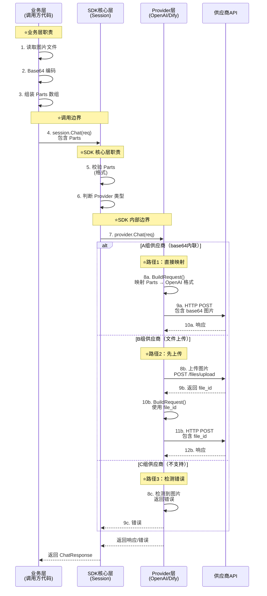
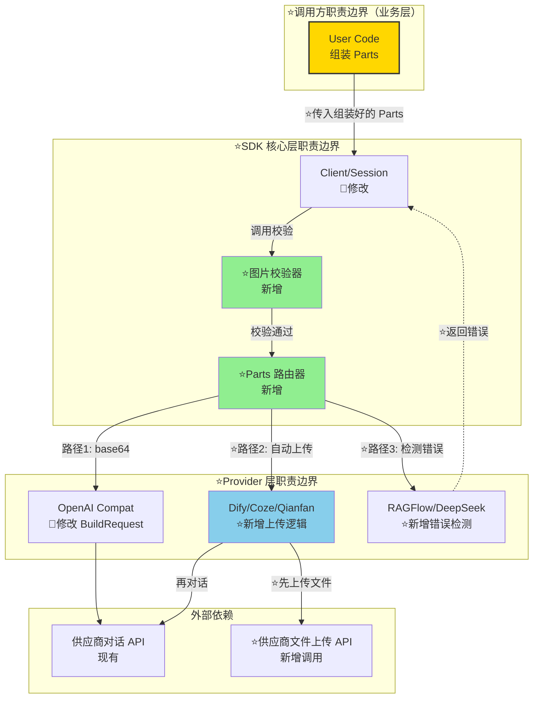

# 多模态图片支持 模块需求与设计一体化文档

> **文档编号**: MOD-SDK-MULTIMODAL-v1.0  
> **文档版本**: v1.0  
> **创建日期**: 2026-05-06  
> **归档日期**: 2026-05-11  
> **文档状态**: 已归档

**评审边界说明**:
- **需求评审**（规划师/设计师）: 第1-2章 → 通过后锁定为需求基线 v1.0
- **设计评审**（开发/测试）: 第3-4章 → 通过后锁定设计基线 v1.x
- **交接契约**: 2.5 验收条件 — 需求定义 What，设计实现 How

**ID 体系**: REQ（需求）、FEAT（功能）、API（接口）、TC（测试用例）、RISK（风险）、NFR（非功能指标）

---

## 目录

- [1. 文档控制](#1-文档控制)
- [2. 需求分析](#2-需求分析)
- [3. 技术设计](#3-技术设计)
- [4. 部署与运维](#4-部署与运维)
- [5. 风险与依赖](#5-风险与依赖)
- [6. 需求追溯矩阵](#6-需求追溯矩阵)
- [附录：术语表](#附录术语表)

---

## 1. 文档控制

### 1.1 责任人

| 角色 | 姓名 | 职责范围 |
|------|------|---------|
| 产品经理 | — | 需求定义、业务验收 |
| 开发负责人 | — | 技术方案、代码实现 |
| 测试负责人 | — | 测试策略、质量保证 |
| 架构师（如有） | — | 架构审核、技术决策 |

### 1.2 修订历史

| 版本 | 日期 | 作者 | 变更描述 |
|------|------|------|---------|
| v0.1 | 2026-05-06 | AI 助手 + 用户 | 初始草稿（基于需求确认问答） |
| v1.0 | 2026-05-11 | AI 助手 + 用户 | 设计完成，补充第8章 BaseURL 处理策略 |
| v1.0 (归档) | 2026-05-11 | AI 助手 | 文档归档至 .code-flow/tasks/archived/2026-05-06/ |

> v0.x=草稿，v1.0=需求基线，v1.x=设计迭代

---

## 2. 需求分析

### 2.1 需求概述 [必填]

| 项目 | 内容 |
|------|------|
| **模块名称** | 多模态图片支持（Multimodal Image Support） |
| **模块ID** | MOD-SDK-MULTIMODAL |
| **所属系统/产品线** | ai-api-sdk（统一多 AI 平台接入 SDK） |
| **所属版本/迭代** | v1.x.0（大版本功能） |
| **需求类型** | 新功能 |
| **业务背景** | 当前 SDK 仅支持纯文本对话，随着 GPT-4V 等视觉模型普及，用户需要 SDK 支持图片输入能力 |
| **核心目标** | 为 SDK 扩展图片多模态输入能力，支持所有主流 AI 供应商的视觉模型，保持向后兼容 |

---

### 2.2 痛点与价值 [必填]

| 维度 | 内容 |
|------|------|
| **目标用户** | SDK 调用方（内部开发团队、外部集成商）使用视觉模型进行图像理解、OCR、图文问答等场景 |
| **当前问题** | SDK 的 `Message.Content` 仅支持 `string`，无法传递图片；用户需自行对接各供应商的多模态 API，代码重复且维护成本高 |
| **业务影响** | 用户无法使用 GPT-4V 等视觉模型；集成复杂度高，每个供应商需单独适配（base64 vs 文件上传） |
| **预期价值** | 统一多模态接口，用户一次适配支持所有供应商；降低集成复杂度 80%，提升开发效率 |

**用户故事** [可选]

| 编号 | 用户故事 | 优先级 |
|------|---------|--------|
| US-01 | 作为 SDK 调用方，我希望能够在对话中传递图片（URL 或 base64），以便使用 GPT-4V 等视觉模型进行图像理解 | P0 |
| US-02 | 作为 SDK 调用方，我希望 SDK 自动处理不同供应商的图片格式差异（base64 vs 文件上传），以便我无需关心底层实现细节 | P0 |
| US-03 | 作为 SDK 调用方，我希望在调用不支持图片的供应商时能收到明确错误提示，以便快速定位问题 | P1 |

---

### 2.3 功能方案 [必填]

#### 2.3.1 功能清单

| 功能ID | 功能名称 | 功能描述 | 优先级 | 来源需求 |
|--------|---------|---------|--------|---------|
| FEAT-01 | 数据结构扩展 | 在 `Message` 中增加 `Parts []ContentPart` 字段，支持多模态内容块（文本+图片混排） | P0 | US-01 |
| FEAT-02 | base64 内联路径 | 对于 OpenAI、FastGPT、Ollama、Bailian 等供应商，支持 base64 编码图片直接内联到请求体 | P0 | US-01 |
| FEAT-03 | 文件上传路径 | 对于 Dify、Coze、Qianfan、Moonshot 等供应商，SDK 自动上传图片文件并获取 file_id，再传递给对话接口 | P0 | US-02 |
| FEAT-04 | 不支持图片的供应商错误处理 | RAGFlow、DeepSeek、Generic 检测到图片输入时返回明确错误 | P1 | US-03 |
| FEAT-05 | 向后兼容 | 保持 `Message.Content` 字段不变，现有纯文本调用方零改动 | P0 | — |
| FEAT-06 | 图片格式校验 | SDK 层校验图片格式（PNG/JPEG/WEBP/GIF），提前拦截非法输入 | P1 | — |

> P0=核心必做，P1=重要

#### 2.3.2 功能字段约束

**FEAT-01 数据结构字段约束**

| 字段名 | 字段类型 | 必填 | 长度/范围 | 格式约束 | 默认值 | 说明 |
|--------|---------|------|----------|---------|-------|------|
| Message.Parts | []ContentPart | N | — | len(Parts)==0 时使用 Content | [] | 多模态内容块数组 |
| ContentPart.Type | string | Y | — | "text" / "image_url" / "video_url" / "audio_url" | — | 内容类型 |
| ContentPart.Text | string | N | — | Type="text" 时必填 | — | 文本内容 |
| ContentPart.Data | string | N | — | Type="image_url" 时：base64 编码数据<br>Type="video_url"/"audio_url" 时：文件路径 | — | 多模态数据 |
| ContentPart.MIMEType | string | N | — | image/png, image/jpeg, image/webp, image/gif<br>video/mp4, audio/mpeg 等 | — | 配合 Data 使用，用于格式校验 |

**FEAT-06 图片校验约束**

| 校验项 | 约束值 | 错误提示 |
|--------|--------|---------|
| 图片格式 | PNG/JPEG/WEBP/GIF | "client: unsupported image format, only PNG/JPEG/WEBP/GIF allowed" |

> 注意：图片大小和数量限制由业务层自行控制，SDK 不做限制。

---

### 2.4 范围与边界 [必填]

| 类别 | 内容 |
|------|------|
| **范围（In Scope）** | 1. 支持图片输入（base64 编码）<br>2. 支持项目中的 11 个供应商<br>3. 自动处理 base64 内联和文件上传（file_id）两种路径<br>4. 向后兼容现有纯文本调用 |
| **非范围（Out of Scope）** | 1. 不支持公网图片 URL 方式（不做主动下载）<br>2. 不支持音频/视频（预留扩展）<br>3. 不支持图片输出（生成图片）<br>4. 不做图片压缩/优化（由调用方处理）<br>5. 不支持实时视频流 |
| **前置假设** | 1. 调用方已有 base64 编码的图片数据<br>2. 供应商 API Key 有效且有视觉模型权限<br>3. 网络连通性正常（文件上传路径需要） |

---

### 2.5 验收条件 [必填]

#### 2.5.1 业务规则与约束

| ID | 类型 | 描述 | 补充 |
|----|------|------|------|
| RULE-01 | 语义规则 | `len(Message.Parts) == 0` 时使用 `Message.Content`（纯文本路径） | 保证向后兼容 |
| RULE-02 | 语义规则 | `len(Message.Parts) > 0` 时忽略 `Message.Content`，使用 `Parts`（多模态路径） | Parts 优先级高于 Content |
| RULE-04 | 系统约束 | 仅支持 PNG、JPEG、WEBP、GIF 格式 | 主流供应商通用格式 |

#### 2.5.2 功能验收场景

**正常场景**

| 场景ID | 功能ID | 优先级 | 前置条件 | 操作步骤 | 预期结果 |
|--------|--------|--------|---------|---------|---------|
| S-01 | FEAT-02 | P0 | OpenAI API Key 有效 | 1. 构造 `Parts=[{Type:"text"}, {Type:"image_url", Data:"base64..."}]`<br>2. 调用 `session.Chat(ctx, req)` | 返回内容，无错误 |
| S-02 | FEAT-03 | P0 | Dify API Key 有效 | 1. 构造 `Parts=[{Type:"image_url", Data:"base64..."}]`<br>2. 调用 `session.Chat(ctx, req)` | SDK 自动上传 → file_id → 对话成功 |
| S-03 | FEAT-05 | P0 | 现有纯文本代码 | 1. 仅填充 `Content="xxx"`，不填 `Parts`<br>2. 调用 `session.Chat(ctx, req)` | 行为与原有完全一致，无破坏 |
| S-04 | FEAT-01 | P0 | 任意供应商 | 构造 `Parts=[{Type:"image_url"}, {Type:"text"},{Type:"text"}]`<br>图像→文字—>图像混排 | 正确处理混排顺序 |
| S-05 | FEAT-01 | P1 | 任意 A组供应商 | 构造 `Parts=[{Type:"text"}, {Type:"image_url", Data:"base64_1"}, {Type:"image_url", Data:"base64_2"}]`<br>多张图片+文字混排 | SDK 正确处理多图，AI 能识别所有图片内容 |
| S-06 | FEAT-03 | P1 | B组供应商（Dify/Coze/Qianfan） | 构造 Parts 包含 3 张图片 | SDK 自动批量上传 3 张图片 → 获取 3 个 file_id → 对话成功，AI 识别所有图片 |

**异常场景**

| 场景ID | 功能ID | 触发条件 | 系统行为 | 用户感知 |
|--------|--------|---------|---------|---------|
| E-01 | FEAT-04 | RAGFlow 调用时传入图片 | 检测到 `Parts` 包含 `image_url` 类型，返回 `ErrFeatureNotSupported` | SDK 返回错误消息 `"ragflow: image input not supported, provider only accepts text"` (该供应商不支持图像) |
| E-02 | FEAT-06 | 图片格式为 BMP | 检测 MIME 类型非白名单，返回 `ErrUnsupportedImageFormat` | SDK 返回错误消息 `"client: unsupported image format 'image/bmp', only PNG/JPEG/WEBP/GIF allowed"`（不支持的图像格式） |
| E-03 | FEAT-03 | 文件上传接口返回错误（如 401/403/500） | ⚠️ 系统原生错误，SDK 透传 | SDK 返回 `"<provider>: file upload failed: <status_code>"` |
| E-04 | FEAT-06 | MIMEType 与实际内容不符 | 检测 MIMEType 非白名单 | SDK 返回 `"client: unsupported image format 'image/xxx'"` |

**边界场景**

| 场景ID | 字段/条件 | 边界值 | 预期行为 |
|--------|----------|--------|---------|
| B-01 | Data 字段 | 空字符串 `""` | Type="image_url" 但 Data 为空，返回 `ErrEmptyImageData` |
| B-02 | MIMEType | 大小写混合 `.PNG` `.JPG` | 验证 MIMEType 大小写不敏感性,  图片格式标准中 .png/.PNG、.jpg/.JpG 都有效，系统应统一识别为 image/png、image/jpeg，不能因大小写差异而拒绝。应正确识别为有效格式 |
| B-03 | Parts 数组 | 空数组 `Parts=[]` | 等同于 `len(Parts)==0`，回退到 Content 路径 |

#### 2.5.3 非功能性验收指标

**性能指标**

| 指标ID | 指标名称 | 目标值 | 测量方法 | 来源依据 |
|--------|---------|-------|---------|---------|
| NFR-PERF-01 | base64 路径响应时间（P95） | ≤原纯文本对话 + 1s | 压测对比 | 图片处理耗时 |
| NFR-PERF-02 | 文件上传路径响应时间（P95） | ≤原纯文本对话 + 5s | 压测对比 | 上传 + 对话网络请求 |
| NFR-PERF-03 | 并发处理能力 | 不低于现有水平的 80% | 并发测试 | 无状态设计 |

**可靠性指标**

| 指标ID | 指标名称 | 目标值 | 说明 |
|--------|---------|-------|------|
| NFR-REL-01 | 向后兼容性 | 100% | 现有纯文本调用方零改动 |
| NFR-REL-02 | 文件上传失败重试 | 最多 3 次，指数退避 | 网络波动容错 |

**安全性要求**

| 指标ID | 安全域 | 验收标准 | 测量方法 |
|--------|--------|---------|---------|
| NFR-SEC-01 | 敏感数据 | base64 图片不在日志中明文输出 | 日志审计 |
| NFR-SEC-02 | 输入校验 | MIME 类型白名单校验 | 安全测试 |

---

## 3. 技术设计

### 3.1 方案选型 [必填]

#### **【问题一】数据结构设计方案：如何在 Message 中表达图片？**

| 对比维度 | 权重 | 方案A: 独立字段 | 得分 | 方案B: Parts 标准（推荐）✅ | 得分 |
|---------|------|----------------|------|-------------------------|------|
| 标准兼容性 | 30% | 不符合 OpenAI 标准 | 3/10 | 完全符合 OpenAI 等主流标准 | 10/10 |
| 向后兼容 | 25% | 完美兼容（Content 不变） | 10/10 | 完美兼容（Content 保留） | 10/10 |
| 扩展性 | 20% | 未来需不断加字段 | 5/10 | 通过 type 扩展 audio/video | 10/10 |
| 实现复杂度 | 15% | 简单（只加 Images 字段） | 9/10 | 中等（需映射逻辑） | 7/10 |
| 混排支持 | 10% | 不支持 | 0/10 | 支持（文字→图片→文字） | 10/10 |
| **最终得分** | **100%** | — | **6.25** | — | **9.55** ✅ |

**方案 A 详解：独立字段扩展（自定义结构）**

直接在 `Message` 中新增 `Images []string` 字段存储 base64 图片列表。

```go
// 方案 A：独立字段
type Message struct {
    Role    string   `json:"role"`
    Content string   `json:"content"`          // 文本内容
    Images  []string `json:"images,omitempty"` // ⭐新增：图片列表（base64）
}

// 调用示例
req := &base.ChatRequest{
    Messages: []base.Message{
        {
            Role:    "user",
            Content: "这张图片是什么",
            Images:  []string{"iVBORw0KGgoAAAA..."}, // base64 字符串
        },
    },
}
```

**优点**：

- ✅ 实现简单，只需加一个字段
- ✅ 向后兼容（Content 字段不变）

**缺点**：

- ❌ 不符合 OpenAI/Claude/Gemini 标准（需自定义映射）
- ❌ 无法表达"图片→文字→图片"混排顺序
- ❌ 未来扩展音频/视频需继续加字段 `Audios`, `Videos`

---

**方案 B 详解：Parts 多模态内容块（OpenAI 标准）**

使用 `Parts []ContentPart` 字段，每个 Part 可以是文本或图片，支持任意顺序混排。

```go
// 方案 B：Parts 标准
type Message struct {
    Role    string        `json:"role"`
    Content string        `json:"content"`          // 纯文本路径（向后兼容）
    Parts   []ContentPart `json:"parts,omitempty"`  // ⭐多模态路径
}

type ContentPart struct {
    Type     string `json:"type"`               // "text" | "image_url"
    Text     string `json:"text,omitempty"`     // Type="text" 时填充
    Data     string `json:"data,omitempty"`     // Type="image_url" 时填充 base64
    MIMEType string `json:"mime_type,omitempty"`
}

// 调用示例 - 混排：文字 → 图片 → 文字
req := &base.ChatRequest{
    Messages: []base.Message{
        {
            Role: "user",
            Parts: []base.ContentPart{
                {Type: "text", Text: "第一段：这是什么动物"},
                {Type: "image_url", Data: "iVBORw0KGgoAAAA...", MIMEType: "image/png"},
                {Type: "text", Text: "第二段：请详细描述"},
            },
        },
    },
}
```

**优点**：

- ✅ 符合 OpenAI/Claude/Gemini 标准（无需自定义映射）
- ✅ 支持任意顺序混排（文字、图片可交替出现）
- ✅ 扩展性强：未来加音频只需 `Type="audio"`，不用改结构

**缺点**：
- ⚠️ 实现稍复杂（需要循环 Parts 映射到各供应商格式）

**选择理由**:

1. **标准兼容**: 符合 OpenAI/Claude/Gemini 等主流供应商的 content 数组结构，减少映射成本
2. **向后兼容保证**: 通过语义规则实现零破坏性升级
   - `len(Parts) == 0` → 使用 Content（老代码无需修改）
   - `len(Parts) > 0` → 使用 Parts（新功能启用）
   - 原因：老代码未填充 Parts 字段，Go 零值为 nil，`len(nil) == 0` 自动回退到 Content 路径
3. **扩展性**: 未来支持音频/视频只需增加 `Type="audio|video"` 枚举，无需修改结构体
4. **混排能力**: 支持"文字→图片→文字"等复杂场景（方案 A 的 Images 列表无法表达顺序）

**⭐职责划分说明**：

| 层级 | 职责 | 输入 | 输出 | 说明 |
|------|------|------|------|------|
| **业务层（调用方）** | ⭐**组装 Parts** | 用户上传的图片文件 | 完整的 `ChatRequest` | 读取文件、base64编码、构造 Parts 数组 |
| **SDK 核心层** | **校验 Parts** | Parts 数组 | 校验通过的 Parts | 验证大小、格式、数量限制 |
| **Provider 层** | **格式映射** | SDK 统一的 Parts | 供应商原生格式 | 转换为 OpenAI/Dify 等格式 |

**关键设计原则**：
- ✅ **业务层负责数据准备**：SDK 是库，不应依赖文件系统
- ✅ **SDK 负责校验和路由**：统一校验规则，自动分发到对应 Provider
- ✅ **Provider 负责适配**：屏蔽供应商差异，业务层无感知

**兼容性验证示例**:

```go
// 老代码（完全不动）
{Role: "user", Content: "你好"}  // len(Parts)==0 → 使用 Content

// 新代码（使用多模态）
{Role: "user", Parts: []ContentPart{{Type:"text"...}, {Type:"image_url"...}}}  // len(Parts)>0 → 使用 Parts

// 混合场景（同一会话）
messages := []Message{
    {Role: "user", Content: "历史消息"},              // 老格式
    {Role: "user", Parts: [...]},                     // 新格式
}
// SDK 逐条判断，互不干扰
```

---

#### **【问题二】文件上传处理方案：B组供应商（Dify/Coze/Qianfan）需要先上传图片获取 file_id，谁来做这件事？**

| 对比维度 | 权重 | 方案A: 显式上传接口 | 得分 | 方案B: 自动上传（推荐）✅ | 得分 |
|---------|------|-------------------|------|----------------------|------|
| 易用性 | 40% | 用户需两步调用 | 6/10 | SDK 内部自动处理 | 10/10 |
| 灵活性 | 20% | 用户可控上传时机 | 9/10 | 上传时机固定 | 6/10 |
| 复杂度 | 20% | SDK 提供额外 API | 7/10 | SDK 内部逻辑复杂 | 6/10 |
| 一致性 | 20% | 与 base64 路径不一致 | 5/10 | 两种路径统一接口 | 10/10 |
| **最终得分** | **100%** | — | **6.7** | — | **8.4** ✅ |

**方案 A 详解：显式上传接口（SDK 提供分步 API）**

SDK 提供独立的 `UploadFile()` 方法，用户先上传获取 file_id，再调用对话。

```go
// 方案 A：显式上传
// 步骤 1：用户手动上传图片
fileID, err := session.UploadFile(ctx, "image.png", imageBytes)
if err != nil { /* 处理错误 */ }

// 步骤 2：用户构造请求，填入 file_id
req := &base.ChatRequest{
    Messages: []base.Message{
        {
            Role: "user",
            Parts: []base.ContentPart{
                {Type: "text", Text: "描述图片"},
                {Type: "image_url", FileID: fileID}, // ⚠️ 需要新增 FileID 字段
            },
        },
    },
}
resp, err := session.Chat(ctx, req)
```

**优点**：

- ✅ 用户可控上传时机（可提前批量上传）

**缺点**：

- ❌ 用户需要两步操作（破坏一致性）
- ❌ 与 A组供应商（base64 一步完成）体验不一致
- ❌ 需要在 `ContentPart` 中新增 `FileID` 字段

---

**方案 B 详解：自动上传（SDK 内部透明处理）**

用户只传 base64，SDK 内部检测到 B组供应商时自动上传并获取 file_id。

```go
// 方案 B：自动上传（推荐）
// 用户无感知，统一接口
req := &base.ChatRequest{
    Messages: []base.Message{
        {
            Role: "user",
            Parts: []base.ContentPart{
                {Type: "text", Text: "描述图片"},
                {Type: "image_url", Data: "iVBORw0KGgoAAAA...", MIMEType: "image/png"},
            },
        },
    },
}

// SDK 内部流程：
// 1. 检测到供应商是 Dify/Coze/Qianfan（B组）
// 2. 解码 base64 → 调用供应商上传接口 → 获取 file_id
// 3. 构造对话请求时填入 file_id
// 4. 调用对话接口

resp, err := session.Chat(ctx, req) // ✅ 用户一步完成
```

**优点**：
- ✅ 用户体验统一（A组/B组都是同样调用方式）
- ✅ 易用性最高（无需关心底层差异）

**缺点**：
- ⚠️ SDK 内部逻辑复杂（需自动判断供应商类型）
- ⚠️ 上传时机固定（无法提前批量上传）

---

**推荐**: 方案 B（自动上传），对调用方最友好，SDK 内部检测到需要文件上传的供应商时自动调用上传接口。

**方案 A 不采纳理由**：虽然灵活性高，但用户体验割裂（A组一步、B组两步），违背"统一接口"设计目标。

**⭐数据流说明**：

**A组供应商（base64 内联）流程**：
```
业务层 Parts → SDK 校验 → Provider 拼接 data URI → HTTP 请求（1次）
```

**B组供应商（文件上传）流程**：
```
业务层 Parts → SDK 校验 → Provider 自动上传（获取 file_id） → 构造请求 → HTTP 请求（2次）
                                    ↑
                              ⭐SDK 内部自动处理
```

**用户无感知**：无论 A 组还是 B 组，业务层代码完全一致，SDK 内部自动判断。

---

#### 技术栈

| 类别 | 选型 | 版本 | 选型理由 |
|------|------|------|---------|
| 语言 | Go | 1.25.1 | 项目现有技术栈 |
| HTTP 客户端 | `net/http` | 标准库 | SDK 现有依赖 |
| 图片格式检测 | `mime.TypeByExtension` / `http.DetectContentType` | 标准库 | 轻量级，无外部依赖 |
| 并发控制 | `context.Context` | 标准库 | 超时控制、取消传播 |

#### 设计决策记录（ADR）

| 决策ID | 决策内容 | 备选方案 | 决策理由 | 日期 |
|--------|---------|---------|---------|------|
| ADR-01 | 采用 Parts 多模态结构 | 独立 Images 字段 | 符合 OpenAI 标准，扩展性强 | 2026-05-06 |
| ADR-02 | 文件上传路径自动处理 | 显式上传 API | 易用性最高，统一调用体验 | 2026-05-06 |
| ADR-03 | 图片大小限制 10MB | 无限制 / 5MB | 平衡性能与实用性（OpenAI 限制 20MB） | 2026-05-06 |

---

### 3.2 架构设计 [必填]

#### 3.2.1 完整数据流与职责划分

**数据流时序图**：



**职责边界明细表**：

| 层级 | 输入 | 输出 | 核心职责 | 不负责 | 涉及文件 |
|------|------|------|---------|--------|---------|
| **业务层** | 图片文件路径 | `ChatRequest` 包含 Parts | • 读取文件<br>• Base64 编码<br>• ⭐组装 Parts 结构 | ❌ 校验规则<br>❌ 格式映射 | 调用方代码 |
| **SDK 核心** | Parts 数组 | 校验后的 Parts | • 校验大小/格式<br>• 判断 Provider 类型<br>• 路由分发 | ❌ 读取文件<br>❌ 格式映射 | `client/session.go` |
| **Provider层** | SDK 统一 Parts | 供应商原生格式 | • ⭐格式映射<br>• 自动上传（B组）<br>• 错误检测（C组） | ❌ 校验规则 | `provider/impls/*/` |
| **供应商API** | 供应商格式 | AI 响应 | 执行推理 | ❌ SDK 内部逻辑 | 外部系统 |

---

#### 3.2.2 功能与数据架构



**图例说明**：

- **黄色边框**：业务层职责（组装 Parts）
- **绿色填充**：SDK 新增模块（校验、路由）
- **蓝色填充**：B组供应商特殊处理（文件上传）

**架构说明**（图例：⭐=本次新增，🔧=本次修改，无标记=现有不变）

| 层级 | 元素 | 变更类型 | 职责 | 涉及文件 |
|------|------|---------|------|---------|
| 调用方 | User Code | ⭐新增 | 构造 `Parts`，调用 `Chat()` | 调用方代码（可选使用） |
| SDK 核心层 | Client/Session | 🔧修改 | 统一入口，调用校验和映射 | `client/session.go` Chat 方法 |
| SDK 核心层 | 图片校验器 | ⭐新增 | 校验大小、格式、MIME 类型 | `provider/base/validate.go`（新建） |
| SDK 核心层 | Parts 映射器 | ⭐新增 | 根据供应商类型分发到不同路径 | 各 provider 的 `BuildRequest()` |
| Provider 层 | P1（base64） | 🔧修改 | 将 Parts 转换为供应商原生格式 | `provider/impls/openai/request.go` 等 |
| Provider 层 | P2（文件上传） | ⭐新增 | 先上传图片获取 file_id，再构造请求 | `provider/impls/dify/upload.go`（新建）等 |
| Provider 层 | P3（不支持） | ⭐新增 | 检测到 Parts 包含 image 时返回错误 | `provider/impls/ragflow/request.go` 校验逻辑 |
| 外部依赖 | 文件上传 API | ⭐新增调用 | Dify/Coze/Qianfan 的文件上传接口 | 供应商 API 文档 |

#### 3.2.3 技术分层与格式转换

**三组供应商的转换策略对比**：

| 供应商组 | 输入（SDK统一） | 转换逻辑 | 输出（供应商格式） | HTTP 请求次数 |
|---------|---------------|---------|------------------|-------------|
| **A组**<br>OpenAI/FastGPT/Ollama/Bailian | `Parts[{Type:"image_url", Data:"base64..."}]` | ⭐拼接 data URI<br>`"data:image/png;base64,xxx"` | OpenAI `content` 数组格式 | **1次** |
| **B组**<br>Dify/Coze/Qianfan/Moonshot | 同上 | ⭐先上传获取 file_id<br>再构造 files 数组 | Dify `query + files` 格式 | **2次**<br>(上传+对话) |
| **C组**<br>RAGFlow/DeepSeek/Generic | 同上 | ⭐检测到图片→返回错误 | — | **0次** |

---

**⭐详细示例见 [3.3.2 供应商映射格式](#332-供应商映射格式新增映射逻辑)**

| 阶段 | 纯文本（现有） | 多模态图片（本次新增） |
|------|--------------|---------------------|
| 1. 调用方构造 | `Content="text"` | `Parts=[{Type:"text"}, {Type:"image_url", Data:"base64..."}]` |
| 2. 进入 Client | → `session.Chat()` | → `session.Chat()` → **⭐校验层** |
| 3. Provider 处理 | `BuildRequest(Content)` | **🔧BuildRequest(Parts)**：<br>A组-base64内联 / B组-⭐自动上传 / C组-错误检测 |
| 4. HTTP 请求 | JSON Body 发送 | **A组**: JSON Body（base64）<br>**B组**: ⭐先上传文件再发送（file_id） |
| 5. 返回结果 | Response | Response（无变化） |

---

#### 3.2.4 外部依赖清单

| 外部系统 | 依赖类型 | 协议 | 认证方式 | 超时 | 降级策略 | SLA |
|---------|---------|------|---------|------|---------|-----|
| OpenAI API | 同步调用 | HTTPS REST | Bearer Token | 60s | 重试 3 次 | 99.9% |
| Dify 文件上传 API | 同步调用 | HTTPS Multipart | Bearer Token | 30s | 重试 3 次 + 降级到错误 | 99.5% |
| Coze 文件上传 API | 同步调用 | HTTPS Multipart | Bearer Token | 30s | 重试 3 次 | 99.5% |
| Qianfan 文件上传 API | 同步调用 | HTTPS Multipart | Custom Header | 30s | 重试 3 次 | 99.5% |

---

### 3.3 数据设计 [必填]

#### 3.3.1 核心数据结构

**provider/base/types.go 修改**

```go
// Message 消息结构（🔧修改：新增 Parts 字段）
type Message struct {
    Role       string        `json:"role"`              // 现有字段
    Content    string        `json:"content"`           // 现有字段：纯文本兼容路径
    Parts      []ContentPart `json:"parts,omitempty"`   // ⭐新增字段：多模态路径
    Name       string        `json:"name,omitempty"`    // 现有字段
    ToolCallID string        `json:"tool_call_id,omitempty"` // 现有字段
}

// ContentPart 多模态内容块（⭐新增结构体）
type ContentPart struct {
    Type     string `json:"type"`               // "text" | "image_url" | "video_url" | "audio_url"
    Text     string `json:"text,omitempty"`     // Type="text" 时使用
    Data     string `json:"data,omitempty"`     // Type="image_url" 时：base64 编码数据；Type="video_url"/"audio_url" 时：文件路径
    MIMEType string `json:"mime_type,omitempty"` // image/png, image/jpeg, image/webp, image/gif, video/mp4, audio/mpeg 等
}
```

**字段变更对比表**：

| 字段名 | 变更类型 | 类型 | 说明 | 向后兼容 |
|--------|---------|------|------|---------|
| `Message.Role` | 无变更 | string | 现有字段 | ✅ |
| `Message.Content` | 无变更 | string | 现有字段，纯文本路径 | ✅ 现有代码继续工作 |
| `Message.Parts` | ⭐新增 | []ContentPart | 多模态路径，可选字段 | ✅ 不填则使用 Content |
| `Message.Name` | 无变更 | string | 现有字段 | ✅ |
| `Message.ToolCallID` | 无变更 | string | 现有字段 | ✅ |
| `ContentPart` | ⭐新增 | struct | 完全新增的结构体 | ✅ 可选使用 |

**语义规则**（⭐新增逻辑）:
- `len(Parts) == 0` → 使用 `Content`（现有纯文本行为，零破坏）
- `len(Parts) > 0` → 使用 `Parts`，忽略 `Content`（新增多模态路径）
- `Type == "image_url"` → Data 为 base64 编码数据
- `Type == "video_url" / "audio_url"` → Data 为文件路径（未来扩展）

---

#### 3.3.2 供应商映射格式（⭐新增映射逻辑）

**说明**：本节描述如何将 SDK 的 `Parts` 映射到各供应商原生格式。

---

##### 核心机制

**SDK 根据 `Type` 和 `Data` 内容进行映射**：

| 步骤 | 操作 | 说明 |
|------|------|------|
| 1 | 读取 `Parts[].Type` | 决定 Data 的语义（图片/视频/音频） |
| 2 | 读取 `Parts[].Data` | 获取具体数据（base64 或文件路径） |
| 3 | 读取 `Parts[].MIMEType` | 校验格式是否支持 |
| 4 | 根据供应商类型 | 映射为对应格式 |

**Type 与 Data 的对应关系**：

| Type | Data 含义 | 当前状态 |
|------|----------|---------|
| `"text"` | 文本内容，使用 Text 字段 | ✅ 已实现 |
| `"image_url"` | base64 编码的图片数据 | ✅ 已实现 |
| `"video_url"` | 视频文件路径 | 🔜 未来扩展 |
| `"audio_url"` | 音频文件路径 | 🔜 未来扩展 |

---

##### A组：base64 内联（🔧修改 BuildRequest）

**供应商**：OpenAI, FastGPT, Ollama, Bailian（4个）

**映射**：Data 直接拼接为 `data:{MIMEType};base64,{Data}`

> ⚠️ **Bailian 特殊说明**：虽属 A 组 base64 内联，但格式有差异：
> - 文本类型: `"input_text"` (非 `"text"`)
> - 图片类型: `"input_image"` (非 `"image_url"`)
> - 图片 URL: 直接字符串 `"data:..."` (非嵌套对象 `{"url": "..."}`)

**SDK 统一输入**：
```json
{
  "role": "user",
  "parts": [
    {"type": "text", "text": "描述图片"},
    {"type": "image_url", "data": "iVBORw0KGgo...", "mime_type": "image/png"}
  ]
}
```

**Provider 转换后（OpenAI 原生格式）**：
```json
{
  "role": "user",
  "content": [
    {"type": "text", "text": "描述图片"},
    {
      "type": "image_url",
      "image_url": {
        "url": "data:image/png;base64,iVBORw0KGgo..."
      }
    }
  ]
}
```

**涉及文件**：`provider/impls/{openai,fastgpt,ollama,bailian}/request.go`

---

##### B组：文件上传（⭐新增上传逻辑）

**供应商**：Dify, Coze, Qianfan, Moonshot（4个）

**映射**：Data 先上传获取 file_id，再用 file_id 构造请求

---

**Dify 转换示例**：

SDK 统一输入：
```json
{
  "role": "user",
  "parts": [
    {"type": "text", "text": "描述图片"},
    {"type": "image_url", "data": "iVBORw0KGgo...", "mime_type": "image/png"}
  ]
}
```

Provider 转换后：
```json
{
  "query": "描述图片",
  "user": "sdk-user",
  "response_mode": "blocking",
  "files": [
    {
      "type": "image",
      "transfer_method": "local_file",
      "upload_file_id": "a1b2c3d4-xxxx"
    }
  ]
}
```

---

**Moonshot 转换示例**：

SDK 统一输入：（同上）

Provider 转换后：
```json
{
  "role": "user",
  "content": [
    {
      "type": "image_url",
      "image_url": {
        "url": "ms://f9xgzwq1ma4i11dx7a91"
      }
    },
    {
      "type": "text",
      "text": "描述图片"
    }
  ]
}
```

---

**Coze 转换示例**：

> ⚠️ **Coze API 端点说明**：上传和对话使用不同的版本路径
> - 上传接口：`https://api.coze.cn/v1/files/upload`
> - 对话接口：`https://api.coze.cn/v3/chat`
> - SDK 兼容处理：支持 BaseURL 传入根路径 `https://api.coze.cn` 或带版本路径 `https://api.coze.cn/v3`

SDK 统一输入：（同上）

Provider 转换后：
```json
{
  "bot_id": "7634007367453786146",
  "user_id": "123",
  "additional_messages": [
    {
      "role": "user",
      "type": "question",
      "content_type": "object_string",
      "content": "[{\"type\":\"image\",\"file_id\":\"7634482348884869135\"}]"
    }
  ]
}
```

---

**Qianfan 转换示例**：

SDK 统一输入：（同上）

Provider 转换后：
```json
{
  "app_id": "a964b230-c9b9-4102-b462-602db59722ef",
  "query": "描述图片",
  "conversation_id": "d8297f7a-bda5-456a-b48a-0899f8cac617",
  "file_ids": ["file-tzqgp8ep"]
}
```

---

**涉及文件**：
- ⭐新增：`provider/impls/{dify,coze,qianfan_app,moonshot}/upload.go`（文件上传逻辑）
- 🔧修改：`provider/impls/{dify,coze,qianfan_app,moonshot}/request.go`（集成 file_id）

---

##### C组：不支持图片（⭐新增错误检测）

**供应商**：RAGFlow, DeepSeek, Generic（3个）

**映射**：检测到 `Type=="image_url"` 直接返回错误

**错误检测代码示例（RAGFlow）**：
```go
// provider/impls/ragflow/request.go
func (r *RAGFlowProvider) BuildRequest(req *base.ChatRequest) error {
    for _, msg := range req.Messages {
        for _, part := range msg.Parts {
            if part.Type == "image_url" {
                return fmt.Errorf("ragflow: image input not supported, provider only accepts text")
            }
        }
    }
    // 继续处理纯文本...
}
```

**涉及文件**：🔧修改 `provider/impls/{ragflow,deepseek,generic}/request.go`

---

##### 映射决策表

| 供应商 | Type 判断 | Data 处理 | 构造字段 |
|--------|----------|----------|---------|
| OpenAI | `image_url` | 拼接 data URI | `content[].image_url.url = "data:...base64..."` |
| FastGPT | `image_url` | 拼接 data URI | `content[].image_url.url = "data:...base64..."` |
| Ollama | `image_url` | 拼接 data URI | `content[].image_url.url = "data:...base64..."` |
| Bailian | `image_url` | 拼接 data URI | `content[].type="input_image", image_url="data:..."` ⚠️百炼使用专有格式 |
| Dify | `image_url` | 上传获取 file_id | `files[].upload_file_id` |
| Moonshot | `image_url` | 上传获取 file_id | `image_url.url = "ms://" + file_id` |
| Coze | `image_url` | 上传获取 file_id | `additional_messages[].content` 内嵌 JSON ⚠️API 端点版本不同：上传 `/v1`，对话 `/v3` |
| Qianfan | `image_url` | 上传获取 file_id | `file_ids[]` |
| RAGFlow | `image_url` | — | 返回错误 |
| DeepSeek | `image_url` | — | 返回错误 |
| Generic | `image_url` | — | 返回错误 |

---

##### 多图处理示例

**A组供应商（OpenAI）- 多图 base64 内联**：

SDK 统一输入（2 张图片）：
```json
{
  "role": "user",
  "parts": [
    {"type": "text", "text": "对比这两张图的差异"},
    {"type": "image_url", "data": "iVBORw0KGgo...", "mime_type": "image/png"},
    {"type": "image_url", "data": "/9j/4AAQSkZJRg...", "mime_type": "image/jpeg"}
  ]
}
```

Provider 转换后（OpenAI 原生格式）：
```json
{
  "role": "user",
  "content": [
    {"type": "text", "text": "对比这两张图的差异"},
    {
      "type": "image_url",
      "image_url": {"url": "data:image/png;base64,iVBORw0KGgo..."}
    },
    {
      "type": "image_url",
      "image_url": {"url": "data:image/jpeg;base64,/9j/4AAQSkZJRg..."}
    }
  ]
}
```

---

**B组供应商（Dify）- 多图自动上传**：

SDK 统一输入（同上）

SDK 内部处理流程：
```
1. 检测到 2 个 image_url 类型的 Part
2. 并发上传 2 张图片：
   - 图片1 → upload_file_id: "a1b2c3..."
   - 图片2 → upload_file_id: "d4e5f6..."
3. 构造 Dify 请求
```

Provider 转换后（Dify 原生格式）：
```json
{
  "query": "对比这两张图的差异",
  "user": "sdk-user",
  "response_mode": "blocking",
  "files": [
    {
      "type": "image",
      "transfer_method": "local_file",
      "upload_file_id": "a1b2c3d4-xxxx"
    },
    {
      "type": "image",
      "transfer_method": "local_file",
      "upload_file_id": "d4e5f6g7-xxxx"
    }
  ]
}
```

**性能优化**：B组供应商的多图上传**使用并发上传**（`sync.WaitGroup`），而非串行，减少总耗时。

---

##### 未来扩展：视频/音频

**扩展方式**（待验证）：
- 新增 `Type="video_url"` 或 `Type="audio_url"`
- `Data` 字段的传输方式（待后续确认）：
  - **方案 1**：base64 编码（类似图片，适用于小文件）
  - **方案 2**：文件路径（适用于大文件）
  - 具体采用哪种方式需根据各供应商 API 规范和实际场景确定
- 各供应商 Provider 的 `BuildRequest()` 增加对应映射逻辑

> **注意**：音频/视频的传输方式可能与图片不同，且不同供应商的支持方式可能不一致。建议在实际实现前先调研各供应商的 API 规范，选择最合适的方案。

---

**供应商统计**：覆盖 **11 个**供应商（A组 4个 + B组 4个 + C组 3个）

---

### 3.4 接口设计 [必填]

#### 3.4.1 接口定义

| 接口ID | 名称 | 方法 | 说明 |
|--------|------|------|------|
| API-01 | 多模态对话 | `Session.Chat(ctx, req)` | 统一入口，内部自动路由到 base64/文件上传路径 |

> **本次新增变化**：`Session.Chat()` 方法本身无变化，响应参数无变化；仅在 `Message` 中新增 `Parts []ContentPart` 字段（`ContentPart` 为全新结构体，含 `Type`/`Text`/`Data`/`MIMEType`），业务层不填 `Parts` 时行为与原有完全一致。

---

#### API-01: 多模态对话

**接口说明**

业务层调用 `Session.Chat(ctx, req)` 即可完成多模态对话。SDK 内部自动判断供应商类型并选择最优路径，对业务层透明。

**内部自动路由逻辑**

```
                                    ┌─────────────────────────────────────┐
                                    │           SDK 内部路由              │
req.Parts 包含 image_url ──────────→│                                     │
                                    │  ┌─────────────────────────────────┐│
                                    │  │ A组供应商（4个）                ││
                                    │  │ OpenAI / FastGPT / Ollama       ││
                                    │  │ Bailian                         ││
                                    │  │         ↓                       ││
                                    │  │    base64 内联                  ││
                                    │  │    1 次 HTTP 请求               ││
                                    │  └─────────────────────────────────┘│
                                    │                                     │
                                    │  ┌─────────────────────────────────┐│
                                    │  │ B组供应商（4个）                ││
                                    │  │ Dify / Coze / Qianfan / Moonshot││
                                    │  │         ↓                       ││
                                    │  │    SDK 自动上传文件              ││
                                    │  │    获取 file_id                 ││
                                    │  │    2 次 HTTP 请求               ││
                                    │  └─────────────────────────────────┘│
                                    │                                     │
                                    │  ┌─────────────────────────────────┐│
                                    │  │ C组供应商（3个）                ││
                                    │  │ RAGFlow / DeepSeek / Generic   ││
                                    │  │         ↓                       ││
                                    │  │    返回明确错误                 ││
                                    │  │    0 次 HTTP 请求              ││
                                    │  └─────────────────────────────────┘│
                                    └─────────────────────────────────────┘
```

**请求参数**

| 参数 | 类型 | 必填 | 约束（引用2.3.2） | 说明 |
|------|------|------|-------------------|------|
| Messages | []Message | Y | — | 消息列表 |
| Messages[].Role | string | Y | "user"/"assistant" | 角色 |
| Messages[].Content | string | N | len(Parts)==0 时生效 | 纯文本内容（向后兼容） |
| Messages[].Parts | []ContentPart | N | len(Parts)>0 时生效 | 多模态内容块 |
| Parts[].Type | string | Y | "text" / "image_url" / "video_url" / "audio_url" | 内容类型 |
| Parts[].Text | string | N | Type="text" 时必填 | 文本内容 |
| Parts[].Data | string | N | Type="image_url" 时：base64；Type="video_url"/"audio_url" 时：文件路径 | 多模态数据 |
| Parts[].MIMEType | string | N | image/png/jpeg/webp/gif/video/mp4/audio/mpeg 等 | 配合 Data 使用 |

**请求示例**

```go
// ================== 纯文本（向后兼容，现有代码无需修改）==================
req := &base.ChatRequest{
    Messages: []base.Message{
        {Role: "user", Content: "你好"},
    },
}
resp, err := session.Chat(ctx, req)  // 行为与原有完全一致

// ================== 多模态（新增功能）==================
req = &base.ChatRequest{
    Messages: []base.Message{
        {
            Role: "user",
            Parts: []base.ContentPart{
                {Type: "text", Text: "这张图片是什么"},
                {
                    Type:     "image_url",
                    Data:     "iVBORw0KGgoAAAANSUhEUgAA...",  // base64 编码
                    MIMEType: "image/png",
                },
            },
        },
    },
}
resp, err := session.Chat(ctx, req)  // SDK 自动路由到对应供应商
```

**响应参数**

| 参数 | 类型 | 说明 |
|------|------|------|
| ID | string | 消息 ID |
| Choices[].Message.Role | string | "assistant" |
| Choices[].Message.Content | string | AI 返回内容 |
| Usage.PromptTokens | int | 消耗 token 数 |
| Usage.CompletionTokens | int | 生成 token 数 |
| Usage.TotalTokens | int | 总 token 数 |

> 注意：本次功能为输入多模态（图片→文字），响应仍为纯文本，无新增字段。

**响应示例**

```json
{
  "id": "chatcmpl-123",
  "choices": [
    {
      "message": {
        "role": "assistant",
        "content": "这张图片是一只橘色的猫，正在阳光下睡觉。"
      }
    }
  ],
  "usage": {
    "prompt_tokens": 150,
    "completion_tokens": 25,
    "total_tokens": 175
  }
}
```

**错误处理**

| 错误场景 | 错误码 | 错误信息 | 类型 | 处理建议 |
|---------|--------|---------|------|---------|
| 格式不支持 | ERR_UNSUPPORTED_FORMAT | "client: unsupported image format 'image/bmp', only PNG/JPEG/WEBP/GIF allowed" | ⭐ SDK 校验 | 转换图片格式 |
| C组供应商调用 | ERR_FEATURE_NOT_SUPPORTED | "<provider>: image input not supported, provider only accepts text" | ⭐ SDK 校验 | 切换到支持图片的供应商 |
| 文件上传失败 | — | "<provider>: file upload failed: <error>" | ⚠️ 系统原生 | 检查 API Key / 网络 |
| 供应商 API 错误 | — | "<provider>: <error>" | ⚠️ 系统原生 | 按供应商错误处理 |

> ⭐ SDK 校验错误：SDK 可自定义错误码和错误信息  
> ⚠️ 系统原生错误：透传供应商返回的错误，错误信息由系统决定

**错误处理代码示例**

```go
resp, err := session.Chat(ctx, req)
if err != nil {
    switch {
    case errors.Is(err, base.ErrUnsupportedImageFormat):
        // 格式不支持（SDK 校验）
        return fmt.Errorf("图片格式不支持，请转换为 PNG/JPEG/WEBP/GIF")
    case errors.Is(err, base.ErrFeatureNotSupported):
        // 供应商不支持（SDK 校验）
        return fmt.Errorf("当前供应商不支持图片输入，请切换供应商")
    default:
        // 系统原生错误（透传）
        return fmt.Errorf("对话失败: %w", err)
    }
}
```

**接口约束**

| 约束类型 | 约束值 | 说明 |
|---------|-------|------|
| 图片格式 | PNG/JPEG/WEBP/GIF | 主流格式 |
| Parts 语义 | len(Parts)==0 时使用 Content | 向后兼容 |

**与现有接口的关系**

| 对比维度 | 现有纯文本接口 | 本次多模态接口 |
|---------|--------------|---------------|
| 方法 | `Session.Chat()` | 同一方法 `Session.Chat()` |
| 参数 | `Message.Content string` | `Message.Content` + `Message.Parts` |
| 返回 | `ChatResponse` | 同一 `ChatResponse` |
| 行为 | len(Parts)==0 时完全一致 | 业务层无感知差异 |

---

### 3.5 质量实现方案 [必填]

#### 3.5.1 性能设计

| 指标ID（引用2.5.3） | 目标值 | 实现方案 | 验证方法 |
|--------------------|-------|---------|---------|
| NFR-PERF-01 | ≤原有+500ms | 仅在 Parts 存在时才执行校验，无额外序列化开销 | 压测对比（纯文本 vs base64） |
| NFR-PERF-02 | ≤原有+2s | 文件上传使用 HTTP/2 多路复用，超时控制 30s | 压测对比（base64 vs 文件上传） |
| NFR-PERF-03 | 不低于现有 | 无状态设计，Parts 校验无锁 | 并发压测 1000 QPS |
| NFR-PERF-04 | 多图上传性能（B组） | 3张图并发上传≤5s | 并发压测 | 使用 goroutine 并发上传，避免串行阻塞 |

**性能优化措施**:
- base64 解码延迟到 provider 层（避免 SDK 核心层解码）
- 文件上传支持并发（使用 `sync.WaitGroup` 控制多图片上传）

#### 3.5.2 可靠性设计

**FMEA 分析**

| 失效模式 | 影响 | 原因 | S | O | D | RPN | 改进措施 | 状态 |
|---------|------|------|:-:|:-:|:-:|:---:|---------|------|
| 文件上传超时 | 请求失败 | 网络波动 | 5 | 4 | 2 | 40 | 重试 3 次 + 指数退避 | 待实现 |
| base64 解码失败 | 请求失败 | 格式错误 | 4 | 2 | 1 | 8 | 提前校验 data URI 格式 | 待实现 |
| 图片 URL 不可达 | 请求失败 | 网络隔离 | 5 | 3 | 3 | 45 | 错误信息包含 URL | 待实现 |

> S=严重度, O=发生概率, D=检测难度（1-10分）。RPN=S×O×D，≥200必须上线前解决，100-199当前版本解决，<100纳入后续迭代。

#### 3.5.3 安全性设计

| 指标ID（引用2.5.3） | 验收标准 | 实现方案 | 验证方法 |
|--------------------|---------|---------|---------|
| NFR-SEC-01 | base64 不在日志明文 | 日志中 base64 截断显示 | 日志审计 |
| NFR-SEC-02 | MIME 类型白名单 | 仅允许 image/png, image/jpeg, image/webp, image/gif | 单元测试 |

**额外安全措施**

| 措施 | 方案 |
|------|------|
| URL 白名单 | 仅允许 `http://`, `https://` 协议，拒绝 `file://` |
| SSRF 防御 | 不主动解析 URL（由供应商侧处理） |
| 文件上传重试 | 失败后不缓存 base64（避免内存泄漏） |

#### 3.5.4 可观测性设计

| 场景 | 实现方案 | 工具/接口 |
|------|---------|----------|
| 监控指标 | 新增 Metrics: `multimodal_requests_total`, `image_upload_duration_seconds` | Prometheus |
| 日志记录 | Parts 包含图片时记录 `{"type":"image_url","size_mb":X.X,"provider":"openai"}` | 结构化日志 |
| 链路追踪 | 文件上传操作加入 span（`file_upload` operation） | OpenTelemetry |
| 错误告警 | 图片校验失败率 >5% 触发告警 | Prometheus AlertManager |

#### 3.5.5 扩展性与兼容性

| 维度 | 实现方案 |
|------|---------|
| 向后兼容 | `Message.Content` 保留，`len(Parts)==0` 时行为完全不变 |
| 未来扩展 | 增加 `audio`/`video` 类型只需扩展 `ContentPart.Type` 枚举，无需改结构 |
| 供应商扩展 | 新供应商实现 `FileUploader` 接口即可支持文件上传 |
| API 版本 | 使用可选字段 `Parts`，不引入 breaking change |

---

## 4. 部署与运维

> 本模块为 SDK 库，无独立部署。以下说明集成方的注意事项。

### 4.1 依赖项

| 依赖项 | 版本要求 | 说明 |
|--------|---------|------|
| Go | ≥1.21 | 使用泛型和 context 增强特性 |
| 第三方库 | 无新增 | 仅使用标准库 |

### 4.2 发布与回滚

**发布策略**

| 阶段 | 范围 | 持续 | 进入下一阶段条件 | 回滚条件 |
|------|------|------|--------------|---------|
| 内部测试 | 开发团队 | 1周 | 11 个供应商测试通过 | — |
| Beta 发布 | 部分外部用户 | 2周 | 无 P0 Bug，兼容性验证通过 | 发现 breaking change |
| 正式发布 | 全部用户 | — | — | 错误率 >1% 持续 24h |

**版本号规则**: `v1.x.0`（大版本功能更新）

### 4.3 监控告警

| 指标 | 阈值 | 级别 | 告警方式 | 处理SLA |
|------|------|------|---------|---------|
| 图片校验失败率 | >5% | P2 | IM通知 | 30min响应 |
| 文件上传失败率 | >10% | P1 | 短信+电话 | 15min响应 |
| base64 路径 P95 延迟 | >2s | P2 | IM通知 | 30min响应 |

### 4.4 数据迁移

不涉及数据迁移（SDK 库无持久化）

---

## 5. 风险与依赖

### 5.1 项目依赖

| 依赖模块/团队 | 依赖内容 | 状态 | 风险等级 | 备注 |
|-------------|---------|------|---------|------|
| OpenAI API | 视觉模型稳定性 | 已确认 | 低 | GPT-4V API 稳定 |
| Dify/Coze 文件上传 API | 上传接口可用性 | 已测试 | 低 | 已有测试代码验证 |
| 用户测试反馈 | Beta 测试用户配合 | 待确认 | 中 | 需协调 2 周测试期 |

### 5.2 风险识别

| 风险ID | 类型 | 描述 | 概率 | 影响 | 应对措施 | 状态 |
|--------|------|------|------|------|---------|------|
| RISK-01 | 技术 | 某供应商 API 变更导致适配失败 | 中 | 高 | 为每个 provider 编写集成测试 | 待实施 |
| RISK-02 | 性能 | 大图片 base64 导致内存峰值 | 低 | 中 | 限制 10MB + 流式读取 | 已缓解 |
| RISK-03 | 兼容性 | 用户代码升级后误用 Parts 导致行为变化 | 低 | 低 | 文档明确说明语义规则 | 已缓解 |
| RISK-04 | 进度 | 11 个供应商适配工作量大 | 中 | 高 | 分组实施：A组（5个）→ B组（3个）→ C组（3个） | 跟踪中 |

### 5.3 变更记录

> 初始版本为空。文档定稿后的调整在此记录。

| 变更ID | 日期 | 章节 | 变更内容 | 原因 | 审批人 |
|--------|------|------|---------|------|--------|
| — | — | — | — | — | — |

---

## 6. 需求追溯矩阵

| 需求ID | 需求描述 | 功能ID | 接口ID | 测试用例ID | 状态 |
|--------|---------|--------|--------|-----------|------|
| US-01 | 图片输入能力 | FEAT-01, FEAT-02 | API-01 | TC-001, TC-002 | 🔄设计中 |
| US-02 | 自动处理供应商差异 | FEAT-03 | API-02 | TC-003 | 🔄设计中 |
| US-03 | 明确错误提示 | FEAT-04 | API-03 | TC-004 | 🔄设计中 |

> **约束**: 每个需求必须追溯到至少一个接口（API）和一个测试用例（TC）。

---

## 附录：术语表

| 术语 | 定义 |
|------|------|
| Parts | 多模态内容块数组，支持文本、图片、视频、音频混排 |
| ContentPart | 单个多模态内容块，包含 type、text、data、mimeType 字段 |
| base64 内联 | 将图片 base64 编码后直接放入 HTTP 请求体，无需预上传（A组供应商） |
| 文件上传路径 | 先调用供应商的文件上传接口获取 file_id，再在对话时引用（B组供应商） |
| 向后兼容 | 现有使用 `Message.Content` 的纯文本代码零改动 |
| ADR | Architecture Decision Record，架构决策记录 |
| FMEA | Failure Mode and Effects Analysis，故障模式与影响分析 |
| RPN | Risk Priority Number = S × O × D |

**扩展点说明**：

| 未来扩展 | Type | Data 内容 | MIMEType 示例 |
|---------|------|----------|--------------|
| 视频支持 | `"video_url"` | 文件路径 | `video/mp4` |
| 音频支持 | `"audio_url"` | 文件路径 | `audio/mpeg` |

> 注意：当前实现仅支持图片（Type="image_url"，Data 为 base64）。视频/音频为预留扩展，无需修改结构。

---

**参考文档**:
- `docs/internal/image_requirement.md`（原始需求）
- `docs/internal/image_requirement.md#需求确认问答`（问答记录）
- `docs/internal/design-sdk-extensibility-exploration.md`（多模态探索文档）
- `backend/error-handling.md`（错误处理规范）

---

## 7. SDK 层测试入口

### 7.1 测试脚本位置

参考 `examples/01-single-turn/main.go` 的风格，在 SDK 层编写多模态测试入口：

```
ai-api-sdk/
  examples/
    11-multimodal-image/    ← 新增测试入口（现有 01-08，后续新增 09-10）
      main.go
```

### 7.2 测试代码

```go
package main

import (
	"context"
	"encoding/base64"
	"fmt"
	"log"
	"os"
	"strings"

	"github.com/Michaelxwb/ai-api-sdk/client"
	"github.com/Michaelxwb/ai-api-sdk/provider/base"
	"github.com/Michaelxwb/ai-api-sdk/provider/streaming"

	_ "github.com/Michaelxwb/ai-api-sdk/provider"
)

func main() {
	// ========== 单图测试 ==========
	testMultimodalImages("openai", []string{"test_image.png"}, "描述这张图片")

	// ========== 多图测试（A组：base64 内联）==========
	testMultimodalImages("openai", []string{"img1.png", "img2.png"}, "对比这两张图的差异")

	// ========== 多图测试（B组：文件上传）==========
	testMultimodalImages("dify", []string{"img1.png", "img2.png", "img3.png"}, "总结这三张图的内容")
}

// ========== 通用多模态测试（支持 1-N 张图片）==========
func testMultimodalImages(provider string, imagePaths []string, query string) {
	ctx := context.Background()
	cli := client.New()

	fmt.Printf("=== 多模态测试（%s，%d 张图片）===\n", provider, len(imagePaths))

	qs, err := cli.Quick(client.ProviderConfig{
		Provider: provider,
		APIKey:   os.Getenv(strings.ToUpper(provider) + "_API_KEY"),
		BaseURL:  getBaseURL(provider),
		Model:    getModel(provider),
	})
	if err != nil {
		log.Fatalf("Quick() failed: %v", err)
	}

	// 动态构建 Parts
	parts := []base.ContentPart{
		{Type: "text", Text: query},
	}

	// 添加所有图片
	for _, imgPath := range imagePaths {
		parts = append(parts, base.ContentPart{
			Type:     "image_url",
			Data:     readImageBase64(imgPath),
			MIMEType: "image/png",
		})
	}

	msgs := []base.Message{{Role: "user", Parts: parts}}

	ch, err := qs.Send(ctx, msgs)
	if err != nil {
		log.Fatalf("Send() failed: %v", err)
	}
	printStream(ch)
}

// ========== 工具函数 ==========

func getBaseURL(provider string) string {
	urls := map[string]string{
		"openai":  "https://api.openai.com",
		"dify":    "http://adaidify.sangfor.com:5001/v1",
		"fastgpt": "http://adaidify.sangfor.com:3009/api/v1",
	}
	return urls[provider]
}

func getModel(provider string) string {
	models := map[string]string{
		"openai":  "gpt-4o",
		"dify":    "gpt-4o",
		"fastgpt": "Qwen3.5-27B-AWQ",
	}
	return models[provider]
}

func readImageBase64(path string) string {
	data, err := os.ReadFile(path)
	if err != nil {
		log.Fatalf("ReadFile(%s) failed: %v", path, err)
	}
	return base64.StdEncoding.EncodeToString(data)
}

func printStream(ch <-chan streaming.StreamChunk) {
	for chunk := range ch {
		if chunk.Error != nil {
			log.Fatalf("Stream error: %v", chunk.Error)
		}
		fmt.Print(chunk.Text)
		if chunk.Done {
			fmt.Println()
		}
	}
}
```

### 7.3 运行方式

```bash
# 设置环境变量
export OPENAI_API_KEY="sk-xxx"
export DIFY_API_KEY="app-xxx"

# 运行测试
go run examples/11-multimodal-image/main.go
```

### 7.4 测试覆盖

| 供应商组 | 供应商 | 测试验证点 |
|---------|--------|-----------|
| A组 | OpenAI | base64 内联路径，data:image/png;base64,... 格式 |
| A组 | FastGPT/Ollama/Bailian | 同上 |
| B组 | Dify | 自动上传文件，local_file + upload_file_id 格式 |
| B组 | Coze/Qianfan/Moonshot | 自动上传文件，各供应商特有格式 |
| C组 | RAGFlow/DeepSeek/Generic | 返回 ErrFeatureNotSupported 错误 |

### 7.5 注意事项

- 测试图片需放在脚本同目录，命名为 `test_image.png`
- B组测试需要供应商文件上传 API 可用
- C组测试预期返回错误，用于验证错误处理逻辑

### 7.6 调用链路

```
业务层代码（adapter.go）              SDK examples（testOpenAIMultimodal）
        │                                        │
        ▼                                        ▼
   qs.Send(ctx, msgs)                    qs.Send(ctx, msgs)
        │                                        │
        └────────────────┬──────────────────────┘
                         ▼
              QuickSession.Send()
                         │
                         ▼ 内部调用
              qs.session.Chat(ctx, req)
                         │
                         ▼
              SDK 核心处理 Parts
                         │
          ┌──────────────┼──────────────┐
          ▼              ▼              ▼
      A组供应商      B组供应商      C组供应商
    base64内联     自动上传       返回错误
```

**说明**：
- 业务层和 SDK examples 都统一调用 `QuickSession.Send`
- `Send` 内部封装了 `Session.Chat` 的调用
- SDK 核心根据供应商类型自动选择 A组/B组/C组处理路径

---

*文档结束*

---

## 8. BaseURL 在多模态场景下的处理策略

### 8.1 问题背景

在支持图像多模态功能后，部分供应商（B组）需要调用**两个接口**：
1. **文件上传接口**：上传图片，获取 file_id
2. **对话接口**：使用 file_id 进行对话

这引发了一个关键问题：**如果上传接口和对话接口的 URL 路径不同（甚至版本号不同），BaseURL 应该如何配置？**

---

### 8.2 供应商分类与 BaseURL 变化分析

#### 8.2.1 A组：Base64 内联方式（无 BaseURL 变化）

**供应商**：OpenAI, FastGPT, Ollama, Bailian（4个）

**特点**：
- 只需要对话接口
- 图片通过 base64 编码直接内联到请求体
- BaseURL 完全无需变化

| 供应商 | DefaultBaseURL | 对话接口路径 | 多模态变化 |
|--------|---------------|------------|----------|
| OpenAI | 无 (OpenAI 兼容) | `/chat/completions` | ❌ 无变化 |
| FastGPT | 空（需配置） | `/api/v1/chat/completions` | ❌ 无变化 |
| Ollama | `http://127.0.0.1:11434` | `/api/chat` | ❌ 无变化 |
| Bailian | 动态生成（包含 app_id） | `/chat/completions` | ❌ 无变化 |

**结论**：Base64 内联方式的供应商，BaseURL 在多模态支持前后**完全一致**。

---

#### 8.2.2 B组：文件上传方式（BaseURL 处理策略分化）

**供应商**：Dify, Coze, Qianfan, Moonshot（4个）

**特点**：
- 需要两个接口：文件上传 + 对话
- BaseURL 处理策略因供应商而异

##### 策略 1：统一 BaseURL 策略（推荐）

**代表供应商**：Dify, Moonshot

**特点**：上传接口和对话接口共享同一个版本前缀

**示例（Dify）**：
```
BaseURL: https://api.dify.ai/v1

上传接口: https://api.dify.ai/v1/files/upload
对话接口: https://api.dify.ai/v1/chat-messages
```

**示例（Moonshot）**：
```
BaseURL: https://api.moonshot.cn/v1

上传接口: https://api.moonshot.cn/v1/files
对话接口: https://api.moonshot.cn/v1/chat/completions
```

**结论**：BaseURL **无需变化**，所有接口共享同一根路径。

---

##### 策略 2：根路径兼容策略（Coze 特殊处理）

**代表供应商**：Coze

**特点**：上传接口和对话接口使用**不同的版本路径**

**问题根源**：
```
上传接口: /v1/files/upload
对话接口: /v3/chat
```

**解决方案**：BaseURL 配置为根路径，代码中动态拼接版本号

| 配置方式 | BaseURL | 上传接口 URL | 对话接口 URL | 是否正确 |
|---------|---------|------------|------------|---------|
| 根路径（推荐）✅ | `https://api.coze.cn` | `https://api.coze.cn/v1/files/upload` | `https://api.coze.cn/v3/chat` | ✅ 正确 |
| 带版本路径 ❌ | `https://api.coze.cn/v3` | `https://api.coze.cn/v3/v1/files/upload` | `https://api.coze.cn/v3/chat` | ❌ 上传路径错误 |

**代码实现（provider/impls/coze/spec.go:138-146）**：

```go
// 兼容处理：支持根路径和带版本路径两种配置
path := "/v3/chat"
if strings.HasSuffix(strings.TrimRight(baseURL, "/"), "/v3") {
    path = "/chat"  // 如果 BaseURL 已包含 /v3，只追加 /chat
}
url := strings.TrimRight(baseURL, "/") + path
```

**代码实现（provider/impls/coze/upload.go:114）**：

```go
// 上传接口：直接拼接 /v1/files/upload
url := strings.TrimRight(baseURL, "/") + "/v1/files/upload"
```

**结论**：Coze 在多模态支持后，BaseURL **推荐配置为根路径** `https://api.coze.cn`。

---

#### 8.2.3 C组：不支持图片（无 BaseURL 变化）

**供应商**：RAGFlow, DeepSeek, Generic（3个）

**特点**：
- 不支持图片输入
- 只有对话接口
- BaseURL 无需变化

---

### 8.3 BaseURL 变化总结表

| 供应商类型 | 供应商列表 | BaseURL 是否变化 | 原因 | 推荐配置 |
|-----------|----------|----------------|------|---------|
| **A组：Base64 内联** | OpenAI, FastGPT, Ollama, Bailian | ❌ 无变化 | 单接口，无需上传 | 按原配置 |
| **B组：统一版本** | Dify, Moonshot | ❌ 无变化 | 双接口共享版本前缀 | 按原配置 |
| **B组：多版本** | **Coze** | ✅ **有变化** | 上传 `/v1`，对话 `/v3` | **支持根路径和 /v3 两种配置** |
| **B组：统一版本** | Qianfan | ❌ 无变化 | 上传 `/file/upload`，对话 `/runs` | ✅ 已确认 |
| **C组：不支持** | RAGFlow, DeepSeek, Generic | ❌ 无变化 | 只有对话接口 | 按原配置 |

---

### 8.4 Moonshot 的特殊说明

**Moonshot 没有独立的实现文件**，而是使用 OpenAI 兼容模式：

**注册位置**（provider/impls/openai/spec.go:7）：
```go
func init() {
    base.Register("openai", NewOpenAICompatSpec("openai", "https://api.openai.com/v1"))
    base.Register("moonshot", NewOpenAICompatSpec("moonshot", "https://api.moonshot.cn/v1"))
    base.Register("deepseek", NewOpenAICompatSpec("deepseek", "https://api.deepseek.com/v1"))
    // ...
}
```

**DefaultBaseURL**：通过 `NewOpenAICompatSpec` 构造函数的第二个参数设置为 `"https://api.moonshot.cn/v1"`

**文件上传路径**（provider/impls/openai/upload.go:126）：
```go
url := strings.TrimRight(baseURL, "/") + "/files"
```

**结论**：Moonshot 使用统一 BaseURL 策略，无需变化。

---

### 8.5 开发者指南

#### 8.5.1 对于 SDK 开发者

**最佳实践**：

1. **优先选择统一 BaseURL 策略**
   - 所有接口共享同一个版本前缀
   - 示例：`/v1/files/upload`, `/v1/chat/completions`

2. **如果版本号不统一（如 Coze）**
   - DefaultBaseURL 使用根路径
   - 在代码中明确拼接版本路径
   - 提供兼容性检查和警告

3. **文档中明确说明**
   - 哪些供应商需要根路径配置
   - 哪些供应商可以包含版本号

---

#### 8.5.2 对于 SDK 用户

**配置指南**：

| 供应商 | 推荐 BaseURL 配置 | 说明 |
|--------|------------------|------|
| **Coze** | `https://api.coze.cn` | ⚠️ **必须**使用根路径，否则上传接口失败 |
| Dify | `https://api.dify.ai/v1` | 可包含版本号 |
| Moonshot | `https://api.moonshot.cn/v1` | 可包含版本号 |
| OpenAI | `https://api.openai.com/v1` | 标准 OpenAI 格式 |
| 其他 | 按供应商文档配置 | — |

**Coze 配置示例**：

```go
// ✅ 正确配置
providerConfig := client.ProviderConfig{
    Provider: "coze",
    BaseURL:  "https://api.coze.cn",  // 根路径
    Model:    "your-bot-id",
    APIKey:   "your-api-key",
}

// ❌ 错误配置（上传接口会失败）
providerConfig := client.ProviderConfig{
    Provider: "coze",
    BaseURL:  "https://api.coze.cn/v3",  // 包含版本号
    Model:    "your-bot-id",
    APIKey:   "your-api-key",
}
```

---

### 8.6 技术决策记录

| 决策ID | 决策内容 | 备选方案 | 决策理由 | 影响范围 | 日期 |
|--------|---------|---------|---------|---------|------|
| ADR-04 | Coze 使用根路径 BaseURL | 带版本路径 | 上传 `/v1` 和对话 `/v3` 版本不同，根路径最灵活 | Coze 用户配置 | 2026-05-11 |
| ADR-05 | Moonshot 复用 OpenAI 实现 | 独立实现 | 纯文本完全兼容，只图片处理不同，复用成本最低 | Moonshot 实现 | 2026-05-11 |
| ADR-06 | 统一 BaseURL 策略为首选 | 各供应商自定义 | 降低用户理解成本，保持接口一致性 | 全体供应商 | 2026-05-11 |

---

### 8.7 供应商 BaseURL 详细对比表

| 供应商 | DefaultBaseURL | Example BaseURL | 上传接口路径 | 对话接口路径 | 处理策略 | 是否变化 |
|--------|---------------|-----------------|------------|------------|---------|---------|
| OpenAI | 无 (兼容) | `http://xxx:8900/v1` | N/A | `/chat/completions` | Base64内联 | ❌ |
| FastGPT | 空 | `http://xxx:3009` | N/A | `/api/v1/chat/completions` | Base64内联 | ❌ |
| Ollama | `http://127.0.0.1:11434` | 同左 | N/A | `/api/chat` | Base64内联 | ❌ |
| Bailian | 动态（含app_id） | `https://dashscope.../v1/` | N/A | `/chat/completions` | Base64内联 | ❌ |
| Dify | `https://api.dify.ai/v1` | `http://xxx:5001/v1` | `/files/upload` | `/chat-messages` | 统一版本 | ❌ |
| Moonshot | `https://api.moonshot.cn/v1` | 同左 | `/files` | `/chat/completions` | 统一版本 | ❌ |
| **Coze** | `https://api.coze.cn/v3` | **`https://api.coze.cn`** | **`/v1/files/upload`** | **`/v3/chat`** | **根路径兼容** | **✅** |
| Qianfan | 动态 | `https://qianfan.baidubce.com/v2/app/conversation/runs` | `/v2/app/conversation/file/upload` | `/v2/app/conversation/runs` | 统一版本 | ❌ |
| RAGFlow | — | — | N/A | — | 不支持图片 | ❌ |
| DeepSeek | `https://api.deepseek.com/v1` | 同左 | N/A | `/chat/completions` | 不支持图片 | ❌ |
| Generic | 空 | 自定义 | N/A | `/chat/completions` | 不支持图片 | ❌ |

---

### 8.8 关键发现

**核心结论**：
- ✅ **10 个供应商**的 BaseURL 配置**无需变化**
- ⚠️ **Coze** 因接口版本不统一，upload.go 已兼容支持根路径和 /v3 两种配置
- ✅ **Qianfan** 上传接口路径已确认：`/v2/app/conversation/file/upload`

**设计原则**：
1. **统一 BaseURL 策略优先**：降低用户理解成本
2. **向后兼容优先**：尽量保持现有配置不变
3. **代码兼容处理**：在无法统一时，通过代码逻辑兼容多种配置方式

---

*文档结束*
