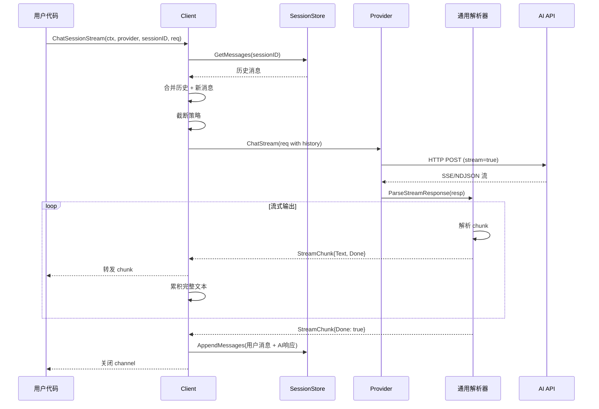

# AI API SDK 架构文档

## 1. 整体架构

### 1.1 模块划分

```
┌─────────────────────────────────────────────────────┐
│                   应用层 (User Code)                 │
└─────────────────────────────────────────────────────┘
                        ↓
┌─────────────────────────────────────────────────────┐
│              Client Layer (client/)                  │
│  ┌─────────┬──────────┬───────────┬──────────────┐  │
│  │ Client  │ Stream   │ Session   │ Transport    │  │
│  │ (统一入口)│ (流式API)│ (多轮对话)│ (认证注入)   │  │
│  └─────────┴──────────┴───────────┴──────────────┘  │
└─────────────────────────────────────────────────────┘
                        ↓
┌─────────────────────────────────────────────────────┐
│            Provider Layer (provider/)                │
│  ┌──────────┬───────────┬──────────┬─────────────┐  │
│  │ Spec     │ Stream    │ Registry │ Impls       │  │
│  │ (接口)   │ (解析器)  │ (注册)   │ (OpenAI/...) │  │
│  └──────────┴───────────┴──────────┴─────────────┘  │
└─────────────────────────────────────────────────────┘
                        ↓
┌─────────────────────────────────────────────────────┐
│              Session Layer (session/)                │
│  ┌────────────┬──────────────┬─────────────────┐   │
│  │ Store      │ Truncate     │ Types           │   │
│  │ (存储接口) │ (截断策略)   │ (数据结构)      │   │
│  └────────────┴──────────────┴─────────────────┘   │
└─────────────────────────────────────────────────────┘
                        ↓
┌─────────────────────────────────────────────────────┐
│           Storage Implementations                    │
│ Memory / File / SQLite / PostgreSQL / MySQL / Redis  │
└─────────────────────────────────────────────────────┘
```

<a id="数据流向"></a>
### 1.2 数据流向

#### 非流式对话数据流
1. 用户代码构造 `ChatRequest` 并调用 `Client.Chat` / `Client.ChatWith`。
2. Client 解析 Provider 配置、注入认证（`AuthTransport`），构建 HTTP 请求。
3. Provider Spec 处理请求与响应：`BuildRequest` → HTTP → `ParseResponse`。
4. Client 返回 `ChatResponse` 给用户代码。

#### 流式对话数据流
1. 用户调用 `Client.ChatStream` / `Client.ChatWithStream`。
2. Provider 返回 HTTP streaming 响应（SSE/NDJSON）。
3. 通用解析器 (`SSEParser` / `NDJSONParser`) 解析为 `StreamChunk`。
4. Client 将 `StreamChunk` 透传给用户，必要时可在 `ChatStreamSync` 聚合。

#### 多轮对话数据流
1. Client 从 `SessionStore` 拉取历史消息。
2. 合并历史与新消息，按 `TruncatePolicy` 截断。
3. 发送请求到 Provider，返回结果（流式/非流式）。
4. 将新增消息写入 `SessionStore`，更新 `SessionMeta`。

### 1.3 关键接口与类型

- `base.ProviderSpec`: Provider 的统一接口，负责构建请求与解析响应。
- `streaming.ProviderStreamSpec`: 可选流式能力接口，返回 `StreamChunk` 通道。
- `base.ChatRequest` / `base.ChatResponse`: 统一请求/响应结构。
- `streaming.StreamChunk`: 流式增量数据结构（`Text`/`Done`/`Error`/`Raw`）。
- `streaming.StreamConfig` / `streaming.DeltaExtractor`: 通用流式解析配置与抽取器。
- `session.SessionStore`: 最小会话存储接口（Get/Append）。
- `session.SessionStoreWithMeta` / `session.SessionStoreWithVersion`: 元数据与乐观锁扩展。
- `session.WindowPolicy`: 默认截断策略实现。
- `client.SessionConfig`: 多轮对话控制项（自动创建、截断、冲突重试）。

## 2. 核心流程

### 2.1 非流式单轮对话
1. 用户调用 `Client.Chat` 或 `Client.ChatWith`。
2. Client 解析 Provider 配置与 Credential，构建 HTTP 请求。
3. `AuthTransport` 注入认证并发送请求。
4. Provider `ParseResponse` 解析结果为 `ChatResponse`。
5. 返回给用户。

### 2.2 流式单轮对话
1. 用户调用 `Client.ChatStream` 或 `Client.ChatWithStream`。
2. Provider 返回 SSE/NDJSON stream。
3. 通用解析器解析 chunk → `StreamChunk`。
4. Client 转发给用户，或在 `ChatStreamSync` 中聚合成 `ChatResponse`。

### 2.3 非流式多轮对话
1. `Client.ChatSession` 拉取历史消息（`SessionStore.GetMessages`）。
2. 合并新消息并执行截断（`TruncatePolicy`）。
3. 发送请求并获取 `ChatResponse`。
4. 将用户消息与 AI 回复追加到 `SessionStore`。
5. 视情况更新 `SessionMeta`。

### 2.4 流式多轮对话
1. `Client.ChatSessionStream` 拉取历史 → 合并 → 截断。
2. `Client.ChatStream` 触发流式请求。
3. Stream 中持续输出 `StreamChunk` 给用户，同时在客户端累积完整文本。
4. 结束后将用户消息 + 完整回复写入 `SessionStore`。

<a id="流式多轮对话完整流程"></a>
## 3. 流式多轮对话完整流程



<a id="各层职责"></a>
## 4. 各层职责

### 4.1 Client 层
- 统一请求入口与参数标准化。
- 认证注入（`AuthTransport`）。
- 流式/非流式统一封装。
- 会话管理协调与截断策略执行。

### 4.2 Provider 层
- 协议适配（OpenAI/Claude/Gemini/Ollama 等）。
- 流式解析适配与抽取规则配置。
- 统一错误处理与响应解析。

### 4.3 Session 层
- 历史对话存储与读取。
- 消息截断与存储优化参数（`GetOptions`）。
- 元数据管理与乐观锁冲突处理。

### 4.4 Streaming 层
- 协议抽象（SSE/NDJSON）与通用解析器复用。
- 增量抽取（`DeltaExtractor`）与结束条件统一。
- 事件过滤、错误封装与 Context 取消传播。

### 4.5 关键数据结构流转

#### ChatRequest
- 字段：`Model` / `Messages` / `Temperature` / `MaxTokens` / `Stream`。
- 流转：用户代码 → Client → Provider.BuildRequest → HTTP 请求。

#### StreamChunk
- 字段：`Text` / `Done` / `Error` / `Raw`。
- 流转：通用解析器 → Client → 用户代码。

#### ChatResponse
- 字段：`Text` / `Raw`。
- 流转：Provider.ParseResponse 或 `ChatStreamSync` 聚合 → 用户代码。

#### Message
- 字段：`Role` / `Content` / `Name`。
- 流转：用户请求 → Provider → SessionStore → 历史合并与截断。

### 4.6 错误处理与 Context 传播

- 网络/HTTP 错误：直接返回给调用方，且在本地配置模式下会触发 `AuthManager.MarkFailed`。
- 流式解析错误：以 `StreamChunk.Error` 下发，并提前终止流。
- 会话存储错误：通过 `SessionConfig.OnStoreError` 回调，并将错误返回给调用方。
- 乐观锁冲突：`ErrSessionConflict` 可在 `ChatSession` 中按 `MaxConflictRetry` 重试。
- `context.Context` 从用户入口传递到 `BuildRequest` 与 HTTP 请求。
- 流式解析器通过 `resp.Request.Context()` 获取取消信号。
- 若 ctx 被取消，解析器发送 `StreamChunk{Error: ctx.Err()}` 并停止。

<a id="流式解析架构"></a>
## 5. 流式解析架构

### 5.1 协议抽象层
- `StreamProtocol`: 支持 `sse` / `ndjson`。
- `StreamConfig`: 定义增量字段路径、结束条件、事件过滤规则。

### 5.2 通用解析器
- `SSEParser`：支持 `event:` / `data:`，可按 `EventFilter` 过滤事件。
- `NDJSONParser`：按行读取并解析 JSON。
- `DeltaExtractor`：从每个 JSON 块抽取增量文本与结束信号。
- `ExtractJSONPath` / `MakeJSONPathExtractor`：通用 JSONPath 抽取器。

### 5.3 Provider 配置
- OpenAI / OpenAICompat：SSE + `choices.0.delta.content`，结束标记 `[DONE]`。
- Ollama：NDJSON + `message.content` + `done=true`。
- Claude：SSE + `event` 过滤（`content_block_delta` / `message_stop`）。
- Gemini：SSE + `candidates.0.content.parts.0.text`。

### 5.4 Provider 协议对比

| Provider | 流式协议 | 增量字段路径 | 结束标记 | 事件过滤 |
|----------|----------|---------------|----------|----------|
| OpenAI | SSE | `choices.0.delta.content` | `[DONE]` | - |
| Claude | SSE | `delta.text` | `message_stop` | `content_block_delta` |
| Gemini | SSE | `candidates.0.content.parts.0.text` | `finishReason=STOP` | - |
| Ollama | NDJSON | `message.content` | `done=true` | - |

### 5.5 新增 Provider 流式支持

扩展指南（何时需要自定义解析器/抽取器）：
- 需要事件过滤（例如 Claude 的 `event` 类型）。
- 同一响应中存在多路增量（如 `tool_calls` + `content`）。
- 结束条件是非标准字段或事件。
- 需要忽略非文本增量。

步骤：
1. 确定流式协议（SSE/NDJSON）。
2. 配置 `StreamConfig`（DeltaPaths/Done 条件/事件过滤）。
3. 实现 `ParseStreamResponse`，复用 `SSEParser` 或 `NDJSONParser`。
4. 测试流式输出（增量文本、结束标记、Context 取消）。

## 6. 认证流程

1. `auth.Manager` 选择可用 Credential（RoundRobin / 自定义选择器）。
2. `AuthTransport` 在 `RoundTrip` 中注入认证（Bearer / APIKey / OAuth / 自定义头）。
3. OAuth 在 401 时触发 `RefreshOAuth`，刷新后重试一次。
4. 成功/失败会回写到 `AuthManager`（冷却失败凭证）。

## 7. 扩展点

### 7.1 新增 Provider
1. 实现 `ProviderSpec`（必要）与 `ProviderStreamSpec`（可选）。
2. 使用 `base.Register(name, spec)` 注册。
3. 配置 `config.ProviderConfig`（BaseURL/Path/Headers/ExtraBody）。

### 7.2 新增存储
1. 实现 `session.SessionStore`（Get/Append）。
2. 如需元数据/乐观锁，扩展 `SessionStoreWithMeta` / `SessionStoreWithVersion`。
3. 在 `Client.SessionStore` 中注入实例。

### 7.3 新增截断策略
1. 实现 `session.TruncatePolicy`（`Truncate`）。
2. 可实现 `Options()` 提供存储优化参数。
3. 注入 `Client.SessionConfig.TruncatePolicy`。

## 相关文档
- [文档索引](README.md)
- [数据流详解](data-flow.md) - 已合并到架构文档，保留链接用于兼容
- [使用指南](usage-guide.md)
- [Session 教程](session-tutorial.md)
- [API 参考](api-reference.md)
