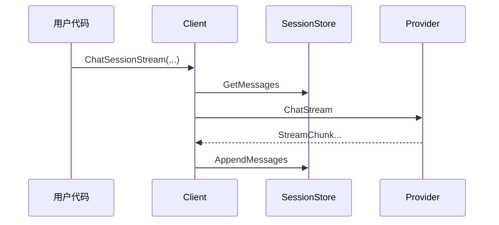

# 数据流详解

> **注意**：本文档内容已合并到 [架构文档](architecture.md)。以下为快速导航。

## 快速导航

完整的数据流详解请参考：
- [架构文档 - 流式多轮对话完整流程](architecture.md#流式多轮对话完整流程)
- [架构文档 - 各层职责](architecture.md#各层职责)
- [架构文档 - 数据流向](architecture.md#数据流向)

## 核心流程图

详细内容请查看 [架构文档](architecture.md)。

## 相关文档
- [文档索引](README.md)
- [架构文档](architecture.md)
- [使用指南](usage-guide.md)
- [流式迁移指南](migration-to-streaming.md)
