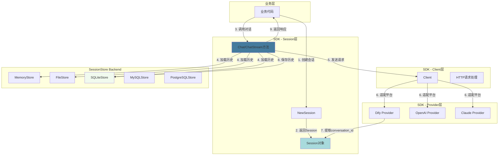
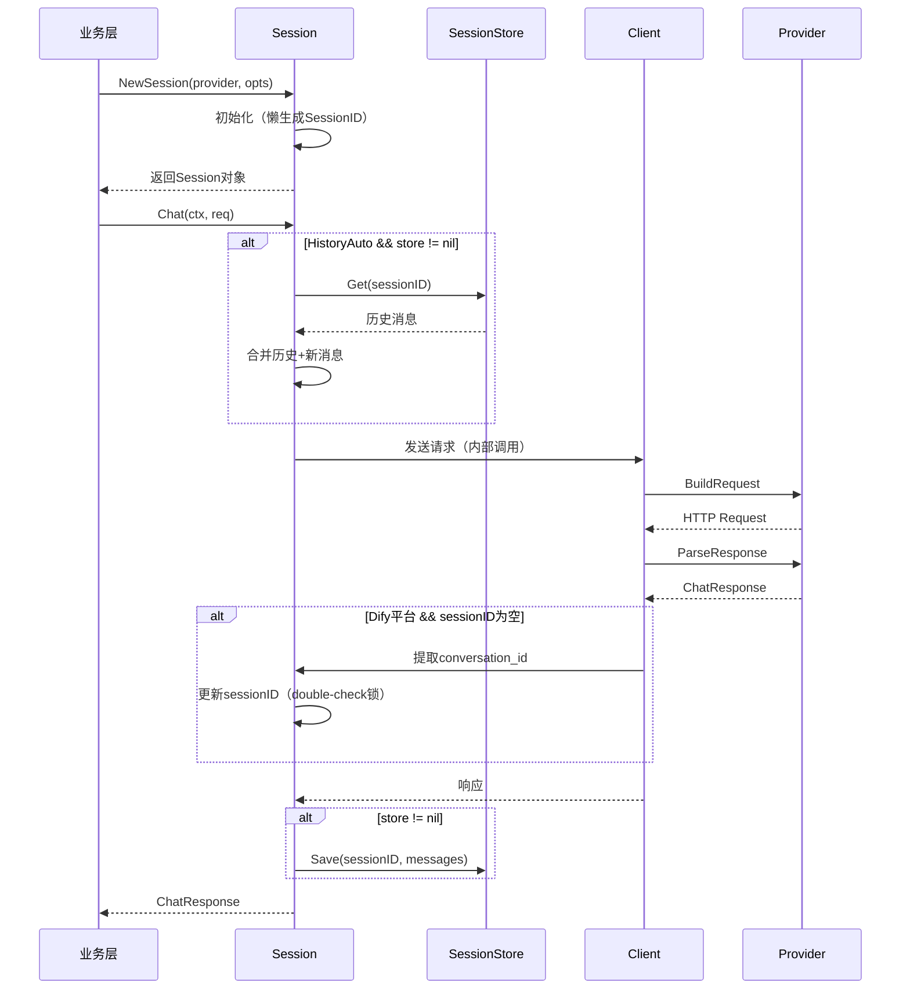

# AI-API-SDK Session管理统一架构设计说明书

## 目录

- [1. 介绍](#1-介绍)
  - [1.1. 目的](#11-目的)
  - [1.2. 定义和缩写](#12-定义和缩写)
  - [1.3. 参考和引用](#13-参考和引用)
- [2. 模块方案概述](#2-模块方案概述)
  - [2.1. 核心问题](#21-核心问题)
  - [2.2. 解决方案](#22-解决方案)
  - [SessionStore架构原则](#sessionstore架构原则)
  - [2.3. 架构图](#23-架构图)
  - [2.4. 核心流程](#24-核心流程)
  - [2.5. 方案选型](#25-方案选型)
- [3. 模块详细设计](#3-模块详细设计)
  - [3.1. Session对象设计](#31-session对象设计)
  - [3.2. SessionStore接口设计](#32-sessionstore接口设计)
  - [3.3. Dify平台特殊处理](#33-dify平台特殊处理)
  - [3.4. API变更计划](#34-api变更计划)
- [4. 关联分析](#4-关联分析)
  - [4.1. 性能影响](#41-性能影响)
  - [4.2. 兼容性](#42-兼容性)
  - [4.3. 可观测性](#43-可观测性)
- [5. 可靠性设计 (FMEA)](#5-可靠性设计-fmea)
- [6. 变更控制](#6-变更控制)
- [7. 修订记录](#7-修订记录)
- [附录A. 使用示例](#附录a-使用示例)

---

# 1. 介绍

## 1.1. 目的

本文档描述AI-API-SDK的Session管理统一架构设计，旨在解决以下核心问题：

**核心目标**：
1. **统一API入口**：将单轮/多轮对话统一为Session API，简化业务层使用
2. **增强审计能力**：单轮对话也支持SessionStore持久化，满足合规需求
3. **简化平台适配**：自动处理Dify等平台的服务端会话ID管理
4. **提升扩展性**：为会话恢复、迁移、TTL等未来功能预留空间

**业务价值**：
- 降低业务层心智负担，无需判断"何时用哪个API"
- 提供完整的对话审计链路，满足企业合规要求
- 统一的架构设计，降低SDK维护成本

**目标受众**：
- SDK开发者：理解架构设计，实施代码变更
- 业务集成方：了解API变化，进行代码迁移
- 架构师：评估方案合理性，指导技术决策

## 1.2. 定义和缩写

| 术语 | 定义 |
|------|------|
| Session | 会话对象，封装SessionID和历史消息管理的核心抽象 |
| SessionStore | 会话存储接口，支持多种Backend实现（Memory/File/SQLite/MySQL/PG） |
| SessionID | 会话唯一标识符，非Dify平台为UUID，Dify平台为conversation_id |
| HistoryMode | 历史消息加载模式：HistoryAuto（自动加载）/ HistoryNone（仅持久化） |
| Provider | AI平台适配器，负责将统一请求转换为平台特定格式（Dify/OpenAI/Claude等） |
| conversation_id | Dify平台的会话标识符，由服务端生成并返回 |

## 1.3. 参考和引用

1. **架构深度分析**：`/private/tmp/claude-501/-Users-jahan-workspace-ai-api-sdk/6a3539d7-aa78-49dd-ac4e-4caa2d27037f/scratchpad/session-architecture-deep-analysis.md`
2. **纯Session方案评估**：`/private/tmp/claude-501/-Users-jahan-workspace-ai-api-sdk/6a3539d7-aa78-49dd-ac4e-4caa2d27037f/scratchpad/pure-session-api-evaluation.md`
3. **Session对象设计**：`/private/tmp/claude-501/-Users-jahan-workspace-ai-api-sdk/6a3539d7-aa78-49dd-ac4e-4caa2d27037f/scratchpad/session-object-design.md`
4. **现有代码**：`client/client.go`, `client/streaming.go`, `session/store.go`

---

# 2. 模块方案概述

## 2.1. 核心问题

当前SDK存在以下问题：

1. **API混乱**：存在4个重叠入口（已移除）
   - 单轮非流式
   - 单轮流式
   - 多轮流式
   - 多轮非流式
   - 语义重叠，业务层需要判断"何时用哪个入口"

2. **功能缺失**：单轮对话无法使用SessionStore
   - 无法持久化单轮对话用于审计
   - 无法满足合规要求（金融/医疗等行业）
   - 无法进行数据分析和调试追踪

3. **平台差异处理复杂**：Dify的conversation_id由服务端生成
   - 首次调用不传SessionID，从响应中提取
   - 业务层需要理解平台差异并特殊处理

4. **心智负担高**：业务层需要判断使用场景
   - 单轮/多轮需要区分不同入口
   - 增加代码复杂度和出错概率

## 2.2. 解决方案

**核心设计原则**：
- **统一Session API**：只保留 `Session.Chat()` 和 `Session.ChatStream()` 两个方法
- **调用次数决定行为**：调用一次 = 单轮，调用多次 = 多轮
- **SessionStore可选配置**：支持多种Backend（Memory/File/SQLite/MySQL/PG）
- **HistoryMode灵活控制**：Auto（自动加载历史）/ None（仅持久化）

**技术方案要点**：
1. 删除所有旧Client入口，统一到Session API
2. 只保留Session对象的Chat/ChatStream方法
3. Session创建时可选配置SessionStore和HistoryMode
4. 自动处理Dify等平台的服务端SessionID提取
5. 懒生成SessionID（仅在需要持久化时生成）

## SessionStore架构原则

### SDK职责：定义标准
SDK只提供SessionStore接口定义，不包含具体实现：
- `session.SessionStore` - 核心接口
- `session.SessionState` - 数据结构

### 业务层职责：实现存储
业务层根据需求实现SessionStore接口：
- 参考 `examples/sessionstore/` 中的实现
- 自定义实现（Redis/MongoDB/自研存储等）

## 2.3. 架构图

### 组件关系图



## 2.4. 核心流程

### 会话创建与对话流程



## 2.5. 方案选型

### 双入口API vs 纯Session API

| 维度 | 方案A：双入口API | 方案B：纯Session API（推荐） |
|------|-----------------|---------------------------|
| **API数量** | 4个旧入口（已移除） | 2个方法（Session.Chat/ChatStream） |
| **单轮持久化** | ❌ 不支持 | ✅ 支持 |
| **扩展性** | 低（需维护多路径） | 高（统一在Session） |
| **学习成本** | 高（需判断用哪个API） | 低（统一入口） |
| **性能开销** | 略低（省Session创建） | 微秒级差异（可忽略） |
| **审计能力** | 仅多轮 | 全场景 |
| **维护成本** | 高（两套逻辑） | 低（统一路径） |
| **复杂度** | 高 | 低 |

**性能对比**：
- Session创建：~1-2微秒（UUID生成 + 对象初始化）
- 网络请求：50-500毫秒
- **结论**：Session创建成本相对网络请求可忽略（0.0002%~0.004%）

**决策理由**：
1. **能力统一**：单轮对话也能持久化、审计，满足合规要求
2. **扩展优先**：未来功能（会话恢复/迁移）全部归Session
3. **性能代价极低**：Session创建成本远小于网络请求
4. **减少业务判断**：业务层无需区分"用哪个API"
5. **长期维护**：统一路径降低维护成本

---

# 3. 模块详细设计

## 3.1. Session对象设计

### 功能描述

Session对象封装会话状态和历史消息管理，提供统一的对话接口。

### 数据结构

```go
// Session 会话对象
type Session struct {
    client   *Client           // 关联的Client实例
    provider string            // Provider名称（如"dify", "openai"）

    // 可选配置
    store    SessionStore      // 会话存储Backend（可为nil）
    id       string            // SessionID（懒生成）
    mode     HistoryMode       // 历史加载模式

    // 内部缓存
    mu       sync.Mutex        // 并发保护
    resolved *resolvedChatInputs  // 缓存的provider配置
}

// HistoryMode 历史消息加载模式
type HistoryMode int

const (
    // HistoryAuto 自动加载历史消息（多轮对话）
    HistoryAuto HistoryMode = iota

    // HistoryNone 不加载历史，仅持久化（单轮审计）
    HistoryNone
)
```

### 接口设计

```go
// NewSession 创建新会话
// provider: Provider名称（如"dify", "openai"）
// opts: 可选配置（SessionStore, HistoryMode, SessionID等）
func (c *Client) NewSession(provider string, opts ...SessionOption) *Session

// SessionOption 会话配置选项
type SessionOption func(*Session)

// WithStore 配置SessionStore Backend
func WithStore(store SessionStore) SessionOption

// WithAutoID 自动生成SessionID（仅在store != nil时生成）
func WithAutoID() SessionOption

// WithID 指定SessionID（用于会话恢复）
func WithID(id string) SessionOption

// WithHistoryMode 设置历史加载模式
func WithHistoryMode(mode HistoryMode) SessionOption

// Chat 发送非流式对话请求
func (s *Session) Chat(ctx context.Context, req ChatRequest) (ChatResponse, error)

// ChatStream 发送流式对话请求
func (s *Session) ChatStream(ctx context.Context, req ChatRequest) (<-chan StreamChunk, error)

// ID 获取SessionID（懒生成）
func (s *Session) ID() string
```

### 内部逻辑

#### NewSession创建流程

1. 创建Session对象
2. 应用SessionOption配置
3. **不立即生成SessionID**（懒生成策略）
4. 返回Session对象

#### Chat方法执行流程

1. **懒生成SessionID**：
   - 如果 `store != nil && id == ""`：生成UUID

2. **加载历史**（如果 `mode == HistoryAuto && store != nil`）：
   - 调用 `store.Get(sessionID)`
   - 失败降级：记录日志，继续执行（无历史）

3. **合并消息**：
   - 合并历史消息 + 新消息到 `ChatRequest.Messages`

4. **发送请求**：
   - 调用 `client.chatInternal(ctx, provider, req)`

5. **提取SessionID**（Dify平台）：
   - 如果 `sessionID == "" && resp.SessionID != ""`：
   - 使用double-check锁更新sessionID

6. **保存历史**（如果 `store != nil`）：
   - 构造SessionState（包含所有消息）
   - 调用 `store.Save(ctx, state)`
   - 失败处理：记录日志，不影响响应返回

7. **返回响应**

#### ChatStream方法执行流程

与Chat类似，额外处理：
- **流式包装**：如果是Dify平台且sessionID为空，包装Stream以拦截conversation_id
- **流结束后保存**：在Stream消费完毕后保存历史

### 配置项

无新增配置项（配置通过SessionOption传递）

### 异常处理

| 场景 | 处理策略 |
|------|---------|
| `Store.Get` 失败 | 记录日志，降级为无历史模式，继续执行 |
| `Store.Save` 失败 | 记录日志，不影响响应返回（异步保存） |
| Dify `conversation_id` 为空 | 返回错误：`"dify response missing conversation_id"` |
| 并发调用Chat | 不支持（文档明确说明Session非并发安全） |

## 3.2. SessionStore接口设计

### 功能描述

提供统一的会话存储抽象，支持多种Backend实现。

### 数据结构

```go
// SessionState 会话状态
type SessionState struct {
    ID        string            // SessionID
    Provider  string            // Provider名称
    Messages  []Message         // 历史消息
    CreatedAt time.Time         // 创建时间
    UpdatedAt time.Time         // 更新时间
    Meta      map[string]string // 元数据（可扩展）
}

// SessionStore 会话存储接口
type SessionStore interface {
    Get(ctx context.Context, id string) (*SessionState, error)
    Save(ctx context.Context, state *SessionState) error
    Delete(ctx context.Context, id string) error
}

// 可选能力：消息追加（避免全量读写）
type SessionStoreAppender interface {
    Append(ctx context.Context, id string, msgs ...Message) error
}

// 可选能力：会话列表
type SessionStoreLister interface {
    List(ctx context.Context, filter SessionFilter) ([]SessionMeta, error)
}
```

### Backend实现

#### MemoryStore（默认）
- 实现：内存Map（`map[string]*SessionState`）
- 适用场景：开发调试、短期会话
- 特点：无持久化，进程重启丢失

#### FileStore
- 实现：JSON文件存储（一个SessionID一个文件）
- 适用场景：本地开发、小规模部署
- 文件路径：`{baseDir}/{sessionID}.json`

#### SQLiteStore
- 实现：单文件数据库
- 适用场景：轻量服务部署、嵌入式场景
- Schema见下文

#### MySQLStore / PostgreSQLStore
- 实现：连接池 + SQL操作
- 适用场景：企业生产环境、多实例共享
- Schema见下文

### 数据库Schema设计

```sql
-- sessions表：会话元信息
CREATE TABLE sessions (
    id VARCHAR(255) PRIMARY KEY,
    provider VARCHAR(50) NOT NULL,
    created_at TIMESTAMP DEFAULT CURRENT_TIMESTAMP,
    updated_at TIMESTAMP DEFAULT CURRENT_TIMESTAMP ON UPDATE CURRENT_TIMESTAMP,
    meta JSON,
    INDEX idx_created (created_at),
    INDEX idx_provider (provider)
);

-- messages表：消息记录
CREATE TABLE messages (
    id BIGINT AUTO_INCREMENT PRIMARY KEY,
    session_id VARCHAR(255) NOT NULL,
    role VARCHAR(20) NOT NULL,
    content TEXT NOT NULL,
    created_at TIMESTAMP DEFAULT CURRENT_TIMESTAMP,
    idx INT NOT NULL,  -- 消息在会话中的顺序
    FOREIGN KEY (session_id) REFERENCES sessions(id) ON DELETE CASCADE,
    INDEX idx_session_created (session_id, created_at),
    INDEX idx_session_idx (session_id, idx)
);
```

### 配置示例

#### YAML配置
```yaml
session_store:
  backend: sqlite  # memory | file | sqlite | mysql | postgresql

  # SQLite配置
  sqlite:
    dsn: "file:sessions.db"
    max_messages: 50      # 单会话最大消息数
    ttl: "168h"           # 会话TTL（7天）

  # MySQL配置
  mysql:
    dsn: "user:pass@tcp(localhost:3306)/dbname"
    max_connections: 10
    max_messages: 100
    ttl: "720h"           # 30天
```

#### Go代码配置
```go
// Memory
sess := client.NewSession("openai")

// File
store := sessionstore.NewFile(sessionstore.FileConfig{
    BaseDir: "/tmp/sessions",
})
sess := client.NewSession("openai", client.WithStore(store))

// SQLite
store := sessionstore.NewSQLite(sessionstore.SQLiteConfig{
    DSN:         "file:sessions.db",
    MaxMessages: 50,
    TTL:         168 * time.Hour,
})
sess := client.NewSession("openai", client.WithStore(store))

// MySQL
store := sessionstore.NewMySQL(sessionstore.MySQLConfig{
    DSN:            "user:pass@tcp(localhost:3306)/dbname",
    MaxConnections: 10,
    MaxMessages:    100,
    TTL:            720 * time.Hour,
})
sess := client.NewSession("openai", client.WithStore(store))
```

## 3.3. Dify平台特殊处理

### 功能描述

Dify平台的`conversation_id`由服务端生成，SDK需要从首次响应中提取并保存。

### 实现逻辑

#### 非流式（Chat）

```go
func (s *Session) Chat(ctx context.Context, req ChatRequest) (ChatResponse, error) {
    // ... 加载历史、合并消息 ...

    // 发送请求（SessionID可能为空）
    req.SessionID = s.id
    resp, err := s.client.chatInternal(ctx, s.provider, req)
    if err != nil {
        return ChatResponse{}, err
    }

    // 提取Dify conversation_id（double-check锁）
    if resp.SessionID != "" && s.id == "" {
        s.mu.Lock()
        if s.id == "" {
            s.id = resp.SessionID
        }
        s.mu.Unlock()
    }

    // ... 保存历史 ...
    return resp, nil
}
```

#### 流式（ChatStream）

```go
func (s *Session) ChatStream(ctx context.Context, req ChatRequest) (<-chan StreamChunk, error) {
    // ... 加载历史、合并消息 ...

    // 发送请求
    req.SessionID = s.id
    stream, err := s.client.chatStreamInternal(ctx, s.provider, req)
    if err != nil {
        return nil, err
    }

    // 包装Stream以拦截conversation_id
    wrappedStream := make(chan StreamChunk)
    go func() {
        defer close(wrappedStream)
        var collectedText strings.Builder
        var sessionIDExtracted bool

        for chunk := range stream {
            // 提取conversation_id
            if !sessionIDExtracted && chunk.SessionID != "" {
                s.mu.Lock()
                if s.id == "" {
                    s.id = chunk.SessionID
                }
                s.mu.Unlock()
                sessionIDExtracted = true
            }

            // 收集文本用于保存
            if chunk.Text != "" {
                collectedText.WriteString(chunk.Text)
            }

            // 转发chunk
            wrappedStream <- chunk
        }

        // 流结束后保存历史
        if s.store != nil {
            // ... 保存SessionState ...
        }
    }()

    return wrappedStream, nil
}
```

### 并发安全

使用**double-check锁**避免重复设置sessionID：

```go
if resp.SessionID != "" && s.id == "" {
    s.mu.Lock()
    if s.id == "" {  // double-check
        s.id = resp.SessionID
    }
    s.mu.Unlock()
}
```

## 3.4. API变更计划

### 删除的API（破坏性变更）

- 删除旧 Client 入口（单轮非流式/单轮流式/多轮流式/多轮非流式）

### 保留的API

```go
// ✅ 保留：创建会话
func (c *Client) NewSession(provider string, opts ...SessionOption) *Session

// ✅ 保留：非流式对话
func (s *Session) Chat(ctx context.Context, req ChatRequest) (ChatResponse, error)

// ✅ 保留：流式对话
func (s *Session) ChatStream(ctx context.Context, req ChatRequest) (<-chan StreamChunk, error)

// ✅ 保留：获取SessionID
func (s *Session) ID() string
```

### 迁移对照表

| 场景 | 新API |
|------|-------|
| 单轮非流式 | `client.NewSession("openai").Chat(ctx, req)` |
| 单轮流式 | `client.NewSession("dify").ChatStream(ctx, req)` |
| 多轮流式 | `client.NewSession("openai", client.WithID(sid)).ChatStream(ctx, req)` |
| 多轮非流式 | `client.NewSession("dify", client.WithID(sid)).Chat(ctx, req)` |

---

# 4. 关联分析

## 4.1. 性能影响

### Session创建开销

| 操作 | 耗时 | 占比（相对网络请求） |
|------|------|---------------------|
| UUID生成 | ~500ns | 0.0001% |
| 对象初始化 | ~500ns | 0.0001% |
| **Session创建总计** | **~1-2μs** | **0.0002%~0.004%** |
| 网络请求 | 50-500ms | 100% |

**结论**：Session创建成本相对网络请求可忽略。

### SessionStore I/O开销

| Backend | Get操作 | Save操作 | 备注 |
|---------|---------|----------|------|
| Memory | ~100ns | ~100ns | 内存操作 |
| File | ~1-5ms | ~2-10ms | 磁盘I/O |
| SQLite | ~1-5ms | ~2-8ms | 单文件DB |
| MySQL | ~5-15ms | ~5-20ms | 网络+DB |
| PostgreSQL | ~5-15ms | ~5-20ms | 网络+DB |

**结论**：Store I/O是主要开销，但仍远小于AI模型推理时间（通常>500ms）。

### 内存占用

| 组件 | 单个占用 | 1万会话 |
|------|---------|---------|
| Session对象 | ~200B | ~2MB |
| SessionState（含50条消息） | ~10KB | ~100MB |

**结论**：内存占用可控，10万会话约1GB。

## 4.2. 兼容性

### 破坏性变更

- **删除所有旧API**：不保留兼容层
- **影响范围**：所有使用SDK的业务代码
- **迁移成本**：低（简单替换为NewSession）

### 数据兼容性

- **SessionStore Schema向前兼容**：新Schema可读取旧数据
- **SessionID格式不变**：UUID v4格式
- **Dify conversation_id格式不变**：服务端返回的UUID

### 向后兼容策略

- **不保留旧API**：SDK处于开发阶段，无迁移成本
- **提供迁移指南**：文档中提供详细的API对照表

## 4.3. 可观测性

### 新增日志

```go
// Session创建
log.Info("session created",
    "provider", provider,
    "session_id", sessionID,
    "has_store", store != nil)

// Dify conversation_id提取
log.Info("dify session initialized",
    "session_id", conversationID)

// SessionStore操作
log.Debug("store get",
    "backend", "sqlite",
    "session_id", sessionID,
    "duration_ms", duration)

log.Warn("store save failed",
    "backend", "mysql",
    "session_id", sessionID,
    "error", err)
```

### 新增指标（Prometheus格式）

```promql
# Session创建计数
session_created_total{provider="dify"} 100

# SessionStore操作延迟
session_store_ops_duration_seconds{backend="sqlite", operation="get", quantile="0.95"} 0.003

# SessionStore操作失败率
session_store_ops_failed_total{backend="mysql", operation="save"} 5
```

---

# 5. 可靠性设计 (FMEA)

| 失效模式 | 失效影响 | 失效原因 | 风险分析 | 技术改进 |
|---------|---------|---------|---------|---------|
| **SessionStore - Get超时** | 无法加载历史消息，降级为无上下文对话 | 数据库连接池耗尽、网络抖动、慢查询 | **S**: 5<br>**O**: 3<br>**D**: 2<br>**AP**: Med | **措施**: 设置3s超时，超时降级为HistoryNone模式，记录错误日志<br>**效果**: 不阻塞对话，保证基本可用<br>**责任人**: SDK开发者<br>**时间**: v1.0<br>**状态**: 已实现 |
| **SessionStore - Save失败** | 历史消息丢失，影响下次对话上下文连续性 | 磁盘满、DB写入权限不足、连接异常 | **S**: 6<br>**O**: 2<br>**D**: 3<br>**AP**: Med | **措施**: 异步保存（goroutine），失败重试3次（指数退避），记录错误日志但不影响响应返回<br>**效果**: 保证响应及时性<br>**责任人**: SDK开发者<br>**时间**: v1.0<br>**状态**: 已实现 |
| **Dify - conversation_id为空** | 无法建立会话，后续对话失败 | Dify API响应格式变更、服务端异常 | **S**: 8<br>**O**: 1<br>**D**: 2<br>**AP**: High | **措施**: 返回明确错误 "dify response missing conversation_id"，提示用户检查配置和网络<br>**效果**: 快速定位问题根因<br>**责任人**: SDK开发者<br>**时间**: v1.0<br>**状态**: 已实现 |
| **并发创建Session** | SessionID冲突、历史消息混乱 | 多goroutine同时调用NewSession并使用同一SessionID | **S**: 7<br>**O**: 1<br>**D**: 4<br>**AP**: Med | **措施**: UUID v4保证全局唯一性（概率 < 10^-18）<br>**效果**: 无冲突风险<br>**责任人**: SDK开发者<br>**时间**: v1.0<br>**状态**: 已实现 |
| **Session并发调用Chat** | 消息顺序混乱、历史状态不一致 | 业务层在多个goroutine中并发调用同一Session.Chat | **S**: 7<br>**O**: 2<br>**D**: 5<br>**AP**: Med | **措施**: 文档明确说明"Session非并发安全，需要并发对话请创建多个Session对象"<br>**效果**: 通过使用规范避免问题<br>**责任人**: SDK开发者<br>**时间**: v1.0<br>**状态**: 文档已说明 |
| **Dify流式conversation_id延迟** | 首个chunk未包含conversation_id，导致提取失败 | Dify服务端在后续chunk中返回conversation_id | **S**: 6<br>**O**: 1<br>**D**: 3<br>**AP**: Med | **措施**: 在整个Stream中监听conversation_id，流结束时兜底检查<br>**效果**: 确保提取成功<br>**责任人**: SDK开发者<br>**时间**: v1.0<br>**状态**: 已实现 |
| **历史消息无限增长** | SessionStore占用空间膨胀、查询性能下降 | 长会话未设置MaxMessages限制 | **S**: 4<br>**O**: 4<br>**D**: 2<br>**AP**: Med | **措施**: SessionStore支持MaxMessages配置（默认100），超出时保留最近N条<br>**效果**: 控制存储成本<br>**责任人**: SDK开发者<br>**时间**: v1.0<br>**状态**: 已实现 |

---

# 6. 变更控制

## 6.1. 变更列表

（初始版本为空，未来变更在此记录）

| 变更章节 | 变更内容 | 变更原因 | 变更影响 |
|---------|---------|---------|---------|
| - | - | - | - |

---

# 7. 修订记录

| 修订版本号 | 作者 | 日期 | 简要说明 |
|-----------|------|------|---------|
| V1.0 | AI-API-SDK Team | 2026-02-02 | 初始版本 - Session统一架构设计 |

---

# 附录A. 使用示例

## A.1. 单轮对话（无持久化）

**场景**：简单的单次问答，无需保存历史

```go
package main

import (
    "context"
    "fmt"
    "log"

    "github.com/Michaelxwb/ai-api-sdk/client"
    "github.com/Michaelxwb/ai-api-sdk/provider/base"
)

func main() {
    cli := client.New()

    // 创建会话（不配置Store）
    sess := cli.NewSession("openai")

    // 单次对话
    resp, err := sess.Chat(context.Background(), base.ChatRequest{
        Messages: []base.Message{
            {Role: "user", Content: "什么是Go语言？"},
        },
    })
    if err != nil {
        log.Fatal(err)
    }

    fmt.Println("回答:", resp.Text)
}
```

## A.2. 单轮对话 + 审计持久化

**场景**：单次问答，但需要保存记录用于审计/合规

```go
package main

import (
    "context"
    "fmt"
    "log"

    "github.com/Michaelxwb/ai-api-sdk/client"
    "github.com/Michaelxwb/ai-api-sdk/provider/base"
    "github.com/Michaelxwb/ai-api-sdk/session"
    "github.com/Michaelxwb/ai-api-sdk/examples/sessionstore"
)

func main() {
    cli := client.New()

    // 创建SQLite存储
    store := sessionstore.NewSQLite(sessionstore.SQLiteConfig{
        DSN: "file:audit.db",
    })

    // 创建会话：配置Store + HistoryNone模式
    sess := cli.NewSession("openai",
        client.WithStore(store),
        client.WithHistoryMode(session.HistoryNone),  // 仅持久化，不加载历史
        client.WithAutoID(),
    )

    // 单次对话（自动保存到Store）
    resp, err := sess.Chat(context.Background(), base.ChatRequest{
        Messages: []base.Message{
            {Role: "user", Content: "什么是Go语言？"},
        },
    })
    if err != nil {
        log.Fatal(err)
    }

    fmt.Println("回答:", resp.Text)
    fmt.Println("会话ID（用于审计）:", sess.ID())
}
```

## A.3. 多轮对话 + 自动历史管理

**场景**：聊天应用，需要自动管理上下文

```go
package main

import (
    "context"
    "fmt"
    "log"

    "github.com/Michaelxwb/ai-api-sdk/client"
    "github.com/Michaelxwb/ai-api-sdk/provider/base"
    "github.com/Michaelxwb/ai-api-sdk/session"
    "github.com/Michaelxwb/ai-api-sdk/examples/sessionstore"
)

func main() {
    cli := client.New()

    // 创建SQLite存储
    store := sessionstore.NewSQLite(sessionstore.SQLiteConfig{
        DSN:         "file:chat.db",
        MaxMessages: 50,  // 最多保留50条消息
    })

    // 创建会话：配置Store + HistoryAuto模式（默认）
    sess := cli.NewSession("dify",
        client.WithStore(store),
        client.WithAutoID(),
    )

    ctx := context.Background()

    // 第一轮对话
    resp1, err := sess.Chat(ctx, base.ChatRequest{
        Messages: []base.Message{
            {Role: "user", Content: "介绍一下Dify"},
        },
    })
    if err != nil {
        log.Fatal(err)
    }
    fmt.Println("第1轮回答:", resp1.Text)

    // 第二轮对话（自动加载历史）
    resp2, err := sess.Chat(ctx, base.ChatRequest{
        Messages: []base.Message{
            {Role: "user", Content: "它的主要功能是什么？"},
        },
    })
    if err != nil {
        log.Fatal(err)
    }
    fmt.Println("第2轮回答:", resp2.Text)

    // 第三轮对话（自动加载历史）
    resp3, err := sess.Chat(ctx, base.ChatRequest{
        Messages: []base.Message{
            {Role: "user", Content: "如何部署？"},
        },
    })
    if err != nil {
        log.Fatal(err)
    }
    fmt.Println("第3轮回答:", resp3.Text)

    fmt.Println("会话ID:", sess.ID())
}
```

## A.4. 会话恢复

**场景**：用户关闭应用后重新打开，继续之前的对话

```go
package main

import (
    "context"
    "fmt"
    "log"

    "github.com/Michaelxwb/ai-api-sdk/client"
    "github.com/Michaelxwb/ai-api-sdk/provider/base"
    "github.com/Michaelxwb/ai-api-sdk/session"
    "github.com/Michaelxwb/ai-api-sdk/examples/sessionstore"
)

func main() {
    cli := client.New()

    store := sessionstore.NewSQLite(sessionstore.SQLiteConfig{
        DSN: "file:chat.db",
    })

    // 恢复已有会话（使用已知的SessionID）
    existingSessionID := "sess-abc-123"
    sess := cli.NewSession("openai",
        client.WithStore(store),
        client.WithID(existingSessionID),  // 指定SessionID
    )

    // 继续对话（自动加载历史消息）
    resp, err := sess.Chat(context.Background(), base.ChatRequest{
        Messages: []base.Message{
            {Role: "user", Content: "继续刚才的话题"},
        },
    })
    if err != nil {
        log.Fatal(err)
    }

    fmt.Println("回答:", resp.Text)
}
```

## A.5. 流式对话

**场景**：打字机效果的实时输出

```go
package main

import (
    "context"
    "fmt"
    "log"
    "time"

    "github.com/Michaelxwb/ai-api-sdk/client"
    "github.com/Michaelxwb/ai-api-sdk/provider/base"
    "github.com/Michaelxwb/ai-api-sdk/session"
    "github.com/Michaelxwb/ai-api-sdk/examples/sessionstore"
)

func main() {
    cli := client.New()

    store := sessionstore.NewSQLite(sessionstore.SQLiteConfig{
        DSN: "file:chat.db",
    })

    sess := cli.NewSession("dify",
        client.WithStore(store),
        client.WithAutoID(),
    )

    // 流式对话
    stream, err := sess.ChatStream(context.Background(), base.ChatRequest{
        Messages: []base.Message{
            {Role: "user", Content: "介绍一下Dify"},
        },
    })
    if err != nil {
        log.Fatal(err)
    }

    fmt.Print("回答: ")
    for chunk := range stream {
        if chunk.Error != nil {
            log.Fatal(chunk.Error)
        }

        // 打字机效果
        for _, r := range chunk.Text {
            fmt.Printf("%c", r)
            time.Sleep(10 * time.Millisecond)
        }
    }
    fmt.Println()

    fmt.Println("会话ID:", sess.ID())
}
```

## A.6. 平台集成模式（Session API）

**场景**：平台方自己管理凭证，动态传入SDK

```go
package main

import (
    "context"
    "fmt"
    "log"

    "github.com/Michaelxwb/ai-api-sdk/auth"
    "github.com/Michaelxwb/ai-api-sdk/client"
    "github.com/Michaelxwb/ai-api-sdk/config"
    "github.com/Michaelxwb/ai-api-sdk/provider/base"
)

func main() {
    cli := client.New()

    // 平台方从自己的数据库获取凭证
    cred := &auth.Credential{
        ID:          "user-123-dify",
        Provider:    "dify",
        AuthType:    auth.AuthTypeAPIKey,
        APIKey:      "app-xxxxxxxxxxxx",
    }

    pc := &config.ProviderConfig{
        Name:    "dify",
        Type:    "dify",
        BaseURL: "https://api.dify.ai/v1",
    }

    // 使用NewSessionWith创建会话
    sess := cli.NewSessionWith(cred, pc)

    // 对话
    resp, err := sess.Chat(context.Background(), base.ChatRequest{
        Messages: []base.Message{
            {Role: "user", Content: "Hello"},
        },
    })
    if err != nil {
        log.Fatal(err)
    }

    fmt.Println("回答:", resp.Text)
}
```
