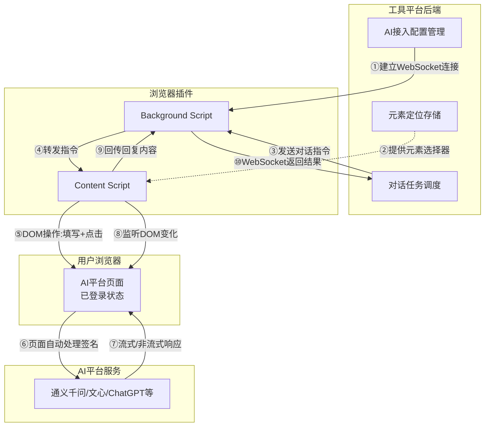
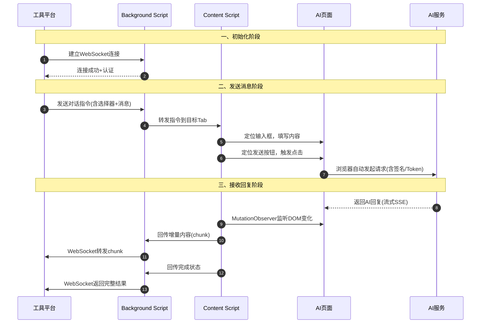
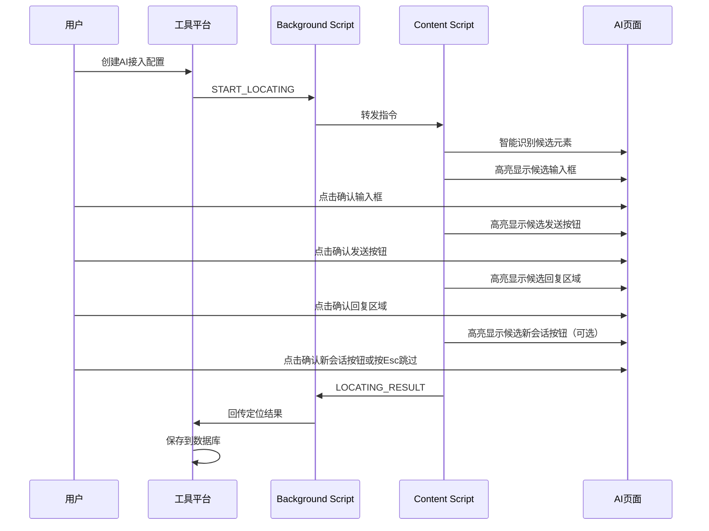
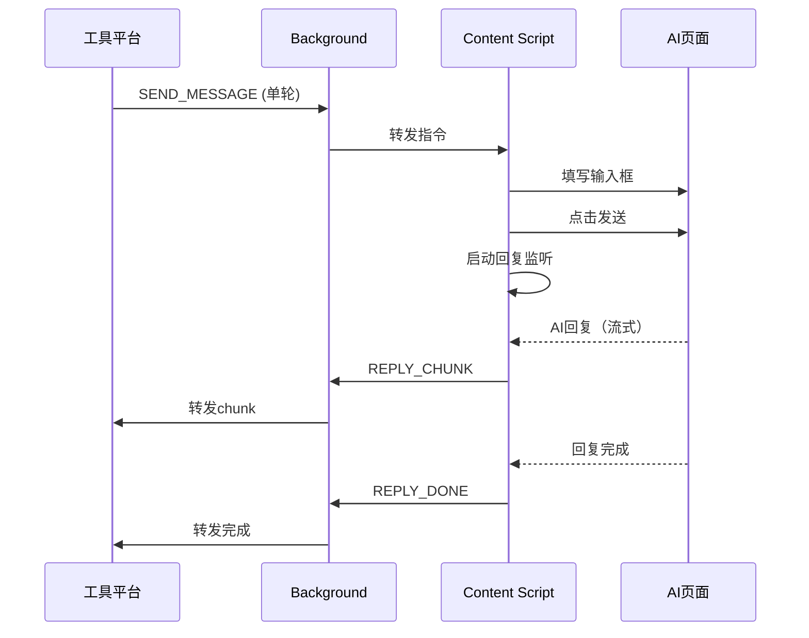

# SFRD-TS-03-1.4_V2.0_浏览器插件AI接入模块微型设计说明书

## 目录

- [1. 介绍](#1-介绍)
  - [1.1. 目的](#11-目的)
  - [1.2. 定义和缩写](#12-定义和缩写)
  - [1.3. 参考和引用](#13-参考和引用)
- [2. 模块方案概述](#2-模块方案概述)
- [3. 模块详细设计](#3-模块详细设计)
  - [3.1. 插件核心架构子模块](#31-插件核心架构子模块)
  - [3.2. 元素定位确认子模块](#32-元素定位确认子模块)
  - [3.3. 消息发送子模块](#33-消息发送子模块)
  - [3.4. 回复监听子模块](#34-回复监听子模块)
  - [3.5. 工具平台通信子模块](#35-工具平台通信子模块)
  - [3.6. 单轮对话子模块](#36-单轮对话子模块)
  - [3.7. 多轮对话子模块](#37-多轮对话子模块)
- [4. 关联分析](#4-关联分析)
- [5. 可靠性设计 (FMEA)](#5-可靠性设计-fmea)
- [6. 变更控制](#6-变更控制)
  - [6.1. 变更列表](#61-变更列表)
- [7. 修订记录](#7-修订记录)

---

## 1. 介绍

### 1.1. 目的

本说明书描述"浏览器插件AI接入模块"的微型设计方案，用于替代原有的"纯CDP执行"方案。

**核心目标**：
- 实现"一次开发，支持多种AI平台接入"的能力
- 通过浏览器插件借用用户已登录的浏览器会话，与各类AI平台进行对话
- 无需了解各平台API细节（签名、Token等），由浏览器页面自身处理

**目标受众**：开发人员、测试人员、架构师

### 1.2. 定义和缩写

| 术语 | 定义 |
| :--- | :--- |
| 浏览器插件 | Chrome Extension，运行在用户浏览器中的扩展程序 |
| Content Script | 插件注入到目标页面的脚本，可访问页面DOM |
| Background Script | 插件后台服务脚本，负责与工具平台通信 |
| 元素定位 | 确定页面中输入框、发送按钮、回复区域的DOM选择器 |
| 新会话按钮 | 创建新对话的页面元素（createChat，可选定位） |
| 受控组件 | React/Vue等框架中，值由状态管理的输入组件 |
| 流式响应 | AI回复以流的形式逐字/逐块返回 |
| StartNewChat | 单轮隔离开关，要求先触发新会话再发送消息 |
| 工具平台 | 接入本SDK的AI安全评估工具后端服务 |

### 1.3. 参考和引用

1. 原CDP纯执行模块设计：`/Users/jahan/Documents/SFRD-TS-03-1.4_V1.0_CDP纯执行模块微型设计说明书.md`
2. Chrome Extension API：`https://developer.chrome.com/docs/extensions/`
3. 现有SDK代码：`github.com/Michaelxwb/ai-api-sdk`

---

## 2. 模块方案概述

### 核心问题

原CDP纯执行方案存在以下问题：
1. **动态参数问题**：网页版AI平台（如通义千问）需要复杂的动态参数（ut、req_id、签名等），SDK无法通用生成
2. **适配成本问题**：DOM操作方案需要为每个平台编写适配器，维护成本高
3. **通用性问题**：无法做到"一次开发，多平台支持"

### 解决方案

采用"浏览器插件 + 元素定位确认"方案：
- 用户首次接入某AI平台时，通过插件确认输入框和发送按钮的位置
- 工具平台保存定位信息，后续通过插件自动操作页面进行对话
- 签名、Token等由浏览器页面自身处理，SDK无需关心

### 架构图



### 交互时序图



### 方案选型

| 方案 | 特点 | 优点 | 缺点 | 选择结论 |
|---|---|---|---|---|
| 纯CDP构造请求 | SDK构造完整HTTP请求 | 实现简单 | 无法处理动态签名，不通用 | 不选 |
| CDP DOM操作 | 通过CDP操作页面DOM | 控制精确 | 每平台需要适配器 | 不选 |
| **浏览器插件** | 插件操作DOM+用户确认定位 | 一次开发多平台支持 | 需用户安装插件 | **选择** |
| 只支持API平台 | 放弃网页版AI | 最稳定 | 覆盖面不足 | 不选 |

**选择理由**：浏览器插件方案可以在用户首次接入时通过简单确认完成元素定位，后续自动执行，实现"一次开发，多平台支持"的目标。

---

## 3. 模块详细设计

### 3.1. 插件核心架构子模块

**功能描述**
- 定义浏览器插件的整体架构，包括 Background Script 和 Content Script 的职责划分
- 建立插件与工具平台之间的通信通道

**输入和输出**
- 输入：工具平台WebSocket连接地址、用户认证Token
- 输出：已建立的双向通信通道

**内部逻辑**

```
1. 插件启动时，Background Script 初始化
2. 连接工具平台 WebSocket 服务
3. 监听来自工具平台的指令
4. 根据指令类型，向对应 Tab 的 Content Script 转发
5. 接收 Content Script 的执行结果，回传工具平台
```

**数据结构（TypeScript）**

```typescript
// 插件配置
interface PluginConfig {
  wsEndpoint: string;      // WebSocket服务地址
  authToken: string;       // 认证Token
  heartbeatInterval: number; // 心跳间隔（毫秒）
}

// 通信消息基础结构
interface Message {
  id: string;              // 消息ID，用于请求-响应匹配
  type: MessageType;       // 消息类型
  timestamp: number;       // 时间戳
}

enum MessageType {
  // 工具平台 → 插件
  START_LOCATING = 'start_locating',   // 开始元素定位
  SEND_MESSAGE = 'send_message',       // 发送消息
  STOP_GENERATION = 'stop_generation', // 停止生成

  // 插件 → 工具平台
  LOCATING_RESULT = 'locating_result', // 定位结果
  REPLY_CHUNK = 'reply_chunk',         // 回复片段（流式）
  REPLY_DONE = 'reply_done',           // 回复完成
  ERROR = 'error',                     // 错误
}
```

**接口设计**

```typescript
// Background Script 核心接口
interface BackgroundService {
  connect(config: PluginConfig): Promise<void>;
  disconnect(): void;
  sendToServer(message: Message): void;
  forwardToContent(tabId: number, message: Message): void;
}

// Content Script 核心接口
interface ContentService {
  initialize(): void;
  handleCommand(message: Message): Promise<any>;
  reportToBackground(message: Message): void;
}
```

**配置项**

| 配置键 | 默认值 | 说明 |
| :--- | :--- | :--- |
| ws.endpoint | - | WebSocket服务地址（必填） |
| ws.reconnect_interval | 5000 | 断线重连间隔（毫秒） |
| ws.heartbeat_interval | 30000 | 心跳间隔（毫秒） |

**异常处理**
- WebSocket连接失败：自动重连，指数退避
- Tab不存在或已关闭：返回错误，提示用户重新打开页面
- Content Script未注入：自动注入或提示用户刷新页面

---

### 3.2. 元素定位确认子模块

**功能描述**
- 在用户首次接入某AI平台时，辅助用户确认输入框、发送按钮、回复区域的位置
- 支持智能识别 + 用户手动确认两种模式
- 将确认后的定位信息保存到工具平台

**输入和输出**
- 输入：目标页面URL、用户操作（点击确认）
- 输出：ElementLocators（包含输入框、发送按钮、回复区域的选择器）

**内部逻辑**

```
1. 用户在工具平台发起"接入配置"
2. 工具平台向插件发送 START_LOCATING 指令
3. Content Script 进入定位模式：
   a. 智能识别候选元素（输入框、按钮）
   b. 高亮显示候选元素，提示用户确认
   c. 用户点击确认或手动选择
4. 用户依次确认：输入框 → 发送按钮 → 回复区域 → （可选）新会话按钮
5. Content Script 生成稳定的选择器
6. 回传定位结果到工具平台保存
```



**数据结构（TypeScript）**

```typescript
// 元素定位结果
interface ElementLocators {
  input: ElementLocator;       // 输入框
  sendButton: ElementLocator;  // 发送按钮
  replyArea: ElementLocator;   // 回复区域
  createChat?: ElementLocator; // 新会话按钮（可选）
  platformUrl: string;         // 平台URL模式
  createdAt: number;           // 创建时间
}

interface ElementLocator {
  selector: string;           // CSS选择器
  xpath?: string;             // XPath（备用）
  type: ElementType;          // 元素类型
  attributes: Record<string, string>; // 关键属性快照
  confidence: number;         // 置信度 0-1
}

enum ElementType {
  TEXTAREA = 'textarea',
  INPUT = 'input',
  CONTENTEDITABLE = 'contenteditable',
  BUTTON = 'button',
  DIV = 'div',
}

// 定位指令
interface StartLocatingCommand extends Message {
  type: MessageType.START_LOCATING;
  payload: {
    configId: string;         // 接入配置ID
    platformUrl: string;      // 平台URL
  };
}

// 定位结果
interface LocatingResultMessage extends Message {
  type: MessageType.LOCATING_RESULT;
  payload: {
    configId: string;
    success: boolean;
    locators?: ElementLocators;
    error?: string;
  };
}
```

**接口设计**

```typescript
// 元素定位服务
interface ElementLocatingService {
  // 开始定位流程
  startLocating(configId: string): void;

  // 智能识别候选元素
  detectCandidates(type: 'input' | 'button' | 'reply' | 'create'): HTMLElement[];

  // 高亮元素
  highlightElement(element: HTMLElement, label: string): void;

  // 生成稳定选择器
  generateSelector(element: HTMLElement): ElementLocator;

  // 用户确认（createChat 可选）
  confirmElement(element: HTMLElement, type: string, optional?: boolean): void;

  // 完成定位
  finishLocating(): ElementLocators;
}
```

**智能识别规则**

```typescript
// 输入框识别规则
const INPUT_RULES = [
  { selector: 'textarea', weight: 10 },
  { selector: '[contenteditable="true"]', weight: 9 },
  { selector: 'input[type="text"]', weight: 8 },
  { selector: '[role="textbox"]', weight: 7 },
  // 位置权重：底部 +3，大尺寸 +2
  // 上下文权重：附近有按钮 +2
];

// 发送按钮识别规则
const BUTTON_RULES = [
  { selector: 'button[type="submit"]', weight: 10 },
  { selector: '[role="button"]', weight: 8 },
  { selector: 'button', weight: 7 },
  // 文本匹配：包含"发送"|"Send"|箭头图标 +5
  // 位置权重：输入框附近 +3
];

// 回复区域识别规则
const REPLY_RULES = [
  { selector: '[role="log"]', weight: 10 },
  { selector: '[aria-live]', weight: 8 },
  { selector: '.message-list', weight: 7 },
  // 位置权重：页面主体区域 +3
  // 动态内容：有子元素变化 +5
];

// 新会话按钮识别规则（可选）
const CREATE_CHAT_RULES = [
  { selector: 'button[aria-label*="新对话"]', weight: 12 },
  { selector: 'button[aria-label*="新建"]', weight: 11 },
  { selector: 'button[aria-label*="new chat"]', weight: 11 },
  { selector: '[data-testid*="new-chat"]', weight: 10 },
  { selector: '[role="button"]', weight: 7 },
  { selector: 'button', weight: 6 },
];
```

**配置项**

| 配置键 | 默认值 | 说明 |
| :--- | :--- | :--- |
| locating.highlight_color | #4f6ef7 | 高亮颜色 |
| locating.highlight_duration | 0 | 高亮持续时间（0=持续到确认） |
| locating.auto_confirm_threshold | 1.1 | 自动确认置信度阈值（默认禁用自动确认） |

**异常处理**
- 无法识别候选元素：提示用户手动点击选择
- 用户选择了错误元素：允许重新选择
- 页面结构复杂（iframe/Shadow DOM）：尝试穿透或提示不支持

---

### 3.3. 消息发送子模块

**功能描述**
- 将用户输入的消息填写到AI平台的输入框中
- 触发发送操作（点击按钮或模拟回车）
- 处理React/Vue等框架的受控组件

**输入和输出**
- 输入：SendMessageCommand（包含消息内容和元素定位信息）
- 输出：发送成功/失败状态

**内部逻辑**

```
1. 接收发送指令，提取消息内容和选择器
2. 若 `startNewChat=true` 且存在 `createChat`：先点击新会话按钮
3. 等待新会话就绪（URL变化 / 输入框清空 / 回复区域变化）
4. 定位输入框元素（必要时向上查找 contenteditable 宿主）
5. 清空输入框现有内容
6. 填写新内容（处理受控组件）
7. 等待内容生效（框架状态更新）
8. 定位发送按钮
9. 触发发送（点击或回车）
10. 返回发送状态
```

**数据结构（TypeScript）**

```typescript
// 发送消息指令
interface SendMessageCommand extends Message {
  type: MessageType.SEND_MESSAGE;
  payload: {
    configId: string;
    sessionId?: string;       // 多轮对话会话ID
    text: string;             // 消息内容
    locators: ElementLocators; // 元素定位信息
    startNewChat?: boolean;   // 是否强制开启新会话（单轮隔离）
    stream?: boolean;         // 是否流式回传
    tabId?: number;           // 指定Tab（可选）
  };
}

// 发送结果
interface SendResult {
  success: boolean;
  error?: string;
  timestamp: number;
}
```

**接口设计**

```typescript
// 消息发送服务
interface MessageSendService {
  // 发送消息
  sendMessage(command: SendMessageCommand): Promise<SendResult>;

  // 设置输入框值（处理受控组件）
  setInputValue(element: HTMLElement, text: string): void;

  // 触发发送
  triggerSend(buttonElement: HTMLElement): void;

  // 检查是否可以发送（如：上一条还在生成中）
  canSend(): boolean;
}
```

**实现要点**
- `startNewChat=true` 时优先点击 `createChat`，等待 URL/输入框/回复区变化后再写入文本。
- 发送后通过输入框清空、按钮禁用、回复区变化等信号判断是否发送成功。
- 输入框为 `contenteditable` 时优先定位到宿主节点，避免对子节点操作导致重复内容。
- 发送按钮不可用时，触发输入事件或逐字输入作为兜底。

**核心实现（受控组件处理）**

```typescript
// 定位可编辑宿主（避免定位到子节点）
function resolveEditableElement(element: HTMLElement): HTMLElement {
  if (element instanceof HTMLTextAreaElement || element instanceof HTMLInputElement) return element;
  if (element.isContentEditable) return element;
  return element.closest('[contenteditable="true"],[contenteditable="plaintext-only"]') as HTMLElement || element;
}

// 设置受控组件的值（兼容 React/Vue）
function setControlledValue(element: HTMLElement, text: string): void {
  if (element instanceof HTMLTextAreaElement || element instanceof HTMLInputElement) {
    const descriptor = Object.getOwnPropertyDescriptor(Object.getPrototypeOf(element), 'value');
    descriptor?.set?.call(element, text);
    element.dispatchEvent(new Event('input', { bubbles: true }));
    element.dispatchEvent(new Event('change', { bubbles: true }));
    return;
  }

  if (element.isContentEditable) {
    element.focus();
    document.execCommand('selectAll', false);
    // 优先使用 execCommand / paste，让框架感知
    if (!document.execCommand('insertText', false, text)) {
      element.textContent = text;
      element.dispatchEvent(new Event('input', { bubbles: true }));
    }
  }
}

// 触发发送（点击按钮或回车）
function triggerSend(buttonElement: HTMLElement, inputElement?: HTMLElement): void {
  buttonElement.click();
  if (inputElement) {
    const enter = new KeyboardEvent('keydown', { key: 'Enter', code: 'Enter', bubbles: true });
    inputElement.dispatchEvent(enter);
  }
}
```

**配置项**

| 配置键 | 默认值 | 说明 |
| :--- | :--- | :--- |
| send.input_delay | 100 | 填写内容后等待时间（毫秒） |
| send.click_delay | 50 | 点击前等待时间（毫秒） |
| send.retry_count | 3 | 发送失败重试次数 |

**异常处理**
- 输入框不存在：返回错误，可能需要重新定位
- 输入框被禁用：等待可用或返回错误
- 发送按钮不可点击：检查是否有遮挡或禁用状态
- 上一条消息还在生成：等待完成或返回繁忙状态

---

### 3.4. 回复监听子模块

**功能描述**
- 监听AI平台的回复内容
- 支持流式响应（逐字/逐块返回）和非流式响应
- 实时回传回复内容到工具平台

**输入和输出**
- 输入：回复区域定位信息、监听配置
- 输出：回复内容（流式：多个chunk；非流式：完整内容）

**内部逻辑**

```
1. 消息发送后，开始监听回复
2. 使用双通道监听：
   a. DOM监听：MutationObserver监听回复区域变化
   b. 轮询兜底：定时检查内容变化
3. 流式响应处理：
   a. 检测新增内容
   b. 计算增量（与上次内容对比）
   c. 回传增量到工具平台
4. 检测回复完成：
   a. 内容停止变化一段时间
   b. 出现完成标记（如"停止生成"按钮消失）
5. 回传完成状态和完整内容

**实现要点**
- 回复文本提取优先选择更高层容器（避免只取到最后一段子节点）。
- 若 `replyArea` 本身命中选择器，会加入候选并过滤掉被包含的子节点。
- DOM监听失败时，轮询兜底保证完成回调。
```

**数据结构（TypeScript）**

```typescript
// 回复监听配置
interface ReplyListenerConfig {
  replyAreaSelector: string;  // 回复区域选择器
  streamMode: boolean;        // 是否流式模式
  chunkInterval: number;      // 流式回传间隔（毫秒）
  completeTimeout: number;    // 完成检测超时（毫秒）
  maxWaitTime: number;        // 最大等待时间（毫秒）
}

// 回复片段（流式）
interface ReplyChunkMessage extends Message {
  type: MessageType.REPLY_CHUNK;
  payload: {
    configId: string;
    sessionId: string;
    chunk: string;            // 增量内容
    fullText: string;         // 当前完整内容
    isFirst: boolean;         // 是否首个片段
  };
}

// 回复完成
interface ReplyDoneMessage extends Message {
  type: MessageType.REPLY_DONE;
  payload: {
    configId: string;
    sessionId: string;
    fullText: string;         // 完整回复内容
    duration: number;         // 生成耗时（毫秒）
  };
}
```

**接口设计**

```typescript
// 回复监听服务
interface ReplyListenerService {
  // 开始监听
  startListening(config: ReplyListenerConfig): void;

  // 停止监听
  stopListening(): void;

  // 获取当前回复内容
  getCurrentReply(): string;

  // 检查是否还在生成
  isGenerating(): boolean;

  // 注册回调
  onChunk(callback: (chunk: string, fullText: string) => void): void;
  onComplete(callback: (fullText: string) => void): void;
}
```

**核心实现**

```typescript
class ReplyListener implements ReplyListenerService {
  private observer: MutationObserver | null = null;
  private lastContent: string = '';
  private completeTimer: number | null = null;

  startListening(config: ReplyListenerConfig): void {
    const replyArea = document.querySelector(config.replyAreaSelector);
    if (!replyArea) {
      throw new Error('Reply area not found');
    }

    // 方式1：DOM变化监听
    this.observer = new MutationObserver((mutations) => {
      const currentContent = this.extractReplyContent(replyArea);

      if (currentContent !== this.lastContent) {
        // 计算增量
        const chunk = this.computeDelta(this.lastContent, currentContent);
        this.lastContent = currentContent;

        // 回传增量
        this.onChunkCallback?.(chunk, currentContent);

        // 重置完成检测定时器
        this.resetCompleteTimer(config.completeTimeout);
      }
    });

    this.observer.observe(replyArea, {
      childList: true,
      subtree: true,
      characterData: true,
    });

    // 轮询兜底：防止MutationObserver失效
  }

  private computeDelta(oldText: string, newText: string): string {
    // 简单策略：如果新内容以旧内容开头，返回增量
    if (newText.startsWith(oldText)) {
      return newText.slice(oldText.length);
    }
    // 否则返回完整新内容
    return newText;
  }

  private extractReplyContent(replyArea: Element): string {
    // 获取最后一条AI回复的文本内容
    const messages = replyArea.querySelectorAll('[data-role="assistant"], .ai-message');
    const lastMessage = messages[messages.length - 1];
    return lastMessage?.textContent || '';
  }
}
```

**配置项**

| 配置键 | 默认值 | 说明 |
| :--- | :--- | :--- |
| reply.chunk_interval | 100 | 流式回传间隔（毫秒） |
| reply.complete_timeout | 3000 | 内容停止变化后判定完成的超时（毫秒） |
| reply.max_wait_time | 85000 | 最大等待时间（毫秒） |

**异常处理**
- 回复区域不存在：返回错误，可能需要重新定位
- 监听超时：返回当前已获取的内容 + 超时标记
- 网络Hook失败：降级为纯DOM监听

---

### 3.5. 工具平台通信子模块

**功能描述**
- 建立和维护插件与工具平台之间的WebSocket连接
- 处理消息的序列化、反序列化
- 实现心跳机制和断线重连

**输入和输出**
- 输入：工具平台地址、认证信息
- 输出：稳定的双向通信通道

**内部逻辑**

```
1. 插件启动时，尝试连接工具平台WebSocket
2. 连接成功后，发送认证信息
3. 启动心跳定时器
4. 监听消息，根据类型分发处理
   - 优先按 `tabId` 精确路由
   - 其次按 `platformUrl` 匹配已有Tab
   - 都没有则回退到最近活跃Tab
5. 连接断开时，自动重连（指数退避）
```

**数据结构（TypeScript）**

```typescript
// WebSocket连接状态
enum ConnectionState {
  DISCONNECTED = 'disconnected',
  CONNECTING = 'connecting',
  CONNECTED = 'connected',
  AUTHENTICATED = 'authenticated',
}

// 认证消息
interface AuthMessage extends Message {
  type: 'auth';
  payload: {
    token: string;
    pluginVersion: string;
    browserInfo: string;
  };
}

// 心跳消息
interface HeartbeatMessage extends Message {
  type: 'heartbeat';
  payload: {
    timestamp: number;
    activeTabsCount: number;
  };
}
```

**接口设计**

```typescript
// 通信服务
interface CommunicationService {
  // 连接
  connect(endpoint: string, token: string): Promise<void>;

  // 断开
  disconnect(): void;

  // 发送消息
  send(message: Message): void;

  // 注册消息处理器
  onMessage(type: MessageType, handler: (message: Message) => void): void;

  // 获取连接状态
  getState(): ConnectionState;
}
```

**配置项**

| 配置键 | 默认值 | 说明 |
| :--- | :--- | :--- |
| ws.reconnect_interval | 5000 | 初始重连间隔（毫秒） |
| ws.max_reconnect_interval | 60000 | 最大重连间隔（毫秒） |
| ws.heartbeat_interval | 30000 | 心跳间隔（毫秒） |
| ws.heartbeat_timeout | 10000 | 心跳超时（毫秒） |

**异常处理**
- 连接失败：自动重连，指数退避
- 认证失败：提示用户检查配置
- 心跳超时：主动断开并重连

---

### 3.6. 单轮对话子模块

**功能描述**
- 执行单轮对话：发送一条消息，获取AI回复
- 整合消息发送和回复监听流程

**输入和输出**
- 输入：SingleTurnRequest（消息内容、接入配置）
- 输出：SingleTurnResponse（AI回复内容）

**内部逻辑**

```
1. 接收单轮对话请求
2. 从配置中获取元素定位信息
3. 若 `startNewChat=true`：优先点击新会话按钮（createChat）并等待就绪
4. 调用消息发送子模块发送消息
5. 调用回复监听子模块等待回复
6. 回复完成后，返回结果
```



**数据结构（TypeScript）**

```typescript
// 单轮对话请求
interface SingleTurnRequest {
  configId: string;           // 接入配置ID
  text: string;               // 用户消息
  streamCallback?: boolean;   // 是否需要流式回调
  startNewChat?: boolean;     // 是否强制新会话（单轮隔离）
  timeout?: number;           // 超时时间
}

// 单轮对话响应
interface SingleTurnResponse {
  success: boolean;
  reply?: string;             // AI回复内容
  duration?: number;          // 耗时（毫秒）
  error?: string;
}
```

**说明**
- `sessionId` 仅用于工具平台侧的请求关联，页面本身不会识别该字段。
- 单轮隔离请使用 `startNewChat=true`，而不是依赖 `sessionId`。

**接口设计**

```typescript
// 单轮对话服务
interface SingleTurnService {
  // 执行单轮对话
  execute(request: SingleTurnRequest): Promise<SingleTurnResponse>;

  // 执行单轮对话（流式）
  executeStream(
    request: SingleTurnRequest,
    onChunk: (chunk: string) => void
  ): Promise<SingleTurnResponse>;
}
```

**配置项**

| 配置键 | 默认值 | 说明 |
| :--- | :--- | :--- |
| single_turn.default_timeout | 120000 | 默认超时时间（毫秒） |

**异常处理**
- 发送失败：返回错误
- 回复超时：返回已获取的部分内容 + 超时标记
- 页面状态异常：返回错误，建议重试

---

### 3.7. 多轮对话子模块

**功能描述**
- 执行多轮对话：在同一会话中进行多次问答
- 管理会话状态，确保对话连续性
- 支持队列化：等待上一轮完成后再发送下一轮

**输入和输出**
- 输入：MultiTurnRequest（会话ID、消息内容、接入配置）
- 输出：MultiTurnResponse（AI回复内容、会话状态）

**内部逻辑**

```
1. 接收多轮对话请求
2. 检查会话状态：
   a. 如果上一轮还在进行，加入等待队列
   b. 如果已完成，继续执行
3. 确保在同一浏览器Tab中操作（同一 `configId`）
4. **不启用 `startNewChat`**，保持上下文连续
5. 调用消息发送子模块发送消息
6. 调用回复监听子模块等待回复
7. 更新会话状态
8. 处理等待队列中的下一条消息
```

**数据结构（TypeScript）**

```typescript
// 会话状态
interface SessionState {
  sessionId: string;
  configId: string;
  tabId: number;              // 浏览器Tab ID
  status: SessionStatus;
  messageCount: number;       // 已发送消息数
  lastActiveTime: number;
}

enum SessionStatus {
  IDLE = 'idle',              // 空闲
  SENDING = 'sending',        // 发送中
  WAITING = 'waiting',        // 等待回复中
  GENERATING = 'generating',  // AI生成中
}

// 多轮对话请求
interface MultiTurnRequest {
  configId: string;
  sessionId: string;          // 会话ID（首次可为空，由系统生成）
  text: string;
  streamCallback?: boolean;
  startNewChat?: boolean;     // 多轮应为 false
  timeout?: number;
}

// 多轮对话响应
interface MultiTurnResponse {
  success: boolean;
  sessionId: string;
  reply?: string;
  messageIndex: number;       // 第几轮对话
  duration?: number;
  error?: string;
}

// 消息队列项
interface QueueItem {
  request: MultiTurnRequest;
  resolve: (response: MultiTurnResponse) => void;
  reject: (error: Error) => void;
}
```

**接口设计**

```typescript
// 多轮对话服务
interface MultiTurnService {
  // 执行多轮对话
  execute(request: MultiTurnRequest): Promise<MultiTurnResponse>;

  // 执行多轮对话（流式）
  executeStream(
    request: MultiTurnRequest,
    onChunk: (chunk: string) => void
  ): Promise<MultiTurnResponse>;

  // 获取会话状态
  getSessionState(sessionId: string): SessionState | null;

  // 结束会话
  endSession(sessionId: string): void;
}
```

**核心实现**

```typescript
class MultiTurnManager implements MultiTurnService {
  private sessions: Map<string, SessionState> = new Map();
  private queues: Map<string, QueueItem[]> = new Map();

  async execute(request: MultiTurnRequest): Promise<MultiTurnResponse> {
    const sessionId = request.sessionId || this.generateSessionId();
    let session = this.sessions.get(sessionId);

    // 初始化会话
    if (!session) {
      session = {
        sessionId,
        configId: request.configId,
        tabId: await this.findOrCreateTab(request.configId),
        status: SessionStatus.IDLE,
        messageCount: 0,
        lastActiveTime: Date.now(),
      };
      this.sessions.set(sessionId, session);
    }

    // 如果会话繁忙，加入队列
    if (session.status !== SessionStatus.IDLE) {
      return this.enqueue(sessionId, request);
    }

    // 执行对话
    return this.doExecute(session, request);
  }

  private async doExecute(
    session: SessionState,
    request: MultiTurnRequest
  ): Promise<MultiTurnResponse> {
    try {
      session.status = SessionStatus.SENDING;

      // 发送消息
      const sendResult = await this.sendMessage(session, request.text);
      if (!sendResult.success) {
        throw new Error(sendResult.error);
      }

      session.status = SessionStatus.GENERATING;

      // 等待回复
      const reply = await this.waitForReply(session, request.timeout);

      session.messageCount++;
      session.status = SessionStatus.IDLE;
      session.lastActiveTime = Date.now();

      // 处理队列中的下一条
      this.processQueue(session.sessionId);

      return {
        success: true,
        sessionId: session.sessionId,
        reply: reply.text,
        messageIndex: session.messageCount,
        duration: reply.duration,
      };

    } catch (error) {
      session.status = SessionStatus.IDLE;
      throw error;
    }
  }

  private enqueue(sessionId: string, request: MultiTurnRequest): Promise<MultiTurnResponse> {
    return new Promise((resolve, reject) => {
      const queue = this.queues.get(sessionId) || [];
      queue.push({ request, resolve, reject });
      this.queues.set(sessionId, queue);
    });
  }

  private processQueue(sessionId: string): void {
    const queue = this.queues.get(sessionId);
    if (!queue || queue.length === 0) return;

    const item = queue.shift()!;
    const session = this.sessions.get(sessionId)!;

    this.doExecute(session, item.request)
      .then(item.resolve)
      .catch(item.reject);
  }
}
```

**配置项**

| 配置键 | 默认值 | 说明 |
| :--- | :--- | :--- |
| multi_turn.session_timeout | 1800000 | 会话超时时间（毫秒，30分钟） |
| multi_turn.max_queue_size | 100 | 最大队列长度 |
| multi_turn.queue_timeout | 300000 | 队列等待超时（毫秒，5分钟） |

**异常处理**
- 会话超时：自动清理会话状态
- 队列溢出：拒绝新请求
- Tab被关闭：尝试重新打开或返回错误

---

## 4. 关联分析

### 性能影响
- 插件运行在用户浏览器中，对工具平台服务器无额外负担
- DOM操作和网络监听可能略微影响浏览器性能，但在可接受范围内
- WebSocket长连接占用少量内存和网络资源

### 兼容性
- 支持Chrome/Edge等Chromium内核浏览器
- 需要用户手动安装插件
- 与现有SDK的标准API Provider（OpenAI/Claude/Dify等）互不影响

### 安全性
- 插件只在用户主动配置的AI平台页面上工作
- 不收集用户敏感信息，对话内容仅在本地和工具平台之间传输
- WebSocket通信应使用wss加密

### 可观测性
- 插件侧记录关键操作日志（发送、接收、错误）
- 工具平台侧记录对话记录和统计数据
- 支持错误上报和诊断

---

## 5. 可靠性设计 (FMEA)

| 失效模式 | 失效影响 | 失效原因 | 风险分析(S:严重度 O:概率 D:检测度 AP:优先级) | 技术改进(措施/效果) |
|---|---|---|---|---|
| WebSocket连接断开 | 无法发送/接收消息 | 网络抖动、服务器重启 | **S**: 7<br>**O**: 4<br>**D**: 2<br>**AP**: High | **措施**：自动重连+指数退避<br>**效果**：提升可用性 |
| 元素定位失效 | 无法填写输入或点击发送 | AI平台改版、DOM结构变化 | **S**: 8<br>**O**: 3<br>**D**: 4<br>**AP**: High | **措施**：检测失败时提示用户重新定位<br>**效果**：快速恢复 |
| 新会话按钮缺失 | 单轮隔离失败或发送前阻塞 | 未配置createChat或按钮变化 | **S**: 6<br>**O**: 3<br>**D**: 4<br>**AP**: Med | **措施**：createChat设为可选，失败可回退不新建；提示重新定位<br>**效果**：减少中断 |
| 回复监听超时 | 无法获取AI回复 | 网络慢、AI响应慢、监听器失效 | **S**: 6<br>**O**: 3<br>**D**: 3<br>**AP**: Med | **措施**：设置合理超时+返回部分内容<br>**效果**：降低数据丢失 |
| 受控组件填写失败 | 消息无法发送 | 框架版本变化、特殊输入组件 | **S**: 7<br>**O**: 2<br>**D**: 5<br>**AP**: Med | **措施**：多种填写策略+降级方案<br>**效果**：提升兼容性 |
| 浏览器Tab被关闭 | 会话中断 | 用户误操作 | **S**: 5<br>**O**: 3<br>**D**: 2<br>**AP**: Low | **措施**：检测Tab状态+提示用户<br>**效果**：及时发现问题 |
| 多轮对话状态混乱 | 消息顺序错误 | 并发请求、队列处理异常 | **S**: 6<br>**O**: 2<br>**D**: 4<br>**AP**: Med | **措施**：严格队列化+状态机管理<br>**效果**：保证顺序 |

---

## 6. 变更控制

### 6.1. 变更列表

| 变更章节 | 变更内容 | 变更原因 | 变更对老功能、原有设计的影响 |
|---|---|---|---|
| 全文 | 新设计，替代原CDP纯执行方案 | 原方案无法处理动态签名，不通用 | 废弃原CDP执行方案，采用浏览器插件方案 |

---

## 7. 修订记录

| 修订版本号 | 作者 | 日期 | 简要说明 |
|---|---|---|---|
| V2.0 | - | 2026-02-06 | 初始版本，浏览器插件AI接入方案 |
| V2.1 | - | 2026-02-07 | 对齐当前实现：新增createChat/startNewChat、路由规则与流式细节 |
