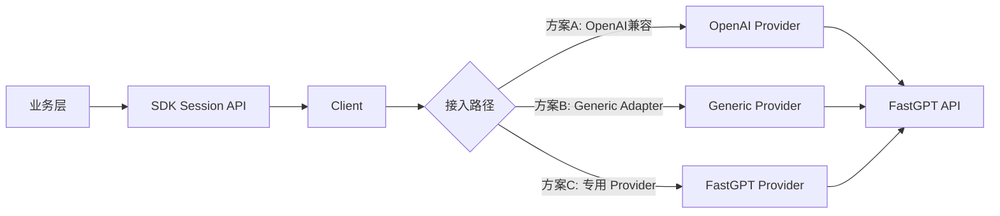

# SFRD-TS-03-1.4_V1.0_FastGPT对话接入模块微型设计说明书

## 目录

- [1. 介绍](#1-介绍)
  - [1.1. 目的](#11-目的)
  - [1.2. 定义和缩写](#12-定义和缩写)
  - [1.3. 参考和引用](#13-参考和引用)
- [2. 模块方案概述](#2-模块方案概述)
  - [2.1. 核心问题](#21-核心问题)
  - [2.2. 解决方案](#22-解决方案)
  - [2.3. 架构图](#23-架构图)
  - [2.4. 方案选型](#24-方案选型)
- [3. 模块详细设计](#3-模块详细设计)
  - [3.1. ProviderSpec 设计](#31-providerspec-设计)
  - [3.2. ProviderStreamSpec 设计](#32-providerstreamspec-设计)
  - [3.3. 配置项映射](#33-配置项映射)
  - [3.4. 错误前缀与异常处理](#34-错误前缀与异常处理)
- [4. 关联分析](#4-关联分析)
- [5. 可靠性设计 (FMEA)](#5-可靠性设计-fmea)
- [6. 变更控制](#6-变更控制)
  - [6.1. 变更列表](#61-变更列表)
- [7. 修订记录](#7-修订记录)

---

# 1. 介绍

## 1.1. 目的

本文档评估 FastGPT 对话接口接入 SDK 的可行方案，并给出设计说明书草案，供 SDK 开发者、测试人员与架构师评审与落地。

**核心目标**：
- 基于现有 SDK Provider 体系评估三种接入路径
- 在最小改动与可维护性之间取得平衡（KISS/YAGNI）
- 给出配置映射与流式处理的落地建议

**目标受众**：SDK 开发者、测试人员、架构师

## 1.2. 定义和缩写

| 术语 | 定义 |
|:---|:---|
| FastGPT | 目标对话平台，提供 OpenAPI 风格的对话接口（兼容 OpenAI chat/completions） |
| ProviderSpec | SDK 适配器接口，负责 BuildRequest/ParseResponse/AuthStrategyOverride |
| ProviderStreamSpec | SDK 流式解析接口，负责 SSE/NDJSON 解析 |
| Generic Adapter | SDK 通用接入模块，通过 JSONPath/extra_body 模板驱动请求与解析 |
| OpenAI 兼容 | 与 OpenAI `/v1/chat/completions` 兼容的请求/响应行为 |

## 1.3. 参考和引用

1. FastGPT 对话接口文档：`https://doc.fastgpt.io/zh-CN/docs/openapi/chat`
2. 模板：`/Users/jahan/Documents/SFRD-TS-03-1.4_XX版本XXX模块微型设计说明书.md`
3. 设计参考：`docs/internal/design-generic-adapter-integration.md`
4. 设计参考：`docs/internal/design-session-unified-architecture.md`
5. 设计参考：`docs/internal/design-browser-plugin-integration.md`

---

# 2. 模块方案概述

## 2.1. 核心问题

当前 SDK 需评估接入 FastGPT 的最小成本方案，但存在以下差异与约束：

1. **接口兼容性存在差异**：文档标注“对话接口兼容 GPT 接口”，但部分字段与行为不同（如 `model/temperature` 无效）。
2. **鉴权方式已确认**：`Authorization: Bearer fastgpt-xxxxxx`，API Key 为应用级 key。
3. **流式规范已确认**：SSE `data:` 行，event 取值包含 `answer/fastAnswer/toolCall/toolParams/toolResponse/flowNodeStatus/flowResponses/updateVariables/error`。
4. **会话模式需兼容**：支持 `local_history` 与 `remote_session`，二者均可由外部传入；`local_history` 由 SDK 初始化本地 SessionID 用于 SessionStore 维护，不传 `chatId`，且需拼接完整历史对话；`remote_session` 由 SDK 初始化本地 SessionID 用于本地维护，同时将该 SessionID 传入 `chatId`，不拼接历史对话（由服务端维护）；字段名按 FastGPT 文档透传。
5. **错误格式不统一**：未见统一错误结构，仅有 `event=error` 事件。

## 2.2. 解决方案

在不引入过度复杂度的前提下，提出三种可选接入路径：

- **方案 A：直接复用 OpenAI 兼容 Provider**（若 FastGPT 兼容 `/v1/chat/completions`）
- **方案 B：使用 Generic Adapter**（通过 JSONPath/extra_body 模板适配）
- **方案 C：新增 FastGPT 专用 Provider**（针对差异化字段做显式适配）

结论调整：优先采用方案 C（FastGPT 专用 Provider）。原因：FastGPT 流式 event 类型多且 payload 字段差异明显，需稳定解析多事件并保持可维护性；Generic Adapter 的模板配置难以覆盖长期演进的事件与字段差异，复用 OpenAI Provider 也难保证流式与字段的稳定兼容。

## 2.3. 架构图



## 2.4. 方案选型

| 方案 | 描述 | 复杂度 | 维护成本 | 适配灵活性 | 适用前提 | 结论 |
|---|---|---|---|---|---|---|
| A. 复用 OpenAI 兼容 Provider | 直接使用现有 OpenAI Provider | 低 | 低 | 低 | FastGPT 完全兼容 `/v1/chat/completions` | 不优先（仅在完全兼容且无需流式差异处理时） |
| B. Generic Adapter | 通过 JSONPath/extra_body 模板适配 | 中 | 中 | 高 | 兼容性不足但可模板化映射 | 可选（字段差异少且事件类型稳定时） |
| C. FastGPT 专用 Provider | 新增 ProviderSpec/StreamSpec | 高 | 中 | 中 | 需处理结构性差异或专有能力 | **优先选择**（多 event 类型、字段差异、可维护性） |

**推荐结论**：
- **优先方案 C**：FastGPT 流式 event 类型多且 payload 字段差异明显，专用 Provider 能更稳定地解析多事件并保持长期可维护性。
- **备选方案 B**：当字段差异较少且 event 类型稳定时，可用 Generic Adapter 的 `extra_body` 与解析配置适配。
- **不优先方案 A**：仅在 FastGPT 与 OpenAI 请求/响应完全一致且流式行为无差异时考虑复用。

---

# 3. 模块详细设计

> 说明：FastGPT 具体字段与行为以已查阅的官方文档为准；文档未明确之处将标注为“文档未提供/未明确”。

## 3.1. ProviderSpec 设计

### 功能描述

将统一 `ChatRequest` 映射为 FastGPT 对话请求，并解析响应为 `ChatResponse`。按照 SDK 统一接口定义 `BuildRequest/ParseResponse/AuthStrategyOverride`。

### 接口映射

- **请求 URL**：`{base_url}{path}`（示例：`http://localhost:3000/api/v1/chat/completions`）
- **默认 path**：`/api/v1/chat/completions`
- **鉴权方式**：`Authorization: Bearer {api_key}`（API Key 为应用级 key）
- **兼容性说明**：文档标注兼容 GPT 接口，可通过修改 BaseUrl 与 Authorization 访问

### BuildRequest 关键点

- 输入：`base.ChatRequest`
- 输出：`*http.Request`
- 处理规则：
  - `req.Messages` -> 请求体 `messages`
  - `req.Stream` -> `stream`
  - `req.ExtraBody` -> 合并到请求体（用于附加平台特定字段）
  - **FastGPT 特有字段**（来自 `extra_body`）：`chatId`、`responseChatItemId`、`detail`、`variables`
  - **会话模式**：`local_history` 与 `remote_session` 均允许由外部传入；`local_history` 由 SDK 初始化本地 SessionID，用于 SessionStore 维护，不传 `chatId`，需要拼接完整历史对话；`remote_session` 由 SDK 初始化本地 SessionID 用于本地维护，同时将该 SessionID 传入 `chatId`，不拼接历史对话（由服务端维护）；字段名按 FastGPT 文档字段透传
  - **responseChatItemId 默认值**：外部未传入时，默认生成 UUID（保证唯一）
  - **variables 来源**：`variables` 对应 SDK 的 `ExtraBody`（或 `ProviderConfig.ExtraBody`），在 BuildRequest 中映射到请求体 `variables`
  - **兼容性差异**：`model/temperature` 等参数无效（无需映射或仅透传）

### ParseResponse 关键点

- 从响应体提取：
  - `choices[0].message.content` -> `ChatResponse.Text`（非流式且响应兼容 OpenAI 时）
  - **增量字段**：`choices[0].delta.content` 作为流式文本增量
  - `id` / `created` / `model` -> 透传（可选）
  - **token 统计**：默认不返回 token 消耗；`detail=true` 时可从 `responseData.tokens` 计算
  - **detail=true 且 stream=false**：`responseData` 为数组，包含多模块明细；token 可能位于各模块对象中（需遍历聚合）
- **响应组合覆盖**：`stream`/`detail` 四种组合（`stream=false/true` × `detail=false/true`）均需解析；未流式时按一次性响应解析，流式时走 SSE 解析，`detail` 仅影响可获得的明细字段

### AuthStrategyOverride

- 若 FastGPT 需要非标准 Header 或 Query 认证，可通过 AuthStrategyOverride 强制覆盖（文档未提供其他鉴权方式）。

## 3.2. ProviderStreamSpec 设计

### SessionID/chatId 解析策略

- **local_history**：SDK 初始化本地 SessionID 用于 SessionStore 维护；不传 `chatId`；需要拼接完整历史对话。
- **remote_session**：SDK 初始化本地 SessionID 用于本地维护；同时将该 SessionID 传入 `chatId`；不拼接历史对话，由服务端维护。


### 功能描述

处理 FastGPT 流式响应并输出 SDK `StreamChunk`。文档仅描述 SSE 流式响应，未提供 NDJSON 规范。

### 流式解析规范

- **协议**：SSE（每条消息以 `data:` 行承载）
- **事件类型**：通过 `event` 字段区分，取值包括 `answer/fastAnswer/toolCall/toolParams/toolResponse/flowNodeStatus/flowResponses/updateVariables/error`
- **终止标记**：支持 `event=answer` 且 `data:[DONE]` 作为终止条件，或以连接结束作为流式终止条件
- **增量字段**：`choices[0].delta.content` 作为文本增量；不同 event 的 payload 仅用于明细或事件处理

### 行为要求

- SSE 模式：
  - 跳过空行与 `retry:` 行
  - 以 `data:` 行为解析入口，按 `event` 类型解析 payload
  - **事件缺省**：`stream=true` 且 `event` 为空时，按 `answer` 事件处理
  - **多事件处理**：仅提取 `event=answer/fastAnswer` 作为 Text 增量；其他事件不输出文本（忽略）；`event=error` 直接转为错误返回（不作为文本）
  - **终止处理**：支持 `event=answer` 且 `data:[DONE]`；若连接先关闭则以连接关闭结束
  - **忽略非 answer 事件**：在 `[DONE]` 后可忽略 `flowResponses` 等非 `answer` 事件，仅提取模型回答
- NDJSON 模式：不适用（文档未提供规范）

### 解析策略（stream/detail 组合）

- **四种组合均需解析**：
  - `stream=false & detail=false`：按一次性响应解析（不含明细）
  - `stream=false & detail=true`：按一次性响应解析，补充 `responseData.tokens` 等明细字段
  - `stream=true & detail=false`：按 SSE 解析，事件增量仅含文本/基础字段
  - `stream=true & detail=true`：按 SSE 解析，事件增量包含明细字段（如 tokens、variables 更新等）
- **组合选择来源**：由外部传入 `stream/detail` 控制；解析器不对组合做限制

## 3.3. 配置项映射

| 配置项 | 作用 | 备注 |
|---|---|---|
| `base_url` | FastGPT API 主机地址 | 例：`http://localhost:3000` |
| `path` | 对话请求路径 | 默认 `/api/v1/chat/completions` |
| `headers` | 自定义请求头 | 追加或覆盖（如鉴权） |
| `extra_body` | 额外请求体字段 | `chatId/responseChatItemId/detail/variables`、`local_history/remote_session` 等；`local_history` 不传 `chatId` 且拼接完整历史对话；`remote_session` 将 SDK 初始化的本地 SessionID 传入 `chatId`，不拼接历史对话（由服务端维护） |
| `generic_profile` | Generic Adapter 运行配置 | 仅方案 B 使用 |

## 3.4. 错误前缀与异常处理

- **错误前缀约定**：`fastgpt:` 为文档约定的可读前缀，用于区分来源；若 Provider/Client 未显式包装，则不保证实际实现。
  - 可能示例：`APIError: fastgpt: unauthorized`、`sse: fastgpt: stream_parse_error`
  - **调用方注意**：不要依赖前缀做逻辑分支，应以错误类型/结构字段为准（如有）
- **常见错误场景**：
  - 鉴权失败：`fastgpt: unauthorized`
  - 参数错误：`fastgpt: invalid_request`
  - 响应结构不一致：`fastgpt: unexpected_response`
  - 流式解析失败：`fastgpt: stream_parse_error`
  - **错误格式说明**：文档未给统一错误结构，仅看到 `event=error` 的流式事件

---

# 4. 关联分析

- **性能影响**：若复用 OpenAI Provider，性能影响可忽略；Generic Adapter 仅增加 JSONPath 解析开销。
- **兼容性影响**：现有差异主要在请求字段与流式事件解析；会话模式下 `local_history` 不传 `chatId` 且需拼接完整历史对话，`remote_session` 需将 SDK 初始化的本地 SessionID 传入 `chatId` 且不拼接历史对话（由服务端维护）；`model/temperature` 无效需避免误导。
- **安全性**：鉴权使用 `Authorization: Bearer {api_key}`（应用级 key），需避免日志泄漏。
- **可观测性**：建议沿用 SDK 现有日志与错误前缀机制，不新增额外埋点。

---

# 5. 可靠性设计 (FMEA)

| 失效模式 | 失效影响 | 失效原因 | 风险分析 (S/O/D/AP) | 技术改进 |
|---|---|---|---|---|
| 接口不兼容导致解析失败 | 请求失败或响应为空 | FastGPT 与 OpenAI 字段不一致 | **S**: 7 **O**: 4 **D**: 3 **AP**: Med | 明确字段映射；必要时切换方案 B/C |
| 流式协议不一致 | 流式输出中断或乱码 | SSE/NDJSON 规范差异 | **S**: 6 **O**: 3 **D**: 3 **AP**: Med | 增加协议探测与可配置解析路径 |
| 鉴权失败 | 请求全部失败 | Header/Token 规则不一致 | **S**: 7 **O**: 3 **D**: 2 **AP**: Med | 明确鉴权策略；在配置层支持覆盖 |
| 错误格式不一致 | 错误信息不清晰 | 错误结构不同 | **S**: 4 **O**: 4 **D**: 4 **AP**: Low | 统一错误前缀与兜底错误映射 |

---

# 6. 变更控制

## 6.1. 变更列表

| 变更章节 | 变更内容 | 变更原因 | 变更对对老功能、原有设计的影响 |
|---|---|---|---|
|  |  |  |  |

---

# 7. 修订记录

| 修订版本号 | 作者 | 日期 | 简要说明 |
|---|---|---|---|
| V1.0 | - | 2026-03-12 | 初始版本，FastGPT 对话接入方案评估与设计草案 |

---

# 附录：响应格式示例

detail: false, stream: false
```
{
  "id": "adsfasf",
  "model": "",
  "usage": {
    "prompt_tokens": 1,
    "completion_tokens": 1,
    "total_tokens": 1
  },
  "choices": [
    {
      "message": {
        "role": "assistant",
        "content": "电影《铃芽之旅》的导演是新海诚。"
      },
      "finish_reason": "stop",
      "index": 0
    }
  ]
}
```

2) detail: fasle stream: true（示例原文拼写）
```

data: {"id":"","object":"","created":0,"choices":[{"delta":{"content":""},"index":0,"finish_reason":null}]}

data: {"id":"","object":"","created":0,"choices":[{"delta":{"content":"电"},"index":0,"finish_reason":null}]}

data: {"id":"","object":"","created":0,"choices":[{"delta":{"content":"影"},"index":0,"finish_reason":null}]}

data: {"id":"","object":"","created":0,"choices":[{"delta":{"content":"《"},"index":0,"finish_reason":null}]}
```

3) detail: true, stream: false
```
{
  "responseData": [
    {
      "moduleName": "Dataset Search",
      "price": 1.2000000000000002,
      "model": "Embedding-2",
      "tokens": 6,
      "similarity": 0.61,
      "limit": 3
    },
    {
      "moduleName": "AI Chat",
      "price": 454.5,
      "model": "FastAI-4k",
      "tokens": 303,
      "question": "导演是谁",
      "answer": "电影《铃芽之旅》的导演是新海诚。",
      "maxToken": 2050,
      "quoteList": [
        {
          "dataset_id": "646627f4f7b896cfd8910e38",
          "id": "8099",
          "q": "本作的主人公是谁？",
          "a": "本作的主人公是名叫铃芽的少女。",
          "source": "手动修改"
        },
        {
          "dataset_id": "646627f4f7b896cfd8910e38",
          "id": "8686",
          "q": "电影《铃芽之旅》男主角是谁？",
          "a": "电影《铃芽之旅》男主角是宗像草太，由松村北斗配音。",
          "source": ""
        },
        {
          "dataset_id": "646627f4f7b896cfd8910e38",
          "id": "19339",
          "q": "电影《铃芽之旅》的导演是谁？22",
          "a": "电影《铃芽之旅》的导演是新海诚。",
          "source": "手动修改"
        }
      ],
      "completeMessages": [
        {
          "obj": "System",
          "value": "下面是知识库内容:\n1. [本作的主人公是谁？\n本作的主人公是名叫铃芽的少女。]\n2. [电影《铃芽之旅》男主角是谁？\n电影《铃芽之旅》男主角是宗像草太，由松村北斗配音。]\n3. [电影《铃芽之旅》的导演是谁？22\n电影《铃芽之旅》的导演是新海诚。]\n"
        },
        {
          "obj": "System",
          "value": "1.请记住，你的身份是百度的下一代知识增强语言模型，能够完全根据知识库提供的内容回答问题。\n\n2. 你忘记了关于电影《铃芽之旅》以外的内容。"
        },
        {
          "obj": "System",
          "value": "你仅回答关于电影《玲芽之旅》的问题，其余问题直接回复: 我不清楚。"
        },
        {
          "obj": "Human",
          "value": "导演是谁"
        },
        {
          "obj": "AI",
          "value": "电影《铃芽之旅》的导演是新海诚。"
        }
      ]
    }
  ],
  "id": "",
  "model": "",
  "usage": {
    "prompt_tokens": 1,
    "completion_tokens": 1,
    "total_tokens": 1
  },
  "choices": [
    {
      "message": {
        "role": "assistant",
        "content": "电影《铃芽之旅》的导演是新海诚。"
      },
      "finish_reason": "stop",
      "index": 0
    }
  ]
}
```

4) detail: true, stream: true
```

event: flowNodeStatus

data: {"status":"running","name":"知识库搜索"}

event: flowNodeStatus

data: {"status":"running","name":"AI 对话"}

event: answer

data: {"id":"","object":"","created":0,"model":"","choices":[{"delta":{"content":"电影"},"index":0,"finish_reason":null}]}

event: answer

data: {"id":"","object":"","created":0,"model":"","choices":[{"delta":{"content":"《铃"},"index":0,"finish_reason":null}]}

event: answer

data: {"id":"","object":"","created":0,"model":"","choices":[{"delta":{"content":"芽之旅》"},"index":0,"finish_reason":null}]}

event: answer

data: {"id":"","object":"","created":0,"model":"","choices":[{"delta":{"content":"的导演是新"},"index":0,"finish_reason":null}]}

event: answer

data: {"id":"","object":"","created":0,"model":"","choices":[{"delta":{"content":"海诚。"},"index":0,"finish_reason":null}]}

event: answer

data: {"id":"","object":"","created":0,"model":"","choices":[{"delta":{},"index":0,"finish_reason":"stop"}]}

event: answer

data: [DONE]

event: flowResponses

data: [{"moduleName":"知识库搜索","moduleType":"datasetSearchNode","runningTime":1.78},{"question":"导演是谁","quoteList":[{"id":"654f2e49b64caef1d9431e8b","q":"电影《铃芽之旅》的导演是谁？","a":"电影《铃芽之旅》的导演是新海诚!","indexes":[{"type":"qa","dataId":"3515487","text":"电影《铃芽之旅》的导演是谁？","_id":"654f2e49b64caef1d9431e8c","defaultIndex":true}],"datasetId":"646627f4f7b896cfd8910e38","collectionId":"653279b16cd42ab509e766e8","sourceName":"data (81).csv","sourceId":"64fd3b6423aa1307b65896f6","score":0.8935586214065552},{"id":"6552e14c50f4a2a8e632af11","q":"导演是谁？","a":"电影《铃芽之旅》的导演是新海诚。","indexes":[{"defaultIndex":true,"type":"qa","dataId":"3644565","text":"导演是谁？\n电影《铃芽之旅》的导演是新海诚。","_id":"6552e14dde5cc7ba3954e417"}],"datasetId":"646627f4f7b896cfd8910e38","collectionId":"653279b16cd42ab509e766e8","sourceName":"data (81).csv","sourceId":"64fd3b6423aa1307b65896f6","score":0.8890955448150635},{"id":"654f34a0b64caef1d946337e","q":"本作的主人公是谁？","a":"本作的主人公是名叫铃芽的少女。","indexes":[{"type":"qa","dataId":"3515541","text":"本作的主人公是谁？","_id":"654f34a0b64caef1d946337f","defaultIndex":true}],"datasetId":"646627f4f7b896cfd8910e38","collectionId":"653279b16cd42ab509e766e8","sourceName":"data (81).csv","sourceId":"64fd3b6423aa1307b65896f6","score":0.8738770484924316},{"id":"654f3002b64caef1d944207a","q":"电影《铃芽之旅》男主角是谁？","a":"电影《铃芽之旅》男主角是宗像草太，由松村北斗配音。","indexes":[{"type":"qa","dataId":"3515538","text":"电影《铃芽之旅》男主角是谁？","_id":"654f3002b64caef1d944207b","defaultIndex":true}],"datasetId":"646627f4f7b896cfd8910e38","collectionId":"653279b16cd42ab509e766e8","sourceName":"data (81).csv","sourceId":"64fd3b6423aa1307b65896f6","score":0.8607980012893677},{"id":"654f2fc8b64caef1d943fd46","q":"电影《铃芽之旅》的编剧是谁？","a":"新海诚是本片的编剧。","indexes":[{"defaultIndex":true,"type":"qa","dataId":"3515550","text":"电影《铃芽之旅》的编剧是谁？22","_id":"654f2fc8b64caef1d943fd47"}],"datasetId":"646627f4f7b896cfd8910e38","collectionId":"653279b16cd42ab509e766e8","sourceName":"data (81).csv","sourceId":"64fd3b6423aa1307b65896f6","score":0.8468944430351257}]}]
```
