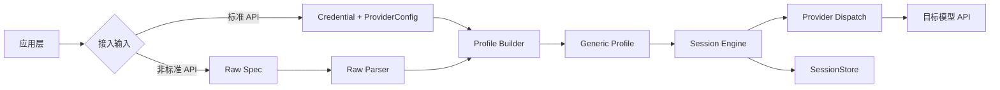

# SFRD-TS-03-1.4_V2.0_Generic Adapter通用接入模块微型设计说明书

## 目录

- [1. 介绍](#1-介绍)
  - [1.1. 目的](#11-目的)
  - [1.2. 定义和缩写](#12-定义和缩写)
  - [1.3. 参考和引用](#13-参考和引用)
- [2. 模块方案概述](#2-模块方案概述)
- [3. 模块详细设计](#3-模块详细设计)
  - [3.1. 会话标识模型子模块](#31-会话标识模型子模块)
  - [3.2. Session 执行引擎子模块](#32-session-执行引擎子模块)
  - [3.3. Generic Adapter 子模块](#33-generic-adapter-子模块)
  - [3.4. 原始报文解析子模块](#34-原始报文解析子模块)
  - [3.5. 鉴权抽取子模块](#35-鉴权抽取子模块)
  - [3.6. 存储与归档子模块](#36-存储与归档子模块)
- [4. 关联分析](#4-关联分析)
- [5. 可靠性设计 (FMEA)](#5-可靠性设计-fmea)
- [6. 变更控制](#6-变更控制)
  - [6.1. 变更列表](#61-变更列表)
- [7. 修订记录](#7-修订记录)

---

## 1. 介绍

### 1.1. 目的

本说明书描述 Generic Adapter 的重构式设计方案，目标是在不依赖自动识别的前提下，统一标准 API 与非标准 API 的接入路径，并彻底重构多轮对话的会话模型。

核心目标：
- 取消“本地会话 ID 与远端会话 ID 混用”的实现方式。
- 用户必须显式声明目标模型是否支持远端 `session_id` 能力。
- 非标准接口只需传 `应用 URL + 请求包 + 响应包 (+ 会话模式)`，SDK 内部自动解析执行。
- 本地始终保存完整对话归档；是否用于请求由会话模式决定。

本版本明确为重构方案，不考虑旧行为兼容。

目标受众：SDK 开发人员、架构师、测试人员、平台接入工程师。

### 1.2. 定义和缩写

| 术语 | 定义 |
| :--- | :--- |
| LocalSessionID | 本地会话标识，仅用于 SessionStore 索引与归档 |
| RemoteSessionID | 目标模型侧会话标识，仅用于远端多轮会话续接 |
| ConversationMode | 会话模式，取值 `remote_session` 或 `local_history` |
| remote_session | 远端维护上下文：后续轮次主要依赖 RemoteSessionID |
| local_history | 本地维护上下文：每轮拼接本地历史发送给模型 |
| Generic Profile | Generic Adapter 的运行时配置对象 |
| Raw Spec | 外部传入的原始接入描述（URL + 请求包 + 响应包） |

### 1.3. 参考和引用

1. 统一请求结构：`provider/base/types.go`
2. Session 现状实现：`client/session.go`
3. Provider 接口与注册：`provider/base/spec.go`、`provider/base/registry.go`
4. 流式解析能力：`provider/streaming/sse.go`、`provider/streaming/json_path.go`
5. 配置模型：`config/config.go`

---

## 2. 模块方案概述

### 核心问题

现有实现存在两个结构性问题：
1. `s.id` 同时承担本地存储键和远端会话键，语义冲突。
2. `req.SessionID = s.id` 的默认赋值策略会导致会话能力不明时误传远端会话参数。

结果是：
- 不能稳定支持“用户显式决定会话语义”的业务要求。
- provider 侧出现特判（如 Dify）而非统一机制。

### 解决方案

采用“显式会话模式 + 双 ID 分离 + 统一执行链路”：
- 显式会话模式：由用户明确传入 `remote_session` 或 `local_history`，SDK 不做自动识别。
- 双 ID 分离：`LocalSessionID` 与 `RemoteSessionID` 完全独立。
- 统一执行：标准 API 与非标准 API 最终都编译成 `Generic Profile`，由统一 Session 引擎执行。

### 架构图



### 方案选型

| 方案 | 会话正确性 | 接入成本 | 维护成本 | 结论 |
|---|---|---|---|---|
| 自动识别远端会话能力 | 中（有误判） | 低 | 中 | 不选 |
| provider 特判（按平台写死） | 中 | 中 | 高 | 不选 |
| **显式模式 + 双 ID 分离** | **高** | 中 | **低** | **选择** |

选择理由：你的业务要求是“避免误判”，必须由用户显式决定会话模式。

---

## 3. 模块详细设计

### 3.1. 会话标识模型子模块

**功能描述**
- 重构会话标识模型，拆分本地与远端会话语义。

**输入和输出**
- 输入：会话模式、首次请求与响应中的远端会话信息。
- 输出：`LocalSessionID`、`RemoteSessionID`、`ConversationMode`。

**内部逻辑**

```text
1. 创建 Session 时生成/注入 LocalSessionID
2. ConversationMode 为必填：remote_session/local_history
3. remote_session 下：从响应提取 RemoteSessionID 并持久化
4. local_history 下：RemoteSessionID 恒为空
```

**数据结构**

```go
type ConversationMode string

const (
    ConversationModeRemoteSession ConversationMode = "remote_session"
    ConversationModeLocalHistory  ConversationMode = "local_history"
)

type Session struct {
    localID  string
    remoteID string
    mode     ConversationMode
    // ...
}
```

**接口设计**

```go
func (s *Session) LocalID() string
func (s *Session) RemoteID() string
func (s *Session) Mode() ConversationMode
```

**配置项**

| 配置键 | 必填 | 说明 |
|---|---|---|
| `conversation.mode` | 是 | `remote_session` / `local_history` |

**异常处理**
- 未指定 mode：直接报错，拒绝执行。
- `remote_session` 且多轮后仍无 RemoteSessionID：报错并提示检查响应映射。

---

### 3.2. Session 执行引擎子模块

**功能描述**
- 统一管理多轮行为，不再根据 provider 名称做特判。

**输入和输出**
- 输入：`ChatRequest`、`ConversationMode`、`SessionStore` 状态。
- 输出：最终发送请求与会话归档结果。

**内部逻辑**

```text
if mode == remote_session:
  - 不拼全量历史（仅发送当前轮输入 + remote_id）
  - 从响应更新 remote_id
  - 本地照常归档完整对话

if mode == local_history:
  - 从本地加载历史并拼接
  - 不发送 remote_id
  - 本地归档完整对话
```

**接口设计**

```go
func (s *Session) Chat(ctx context.Context, req base.ChatRequest) (base.ChatResponse, error)
func (s *Session) ChatStream(ctx context.Context, req base.ChatRequest) (<-chan streaming.StreamChunk, error)
```

**配置项**
- 无新增运行参数，完全由 `conversation.mode` 决定行为。

**异常处理**
- SessionStore 读取失败：降级为无历史（仅 `local_history` 模式生效）。
- SessionStore 写入失败：通过 `OnStoreError` 上报但不影响主请求。

---

### 3.3. Generic Adapter 子模块

**功能描述**
- 将统一请求映射到目标接口并解析响应，支持远端会话字段注入。

**输入和输出**
- 输入：`GenericProfile`、`ChatRequest`、`RemoteSessionID`。
- 输出：标准 `ChatResponse`/`StreamChunk`。

**内部逻辑**

```text
1. 渲染请求模板：{{input}} {{model}} {{temperature}} {{max_tokens}} {{stream}} {{session_id}}
2. mode=remote_session 时允许注入 {{session_id}}
3. 解析响应文本、done 标记、remote_session_id
```

**数据结构**

```go
type GenericProfile struct {
    Request struct {
        Method         string
        Path           string
        BodyTemplate   map[string]any
        SessionIDField string // 例如 session_id / conversation_id
    }
    Response struct {
        TextPath      string
        RemoteIDPath  string
        Stream struct {
            Protocol   string
            DeltaPaths []string
            DonePath   string
            DoneValue  string
            DoneMarker string
        }
    }
    Conversation struct {
        Mode ConversationMode
    }
}
```

**接口设计**

```go
func (s *GenericSpec) BuildRequest(ctx context.Context, opts base.BuildOptions, req base.ChatRequest) (*http.Request, error)
func (s *GenericSpec) ParseResponse(resp *http.Response) (base.ChatResponse, error)
func (s *GenericSpec) ParseStreamResponse(resp *http.Response) (<-chan streaming.StreamChunk, error)
```

**配置项**

| 配置键 | 必填 | 说明 |
|---|---|---|
| `generic.request.body_template` | 是 | 请求模板 |
| `generic.response.stream.delta_paths` | 流式时是 | 流式文本路径 |
| `generic.response.remote_id_path` | remote_session 时是 | 远端会话 ID 提取路径 |

**异常处理**
- `remote_session` 但未配置 `session_id` 注入能力：报错。
- 流式路径提取失败：返回解析错误并结束流。

---

### 3.4. 原始报文解析子模块

**功能描述**
- 将外部三字段输入编译为 `GenericProfile + Credential`。

**输入和输出**
- 输入：`RawIntegrationSpec`。
- 输出：`CompiledIntegration`。

**内部逻辑**

```text
1. URL -> base_url + path
2. 请求包解析：识别输入占位、session 占位、参数字段
3. 响应包解析：识别 text/delta/remote_id 路径
4. 构造 GenericProfile
5. 构造 Credential
```

**数据结构**

```go
type RawIntegrationSpec struct {
    URL          string
    Request      RawPacket
    Response     RawPacket
    Conversation struct {
        Mode ConversationMode // 必填
    }
    Placeholders struct {
        Input     []string // 默认 ["$$$"]
        SessionID []string // 默认 ["$$$SESSION_ID$$$"]
    }
}

type RawPacket struct {
    Headers map[string]string
    Body    string
}

type CompiledIntegration struct {
    Credential *auth.Credential
    Provider   *config.ProviderConfig
    Profile    *GenericProfile
}
```

**接口设计**

```go
func ParseRawIntegration(raw RawIntegrationSpec) (*CompiledIntegration, error)
func (c *Client) NewSessionFromRaw(raw RawIntegrationSpec, opts ...SessionOption) (*Session, error)
```

**配置项**

| 配置键 | 默认值 | 说明 |
|---|---|---|
| `raw.placeholders.input` | `[$$$]` | 输入占位符 |
| `raw.placeholders.session_id` | `[$$$SESSION_ID$$$]` | 会话占位符 |

**异常处理**
- Raw JSON 不可解析：返回字段级错误信息。
- mode 缺失：拒绝构建 profile。
- remote_session 模式下找不到 session_id 占位：报错。

---

### 3.5. 鉴权抽取子模块

**功能描述**
- 从原始请求头抽取并标准化鉴权配置。

**输入和输出**
- 输入：`RawPacket.Headers`。
- 输出：`auth.Credential`。

**内部逻辑**

```text
1. 优先识别 Authorization: Bearer xxx -> bearer_token
2. 识别 Cookie / X-* 自定义头 -> none + headers
3. 识别 query 鉴权 -> query_params
4. 输出统一 Credential
```

**接口设计**

```go
func ExtractCredential(headers map[string]string) (*auth.Credential, error)
```

**异常处理**
- 多个冲突鉴权头：按优先级规则报错，不自动猜。
- 鉴权头为空：允许无鉴权（内部网络场景）。

---

### 3.6. 存储与归档子模块

**功能描述**
- 始终保存完整对话归档，并持久化 local/remote 会话映射。

**输入和输出**
- 输入：用户消息、模型回复、Session 标识。
- 输出：SessionState。

**数据结构**

```go
type SessionState struct {
    ID        string            // LocalSessionID
    Provider  string
    Messages  []Message
    Meta      map[string]string // 包含 remote_session_id, mode
    UpdatedAt time.Time
}
```

**内部逻辑**

```text
1. 请求前按 mode 决定是否加载历史
2. 响应后统一追加 assistant 消息
3. 保存 messages + mode + remote_session_id 到本地
```

**异常处理**
- Save 失败：记录错误并继续返回主响应。

---

## 4. 关联分析

### 4.1. 当前代码关联影响点清单

本节基于当前仓库代码扫描，列出本次重构必须触达的模块与影响点。

| 影响域 | 当前代码位置 | 当前行为 | 重构影响点 | 处理动作 |
|---|---|---|---|---|
| 会话数据模型 | `provider/base/types.go` | `ChatRequest.SessionID` / `ChatResponse.SessionID` 混用语义 | 需区分远端会话标识语义，避免与本地会话键混淆 | 重命名或重定义为远端语义字段（如 `RemoteSessionID`），同步全链路调用 |
| 流式分片模型 | `provider/streaming/types.go` | `StreamChunk.SessionID` 表达不明确 | 流式回传需明确是远端会话 ID | 字段语义改为远端会话标识，并更新解析器与聚合器 |
| Session 引擎核心 | `client/session.go` | `s.id` 同时用于本地存储键与请求 `req.SessionID`；含 `isDifyProvider` 特判 | 与“显式模式 + 双 ID 分离”冲突 | 重构为 `localID + remoteID + mode`；删除 provider 特判；按 mode 分支执行 |
| Session 构造入口 | `client/client.go` | `NewSession/NewSessionWith` 不要求会话模式 | 容易漏配 mode，导致行为不确定 | 新增会话模式必填校验；提供重构后统一构造参数 |
| 流式结果聚合 | `client/stream.go` | 从 `chunk.SessionID` 汇总到 `ChatResponse.SessionID` | 字段语义变更后聚合逻辑需同步 | 聚合字段改为远端会话语义，并更新返回结构 |
| Dify Provider | `provider/impls/dify/spec.go` `provider/impls/dify/stream.go` | 通过 `req.SessionID` / `conversation_id` 传递会话 | 需适配远端会话新字段与 mode 约束 | 显式使用远端会话字段；在 `local_history` 模式不传 `conversation_id` |
| Plugin Provider | `provider/impls/plugin/spec.go` | `session_id` 与 `startNewChat` 透传 | 需与新会话字段和 mode 对齐 | 请求/响应字段映射改为远端语义；按 mode 控制是否透传 |
| Plugin Transport | `provider/plugin/transport.go` | 同时兼容 `session_id/sessionId`，提取后回填 `SessionID` | 需统一远端会话命名，减少歧义 | 统一抽取到 `remote_session_id` 语义字段；保留协议层映射但内部统一命名 |
| 配置模型 | `config/config.go` | 尚无 `conversation.mode` 与 generic profile 结构 | 无法承载重构后的显式模式 | 扩展 ProviderConfig：增加会话模式与 generic 配置结构 |
| 多轮文档体系 | `docs/session-guide.md` `docs/api-guide.md` `docs/quickstart.md` `docs/architecture.md` `docs/internal/design-session-unified-architecture.md` | 文档建立在旧 `SessionID` 语义与 Dify 特判上 | 与重构设计不一致 | 全量改写会话章节：双 ID、显式模式、无自动识别 |
| 示例代码 | `examples/`（尤其多轮与插件示例） | `WithID` 默认等同请求会话 ID | 行为模型变化后示例会误导使用方 | 按新接口改造示例：显示设置 mode，区分 local/remote ID |
| 测试基线 | `test/client_test.go` `test/provider_test.go` 等 | 断言基于旧 `SessionID` 行为 | 重构后会系统性失败 | 按新语义重写断言矩阵（remote/local 两模式） |

### 4.2. 代码重构范围结论

本次改造不是局部修补，属于跨层重构，至少覆盖以下 6 层：数据结构层、Session 执行层、Provider 适配层、配置层、示例文档层、测试层。

建议按以下顺序实施，降低返工风险：
1. 先改数据结构与 Session 核心执行路径（`base/types`、`client/session`、`client/stream`）。
2. 再改 Provider 与 Raw Parser（dify/plugin/generic）。
3. 最后统一更新测试、示例与文档。

### 性能影响
- local_history 模式下请求包会随历史增长，需要窗口裁剪策略。
- remote_session 模式下网络负载更小，但依赖远端会话稳定性。

### 兼容性
- 本方案为重构设计，不保持旧行为兼容。
- 需要同步修改文档、示例、测试基线。

### 安全性
- 原始报文解析不信任输入，需做 JSON 和 Header 注入校验。
- 日志需脱敏（Authorization/Cookie）。

### 可观测性
建议新增指标：
- `session_mode_remote_total`
- `session_mode_local_total`
- `remote_session_id_missing_total`
- `raw_parse_failure_total`

---

## 5. 可靠性设计 (FMEA)

| 失效模式 (Failure Mode) | 失效影响 (Effect) | 失效原因 (Cause) | 风险分析<br>(S:严重度, O:概率, D:检测度, AP:优先级) | 技术改进<br>(措施 / 效果 / 责任人 / 时间 / 状态) |
| :--- | :--- | :--- | :--- | :--- |
| remote_session 模式无远端会话 ID | 多轮会话中断 | 响应映射缺失或服务端未返回 | **S**: 8<br>**O**: 4<br>**D**: 4<br>**AP**: High | **措施**: remote_session 模式强制配置 `remote_id_path`，缺失即失败。<br>**效果**: 避免静默错误。<br>**责任人**: SDK开发者<br>**完成时间**: V2.0<br>**完成状态**: 待实现 |
| local_history 模式上下文过大 | 延迟升高/请求失败 | 历史无限增长 | **S**: 7<br>**O**: 6<br>**D**: 3<br>**AP**: High | **措施**: 引入窗口裁剪策略（条数/Token 双阈值）。<br>**效果**: 控制请求体规模。<br>**责任人**: SDK开发者<br>**完成时间**: V2.0<br>**完成状态**: 待实现 |
| Raw 解析失败 | 新接入不可用 | 报文不完整或字段异常 | **S**: 6<br>**O**: 5<br>**D**: 3<br>**AP**: Med | **措施**: 返回结构化错误（字段路径 + 原因）。<br>**效果**: 缩短接入排障时间。<br>**责任人**: SDK开发者<br>**完成时间**: V2.0<br>**完成状态**: 待实现 |
| 鉴权冲突 | 401/403 | 同时出现多套认证信息 | **S**: 7<br>**O**: 4<br>**D**: 5<br>**AP**: Med | **措施**: 鉴权冲突直接失败，不自动猜测。<br>**效果**: 降低错误接入风险。<br>**责任人**: SDK开发者<br>**完成时间**: V2.0<br>**完成状态**: 待实现 |

---

## 6. 变更控制

### 6.1. 变更列表

**最初版本的设计中本节内容应当为空。**

| 变更章节 | 变更内容 | 变更原因 | 变更对对老功能、原有设计的影响 |
|---|---|---|---|
|  |  |  |  |

---

## 7. 修订记录

| 修订版本号 | 作者 | 日期 | 简要说明 |
|---|---|---|---|
| V2.0 | 徐文彬 | 2026-03-06 | 重构版：显式会话模式、双 ID 分离、非兼容改造 |
