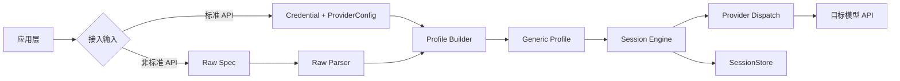

# SFRD-TS-03-1.4_V2.0_Generic Adapter通用接入模块微型设计说明书

## 目录

- [1. 介绍](#1-介绍)
  - [1.1. 目的](#11-目的)
  - [1.2. 范围、非目标与假设](#12-范围非目标与假设)
  - [1.3. 定义和缩写](#13-定义和缩写)
  - [1.4. 参考和引用](#14-参考和引用)
  - [1.5. 需求追溯](#15-需求追溯)
- [2. 模块方案概述](#2-模块方案概述)
  - [2.1. 问题与背景](#21-问题与背景)
  - [2.2. 方案概述与架构图](#22-方案概述与架构图)
  - [2.3. 方案选型](#23-方案选型)
  - [2.4. 设计决策记录](#24-设计决策记录)
- [3. 模块详细设计](#3-模块详细设计)
  - [3.1. 数据库设计](#31-数据库设计)
  - [3.2. 接口设计总览](#32-接口设计总览)
  - [3.3. 会话标识模型子模块](#33-会话标识模型子模块)
  - [3.4. Session 执行引擎子模块](#34-session-执行引擎子模块)
  - [3.5. Generic Adapter 子模块](#35-generic-adapter-子模块)
  - [3.6. 原始报文解析子模块](#36-原始报文解析子模块)
  - [3.7. 鉴权抽取子模块](#37-鉴权抽取子模块)
  - [3.8. 存储与归档子模块](#38-存储与归档子模块)
- [4. 质量目标与非功能需求](#4-质量目标与非功能需求)
- [5. 关联分析](#5-关联分析)
- [6. 可靠性设计 (FMEA)](#6-可靠性设计-fmea)
- [7. 部署与回滚策略](#7-部署与回滚策略)
- [8. 验证策略](#8-验证策略)
- [9. 变更控制](#9-变更控制)
  - [9.1. 变更列表](#91-变更列表)
- [10. 修订记录](#10-修订记录)

---

# 1. 介绍

## 1.1. 目的

本说明书描述 Generic Adapter 的重构式设计方案，目标是在不依赖自动识别的前提下，统一标准 API 与非标准 API 的接入路径，并彻底重构多轮对话的会话模型。

**核心目标**：
- 取消"本地会话 ID 与远端会话 ID 混用"的实现方式
- 用户必须显式声明目标模型是否支持远端 `session_id` 能力
- 非标准接口只需传 `应用 URL + 请求包 + 响应包 (+ 会话模式)`，SDK 内部自动解析执行
- 本地始终保存完整对话归档；是否用于请求由会话模式决定

本版本明确为重构方案，不考虑旧行为兼容。

**目标受众**：SDK 开发人员、架构师、测试人员、平台接入工程师。

## 1.2. 范围、非目标与假设

| 类别 | 内容 |
|------|------|
| **范围** | 会话标识模型重构；Session 执行引擎统一；Generic Adapter 模板驱动接入；原始报文（Raw Spec）解析与编译；鉴权标准化提取；SessionStore 归档 |
| **非目标** | 不改动已有 Provider 的上层业务逻辑；不处理 SDK 以外的任务调度与攻击策略；不保持与旧 `SessionID` 单字段行为的向后兼容 |
| **前置假设** | 调用方已正确配置目标模型的 URL 和鉴权信息；SessionStore 实现由接入方提供，SDK 仅定义接口；目标模型 API 返回 HTTP 200 表示成功 |

## 1.3. 定义和缩写

| 术语 | 定义 |
|:---|:---|
| SessionID | 会话标识，兼作本地归档查询键与远端会话传递键；来源取决于会话模式 |
| ConversationMode | 会话模式，取值 `remote_session` 或 `local_history` |
| remote_session | 目标模型支持 session_id：SessionID 从首轮响应中提取，后续轮次原样传回目标模型；本地存储仅做归档 |
| local_history | 目标模型不支持 session_id：SessionID 由应用端生成/传入，用于查询本地历史并拼接到每轮请求；本地存储有实用意义 |
| Generic Profile | Generic Adapter 的运行时配置对象 |
| Raw Spec | 外部传入的原始接入描述（URL + 请求包 + 响应包） |
| OnError 策略 | 多轮对话中单轮失败的处理策略：`continue`（跳过继续）或 `abort`（终止任务） |
| HistoryWindow | local_history 模式下历史消息的裁剪窗口配置 |

## 1.4. 参考和引用

1. 统一请求结构：`provider/base/types.go`
2. Session 现状实现：`client/session.go`
3. Provider 接口与注册：`provider/base/spec.go`、`provider/base/registry.go`
4. 流式解析能力：`provider/streaming/sse.go`、`provider/streaming/json_path.go`
5. 配置模型：`config/config.go`
6. 旧项目多轮对话实现参考：`AI-Security-Platform/api/routers/v1/multi_round/handler.go`

## 1.5. 需求追溯

| 需求 ID | 需求描述 | 对应设计章节 | 对应验证用例 |
|---------|---------|-------------|-------------|
| REQ-001 | 用户显式声明会话模式（remote_session/local_history） | 3.3 会话标识模型 | TC-001 |
| REQ-002 | remote_session：SessionID 从目标模型响应提取，后续轮次原样传回目标模型 | 3.3 会话标识模型 | TC-002 |
| REQ-002B | local_history：SessionID 由应用端生成，用于查询本地历史拼接上下文 | 3.3 会话标识模型、3.4 Session 执行引擎 | TC-002B |
| REQ-003 | 非标准 API 通过 RawSpec 三字段接入 | 3.6 原始报文解析 | TC-003 |
| REQ-004 | 本地始终保存完整对话归档 | 3.8 存储与归档 | TC-004 |
| REQ-005 | 鉴权信息从请求头标准化提取 | 3.7 鉴权抽取 | TC-005 |
| REQ-006 | 模板渲染时 input 占位符必须做 JSON 字符串转义 | 3.5 Generic Adapter | TC-006 |
| REQ-007 | 流式响应支持 SSE 格式（data: 前缀、[DONE] 终止、空行跳过） | 3.5 Generic Adapter | TC-007 |
| REQ-008 | HTTP 响应自动处理 gzip 压缩 | 3.5 Generic Adapter | TC-008 |
| REQ-009 | 多轮错误策略可配置（continue/abort） | 3.4 Session 执行引擎 | TC-009 |
| REQ-010 | local_history 模式支持历史窗口裁剪 | 3.4 Session 执行引擎 | TC-010 |
| REQ-011 | 支持多轮请求-响应字段链路传递（ChainFields）：从指定 SSE event 类型提取任意响应字段，注入到下一轮请求体占位符；ChainFields 不传则不启用，传了则三个子字段全部必填 | 3.5 Generic Adapter、3.6 原始报文解析 | TC-011 |

---

# 2. 模块方案概述

## 2.1. 问题与背景

现有实现存在两个结构性问题：

1. `s.id` 同时承担本地存储键和远端会话键，语义冲突，导致 Dify 等 provider 出现特判逻辑。
2. `req.SessionID = s.id` 的默认赋值策略会在会话能力不明时误传远端会话参数。

此外，对比旧项目（AI-Security-Platform）的实际多轮实现，还暴露出以下工程问题：

- 模板渲染直接拼接用户输入，未做 JSON 转义，输入含引号或换行时产生无效 JSON
- 流式解析未定义 SSE 规范（`data:` 前缀、`[DONE]` 终止），兼容性差
- gzip 响应未处理，目标模型返回压缩内容时解析失败
- 多轮错误策略不一致（部分场景"失败继续"，部分"直接 abort"）
- RemoteSessionID 仅存内存，进程重启后会话丢失

## 2.2. 方案概述与架构图

采用"显式会话模式 + 双 ID 分离 + 统一执行链路"：

- **显式会话模式**：由用户明确传入 `remote_session` 或 `local_history`，SDK 不做自动识别
- **单一 SessionID**：不区分 LocalSessionID / RemoteSessionID，只有一个 `sessionID`，其来源与用途由 mode 决定
- **统一执行**：标准 API 与非标准 API 最终都编译成 `Generic Profile`，由统一 Session 引擎执行



## 2.3. 方案选型

| 对比维度 | 方案 A：自动识别远端会话能力 | 方案 B：provider 特判（按平台写死） | 方案 C：显式模式 + 双 ID 分离 |
|---------|--------------------------|----------------------------------|------------------------------|
| 会话正确性 | 中（有误判） | 中 | **高** |
| 接入成本 | 低 | 中 | 中 |
| 维护成本 | 中 | 高 | **低** |
| 风险 | 静默误判 | 每新 provider 须改核心代码 | 接入方需显式配置 mode |
| **结论** | — | — | **选择方案 C**：业务要求"避免误判"，必须由用户显式决定会话模式 |

## 2.4. 设计决策记录

| 决策 ID | 决策内容 | 备选方案 | 决策理由 | 决策人 | 日期 |
|---------|---------|---------|---------|-------|------|
| DR-001 | 不区分首轮/续轮两套请求模板 | 旧项目 firstRound*/followUp* 双模板 | 首轮 SessionID 为空天然不注入 `{{session_id}}`，无需额外模板；双模板增加配置负担 | 徐文彬 | 2026-03-06 |
| DR-002 | OnError 策略作为 Session 级别配置 | 硬编码 abort 或 continue | 旧项目两种攻击方法行为不一致，SDK 层不应绑定业务语义，由调用方决定 | 徐文彬 | 2026-03-06 |
| DR-003 | HistoryWindow 双阈值（条数 + Token） | 仅条数限制 | Token 超限是模型侧的直接失败原因，仅靠条数无法有效控制请求体大小 | 徐文彬 | 2026-03-06 |
| DR-004 | 使用单一 SessionID，不做 Local/Remote 双 ID 分离 | LocalSessionID + RemoteSessionID 两个字段 | remote_session 模式：目标模型返回的 session_id 同时作为本地归档键；local_history 模式：应用端生成的 session_id 用于查询本地历史。两种模式均只需一个 ID，双 ID 分离是过度设计 | 徐文彬 | 2026-03-06 |

---

# 3. 模块详细设计

## 3.1. 数据库设计

无数据库操作。SDK 通过 `SessionStore` 接口抽象存储，具体 Schema 由接入方实现。SDK 定义的 `SessionState` 数据结构见 [3.8 存储与归档子模块](#38-存储与归档子模块)。

---

## 3.2. 接口设计总览

| 序号 | 子模块 | 核心函数签名 | 简要说明 | 详细章节 |
|------|--------|------------|---------|---------|
| 1 | 会话标识模型 | `NewSession(mode, opts...) *Session` | 创建会话，mode 必填 | [3.3](#33-会话标识模型子模块) |
| 2 | Session 执行引擎 | `(s *Session) Chat / ChatStream` | 统一多轮执行入口 | [3.4](#34-session-执行引擎子模块) |
| 3 | Generic Adapter | `BuildRequest / ParseResponse / ParseStreamResponse` | 模板驱动请求构建与响应解析 | [3.5](#35-generic-adapter-子模块) |
| 4 | 原始报文解析 | `ParseRawIntegration(raw) *CompiledIntegration` | Raw Spec 编译为 Profile | [3.6](#36-原始报文解析子模块) |
| 5 | 鉴权抽取 | `ExtractCredential(headers) *Credential` | 从请求头标准化提取鉴权 | [3.7](#37-鉴权抽取子模块) |
| 6 | 存储与归档 | SessionStore interface（Save/Load/Delete） | 会话状态持久化 | [3.8](#38-存储与归档子模块) |

---

## 3.3. 会话标识模型子模块

**功能描述**

定义会话标识与模式语义，SDK 使用单一 `sessionID`，其来源与用途由 `ConversationMode` 决定。

**输入和输出**

- 输入：会话模式、SessionID（remote_session 时可为空待提取；local_history 时由应用端传入）
- 输出：`sessionID`、`ConversationMode`

**数据结构**

```go
type ConversationMode string

const (
    ConversationModeRemoteSession ConversationMode = "remote_session"
    ConversationModeLocalHistory  ConversationMode = "local_history"
)

type Session struct {
    id   string           // 单一 SessionID，含义由 mode 决定
    mode ConversationMode
    // ...
}
```

**两种模式的 SessionID 语义对比**

| 维度 | remote_session | local_history |
|---|---|---|
| **SessionID 来源** | 首轮响应由目标模型返回 | 应用端生成/传入 |
| **发给目标模型** | 是，后续轮次原样传回 | 否，目标模型不支持 |
| **本地存储用途** | 仅归档查询，不用于拼接上下文 | 有实用意义，查询历史后拼入请求 |
| **首轮 SessionID** | 空，不注入请求；从响应提取后持久化 | 已有，直接用于查询本地历史 |

**内部逻辑**

```text
remote_session 模式：
  首轮：SessionID 为空 → 不注入 {{session_id}} → 发出请求
        从响应按 remote_id_path 提取 SessionID → 立即持久化到 SessionStore
  续轮：SessionID 非空 → 注入 {{session_id}} → 发出请求
        本地保存完整对话（归档用）

local_history 模式：
  每轮：按应用端传入的 SessionID 从 SessionStore 查询历史
        历史经 HistoryWindow 裁剪后拼入请求
        SessionID 不注入请求体（目标模型不支持）
        本地保存完整对话（下轮继续使用）
```

**接口设计**

```go
func (s *Session) ID() string
func (s *Session) Mode() ConversationMode
```

**配置项**

| 配置键 | 必填 | 说明 |
|---|---|---|
| `conversation.mode` | 是 | `remote_session` / `local_history` |
| `session.id` | local_history 时是 | 应用端生成的会话 ID；remote_session 时可不传，由首轮响应提取 |

**异常处理**

- 未指定 mode：直接报错，拒绝执行
- `remote_session` 模式首轮响应无法提取 SessionID：报错并提示检查 `remote_id_path` 配置
- `local_history` 模式未传 SessionID：自动生成 UUID 并返回给调用方

---

## 3.4. Session 执行引擎子模块

**功能描述**

统一管理多轮行为，不再根据 provider 名称做特判。支持可配置的错误策略与历史窗口裁剪。

**输入和输出**

- 输入：`ChatRequest`、`ConversationMode`、`OnErrorStrategy`、`HistoryWindow`、`SessionStore` 状态
- 输出：最终发送请求与会话归档结果

**数据结构**

```go
type OnErrorStrategy string

const (
    OnErrorContinue OnErrorStrategy = "continue" // 单轮失败记录后继续下一轮
    OnErrorAbort    OnErrorStrategy = "abort"    // 单轮失败立即终止整个会话
)

type HistoryWindow struct {
    MaxMessages int // 最大保留消息条数，0 表示不限
    MaxTokens   int // 最大 Token 数估算阈值，0 表示不限
}
```

Session 内部还需维护当前轮的链路字段值快照，用于下一轮注入：

```go
// Session 内部字段（非公开）
type Session struct {
    // ...existing fields...
    chainValues map[string]string // 上一轮从响应提取的 ChainField 值，key=占位符（含$$$），val=提取值
}
```

**内部逻辑**

```text
if mode == remote_session:
  - 不加载本地历史（仅发送当前轮输入）
  - s.id != ""（非首轮）时注入 {{session_id}}；首轮 s.id 为空不注入
  - 将 Session.chainValues 作为 req.ChainValues 传入 BuildRequest，供链路占位符替换
  - 从响应提取 SessionID 并立即持久化到 SessionStore
  - 从流式 chunk.ChainValues 按 ExtractOnEvent 累积提取链路字段值；流结束后更新 Session.chainValues（供下一轮使用）
  - 本地照常归档完整对话

if mode == local_history:
  - 从本地加载历史并裁剪（先按 MaxMessages，再按 MaxTokens 估算）
  - 拼接裁剪后的历史发送，不注入 session_id（目标模型不支持）
  - 本地归档完整对话

单轮失败处理（由 OnError 策略决定）：
  OnErrorContinue: 记录错误，继续下一轮
  OnErrorAbort:    立即终止，调用 SessionStore 标记会话状态
```

**流式与非流式的行为差异**

| 行为 | 非流式 Chat() | 流式 ChatStream() |
|---|---|---|
| session_id 注入 | 发请求前按 mode 决定是否注入 | 同左，发请求前处理 |
| session_id 提取 | 收到完整响应后提取并持久化 | goroutine 内收到首个含 SessionID 的 chunk 后**立即持久化**，不等流结束 |
| ChainFields 提取 | 收到完整响应后按 ResponsePath 提取并存入 Session.chainValues | goroutine 内按 ExtractOnEvent 匹配 chunk.ChainValues，流结束后更新 Session.chainValues |
| ChainFields 注入 | 发请求前将 Session.chainValues 传入 req.ChainValues | 同左 |
| 历史保存时机 | 收到完整响应后 `store.Save` | 流全部结束后 `store.Save`（messages 需等全文聚合完毕） |
| 流中断时 session_id | 响应错误时不提取 | session_id 已在首个 chunk 时持久化，中断不丢失 |
| gzip 处理 | 非 200 错误 body 需解压后读取 | 同左（`stream.go:L57`） |

**接口设计**

```go
func (s *Session) Chat(ctx context.Context, req base.ChatRequest) (base.ChatResponse, error)
func (s *Session) ChatStream(ctx context.Context, req base.ChatRequest) (<-chan streaming.StreamChunk, error)
```

**配置项**

| 配置键 | 默认值 | 说明 |
|---|---|---|
| `session.on_error` | `abort` | 单轮失败策略：`continue` / `abort` |
| `session.history_window.max_messages` | `0`（不限） | local_history 模式最大保留消息条数 |
| `session.history_window.max_tokens` | `0`（不限） | local_history 模式 Token 估算上限 |

**异常处理**

- SessionStore 读取失败：降级为无历史（仅 `local_history` 模式生效）
- SessionStore 写入失败：通过 `OnStoreError` 上报，不影响主请求返回
- RemoteID 持久化失败：报错，`remote_session` 模式下不允许静默跳过

---

## 3.5. Generic Adapter 子模块

**功能描述**

将统一请求映射到目标接口并解析响应，支持远端会话字段注入、模板安全渲染、SSE 流式解析和 gzip 响应处理。

**输入和输出**

- 输入：`GenericProfile`、`ChatRequest`、`RemoteSessionID`
- 输出：标准 `ChatResponse` / `StreamChunk`

**数据结构**

```go
// ChainField 描述一条"响应字段 → 下一轮请求字段"的链路传递规则。
// 三个子字段均为必填（当 ChainFields 列表非空时）。
type ChainField struct {
    Placeholder    string // 请求体占位符，格式必须为 $$$NAME$$$，e.g. "$$$PARENT_MSG$$$"
    ResponsePath   string // 响应 JSON 路径，e.g. "message_id"
    ExtractOnEvent string // 指定从哪个 SSE event 类型提取，e.g. "message_end"
}

type GenericProfile struct {
    Request struct {
        Method         string
        Path           string
        BodyTemplate   map[string]any
        SessionIDField string // 例如 session_id / conversation_id
    }
    Response struct {
        TextPath     string
        RemoteIDPath string
        Stream struct {
            Protocol    string     // "sse" | "ndjson"
            DeltaPaths  []string
            DonePath    string
            DoneValue   string
            DoneMarker  string     // SSE 模式下的终止行，如 "[DONE]"
            ChainFields []ChainField // 多轮字段链路传递规则，可为空
        }
    }
    Conversation struct {
        Mode ConversationMode
    }
}
```

**内部逻辑**

```text
模板渲染（REQ-006、REQ-011）：
  - {{input}} 替换前必须做 JSON 字符串转义（等价于 json.Marshal 后去除首尾引号）
    确保用户输入含引号、换行、反斜杠时不破坏 JSON 结构
  - {{session_id}} 仅在 RemoteID 非空时注入，RemoteID 为空时移除该字段
  - ChainFields 占位符（$$$NAME$$$）：
      有值（req.ChainValues[placeholder] != ""）→ 替换为对应值
      无值（首轮或上一轮未提取到）→ 移除该字段，不发送（等同 session_id 首轮行为）
  - {{model}}、{{temperature}}、{{max_tokens}}、{{stream}} 按配置值渲染

HTTP 请求发送：
  - 自动处理 Content-Encoding: gzip 响应（REQ-008）
    resp.Body 使用 gzip.NewReader 包装后再交给后续解析

SSE 流式解析规范（REQ-007，Protocol="sse"）：
  逐行读取响应体：
    1. 跳过空行
    2. 跳过以 "retry:" 开头的行
    3. 剥离 "data: " 前缀（包含末尾空格）
    4. 若剥离后内容等于 DoneMarker（默认 "[DONE]"）→ 结束流
    5. 否则解析 JSON，按 DeltaPaths 提取增量文本

NDJSON 流式解析（Protocol="ndjson"）：
  逐行读取，跳过空行，直接解析 JSON，按 DeltaPaths 提取

远端会话 ID 提取：
  mode=remote_session 时，从每轮响应 JSON 按 RemoteIDPath 提取；
  提取成功后立即调用 SessionStore 持久化

ChainFields 提取（REQ-011）：
  ParseStreamResponse wrapper 对每个 SSE chunk：
    遍历 ChainFields，若 chunk 对应的 SSE event 类型 == ChainField.ExtractOnEvent：
      按 ChainField.ResponsePath 从 chunk.Raw 提取值
      写入 chunk.ChainValues[ChainField.Placeholder]
  session.go 在 goroutine 内累积 chunk.ChainValues，流结束后更新 Session.chainValues
  下一轮 BuildRequest 时将 Session.chainValues 作为 req.ChainValues 传入，用于替换占位符
```

**接口设计**

```go
func (s *GenericSpec) BuildRequest(ctx context.Context, opts base.BuildOptions, req base.ChatRequest) (*http.Request, error)
func (s *GenericSpec) ParseResponse(resp *http.Response) (base.ChatResponse, error)
func (s *GenericSpec) ParseStreamResponse(resp *http.Response) (<-chan streaming.StreamChunk, error)
```

`base.ChatRequest` 新增字段：

```go
type ChatRequest struct {
    // ...existing fields...
    ChainValues map[string]string // 上一轮提取的链路字段值，key=占位符（含$$$），val=提取值
}
```

`streaming.StreamChunk` 新增字段：

```go
type StreamChunk struct {
    // ...existing fields...
    ChainValues map[string]string // 本 chunk 提取到的链路字段值，key=占位符（含$$$），val=提取值
}
```

**配置项**

| 配置键 | 必填 | 说明 |
|---|---|---|
| `generic.request.body_template` | 是 | 请求模板，支持 `{{input}}`、`{{session_id}}`、`$$$NAME$$$` 等占位符 |
| `generic.response.stream.protocol` | 流式时是 | `sse` 或 `ndjson` |
| `generic.response.stream.delta_paths` | 流式时是 | 流式增量文本的 JSON 路径列表 |
| `generic.response.stream.done_marker` | SSE 时是 | SSE 终止标记，默认 `[DONE]` |
| `generic.response.remote_id_path` | remote_session 时是 | 从响应提取远端会话 ID 的 JSON 路径 |
| `generic.response.stream.chain_fields` | 否 | ChainField 列表；传了则每条的三个子字段均必填 |

**异常处理**

- `remote_session` 但未配置 `SessionIDField` 或 `remote_id_path`：初始化时报错，拒绝构建
- 模板占位符渲染后 JSON 非法：返回渲染错误，不发送请求
- ChainFields 列表非空但某条目存在空字段：初始化时报错，拒绝构建
- ChainFields 占位符格式不符合 `$$$NAME$$$`（NAME 非空）：初始化时报错
- gzip 解压失败：返回解压错误并关闭连接
- SSE 行解析 JSON 失败：跳过该行并继续，累计错误超过阈值时终止流并报错
- 非 200 状态码：直接返回 HTTP 错误，不尝试解析 body

---

## 3.6. 原始报文解析子模块

**功能描述**

将外部三字段输入编译为 `GenericProfile + Credential`，URL 解析包含 base_url/path 合成规则。

**输入和输出**

- 输入：`RawIntegrationSpec`
- 输出：`CompiledIntegration`

**数据结构**

```go
type RawIntegrationSpec struct {
    URL          string
    Request      RawPacket
    Response     RawPacket
    Conversation struct {
        Mode    ConversationMode // 必填
        OnError OnErrorStrategy  // 默认 abort
    }
    Placeholders struct {
        Input     []string // 默认 ["$$$"]
        SessionID []string // 默认 ["$$$SESSION_ID$$$"]
    }
    // ChainFields 描述多轮字段链路传递规则，可不传。
    // 传了则每条的三个子字段（Placeholder、ResponsePath、ExtractOnEvent）均必填。
    ChainFields []ChainField
}

type RawPacket struct {
    Headers map[string]string
    Body    string
}

type CompiledIntegration struct {
    Credential *auth.Credential
    Provider   *config.ProviderConfig
    Profile    *GenericProfile
}
```

**内部逻辑**

```text
URL 合成规则：
  1. 解析 URL 为 scheme + host + path
  2. base_url = scheme://host
  3. path 作为 GenericProfile.Request.Path
  4. 若 URL 缺少 scheme：默认补 https://
  5. 若 URL 为空：返回字段级错误

请求包解析：
  1. 识别输入占位符（默认 $$$）→ 替换为 {{input}}
  2. 识别 session_id 占位符（默认 $$$SESSION_ID$$$）→ 替换为 {{session_id}}
  3. 识别 ChainFields 占位符（$$$NAME$$$，NAME 不为 SESSION_ID）→ 保留原占位符字符串，供 renderTemplate 在运行时替换
  4. 识别 HTTP Method（从请求包 Headers 或默认 POST）
  5. 构造 BodyTemplate

ChainFields 校验：
  若 ChainFields 列表非空，遍历每条：
    Placeholder 为空 → 报错
    Placeholder 格式不符合 $$$NAME$$$ 或 NAME 为空 → 报错
    ResponsePath 为空 → 报错
    ExtractOnEvent 为空 → 报错
  通过校验后将 ChainFields 直接写入 GenericProfile.Response.Stream.ChainFields

响应包解析：
  1. 识别文本/delta 路径 → DeltaPaths
  2. 识别 remote_id 路径（含 $$$SESSION_ID$$$ 占位的字段）→ RemoteIDPath
  3. 识别流式协议（有 data: 前缀行 → SSE，否则 → NDJSON）

调用 ExtractCredential 从 Request.Headers 提取鉴权
```

**接口设计**

```go
func ParseRawIntegration(raw RawIntegrationSpec) (*CompiledIntegration, error)
func (c *Client) NewSessionFromRaw(raw RawIntegrationSpec, opts ...SessionOption) (*Session, error)
```

**配置项**

| 配置键 | 默认值 | 说明 |
|---|---|---|
| `raw.placeholders.input` | `[$$$]` | 输入占位符列表 |
| `raw.placeholders.session_id` | `[$$$SESSION_ID$$$]` | 会话 ID 占位符列表 |

**异常处理**

- Raw JSON 不可解析：返回字段级错误（字段路径 + 原因）
- mode 缺失：拒绝构建，返回 `"raw: conversation.mode is required"` 错误
- `remote_session` 模式下找不到 session_id 占位：返回 `"raw: session_id placeholder not found in request body"` 错误
- URL 为空或无法解析：返回字段级错误

---

## 3.7. 鉴权抽取子模块

**功能描述**

从原始请求头抽取并标准化鉴权配置，处理冲突规则与无鉴权场景。

**输入和输出**

- 输入：`RawPacket.Headers`（map[string]string）
- 输出：`*auth.Credential`

**内部逻辑**

```text
优先级（从高到低）：
  1. Authorization: Bearer xxx → bearer_token 类型
  2. Authorization: Basic xxx → basic_auth 类型
  3. Cookie: xxx             → none 类型 + 自定义 headers
  4. X-* 自定义头            → none 类型 + 自定义 headers
  5. query 参数中的 token/key → query_params 类型

冲突判断：
  若同时命中 1/2 和 3/4，视为冲突 → 按优先级取最高级，其余作为额外 headers 附带
  若同时命中 bearer 和 basic → 直接报错，要求调用方明确

脱敏要求：
  Authorization / Cookie 字段在日志中必须 mask，仅保留前 4 字符 + "****"
```

**接口设计**

```go
func ExtractCredential(headers map[string]string) (*auth.Credential, error)
```

**异常处理**

- 同时存在多个冲突的主认证头（Bearer + Basic）：报错，不自动猜测
- 鉴权头为空：允许（无鉴权内网场景），返回 `none` 类型 Credential

---

## 3.8. 存储与归档子模块

**功能描述**

始终保存完整对话归档，并持久化 local/remote 会话映射，支持进程重启后会话恢复。

**输入和输出**

- 输入：用户消息、模型回复、Session 标识（LocalID + RemoteID）
- 输出：`SessionState`

**数据结构**

```go
type SessionState struct {
    ID        string            // SessionID（remote_session 下为目标模型返回值；local_history 下为应用端生成值）
    Provider  string
    Messages  []Message
    Meta      map[string]string // 包含 mode、on_error
    UpdatedAt time.Time
}
```

**内部逻辑**

```text
请求前：
  - local_history 模式：从 SessionStore 按 SessionID 加载历史，应用 HistoryWindow 裁剪
  - remote_session 模式：SessionID 已持久化，直接从 Session 对象取值注入请求

响应后：
  - 追加 assistant 消息到 Messages
  - remote_session 模式：若 SessionID 为空（首轮），从响应提取并更新 Session.id，立即持久化
  - 调用 SessionStore.Save 持久化（含完整 Messages）

Save 失败处理：
  - 通过 OnStoreError 回调上报错误
  - remote_session 首轮 Save 失败（SessionID 丢失）：视为严重错误，按 OnError 策略处理
  - local_history Save 失败：记录错误，继续返回主响应
```

**异常处理**

- Save 失败（local_history）：记录错误，继续返回主响应
- Save 失败（remote_session）：按 OnError 策略处理，不允许静默丢失 RemoteID

---

# 4. 质量目标与非功能需求

| 指标 | 目标值 | 依据 | 监测方式 |
|------|-------|------|---------|
| Chat 接口额外延迟（SDK 自身开销） | ≤ 5ms（P99） | SDK 不应成为瓶颈 | 基准测试 |
| 流式解析吞吐 | ≥ 10MB/s | 目标模型典型响应速率 | 基准测试 |
| SessionStore 故障降级 | 不影响主请求返回 | 可用性要求 | 单元测试模拟故障 |
| 内存占用（local_history，HistoryWindow=0） | 随历史线性增长，需由调用方配置窗口 | 性能风险说明 | 内存 profile |
| 安全合规 | Authorization/Cookie 日志必须 mask | 安全规范 | 日志审查 |

---

# 5. 关联分析

### 当前代码关联影响点清单

> 代码扫描基准：V2.1 设计方案，含 6 个补充点的影响范围核查。标注 🆕 的条目为本次新增。

| 影响域 | 当前代码位置 | 当前行为 | 重构影响点 | 处理动作 |
|---|---|---|---|---|
| 会话数据模型 | `provider/base/types.go` | `ChatRequest.SessionID` / `ChatResponse.SessionID` 混用语义 | 需明确 SessionID 在两种 mode 下的语义（来源/是否传给目标模型） | 字段保留 `SessionID` 命名，通过 mode 区分其语义；同步全链路调用 |
| 流式分片模型 | `provider/streaming/types.go` | `StreamChunk.SessionID` 表达不明确 | remote_session 模式下流式回传需携带目标模型返回的 SessionID | 保留字段名，明确语义为目标模型返回的会话 ID，更新聚合器 |
| Session 引擎核心 | `client/session.go`（L97、L107、L122、L152、L158、L186、L200、L210、L225、L264、L288、L312、L330） | **Chat()非流式**：步骤4无条件 `req.SessionID = s.id`（本地 UUID 被当成远端 session_id 发出）；步骤5仅靠 `s.id == ""` 隐式触发提取，且不持久化。**ChatStream()流式**：goroutine 内提取到 SessionID 后仅更新内存（L265-273），流全部结束后才 Save（L288-308）；流中断时 `streamErr != nil` 直接 return 不保存（L284-286）；`isDifyProvider()` 特判控制两处 SessionID 生成时机（L97、L200、L330）；历史全量加载无裁剪 | 根因直接体现：非 Dify 本地 UUID 被当成远端 session_id 误传；流中断时 SessionID 仅存内存，进程重启丢失；新设计通过 ConversationMode 将隐式分支变为显式配置 | **Chat()** 改为：`remote_session` 且 `s.id != ""`（非首轮）才注入 session_id；`remote_session` 每轮提取并持久化；`local_history` 加载历史 + HistoryWindow 裁剪，不注入 session_id。**ChatStream()** 额外改为：`remote_session` 提取到 SessionID 后**立即** `store.Save` 持久化，不等流结束；流中断时已提取的 session_id 已持久化。删除 `isDifyProvider()` 及 `isDifyName()` 函数 |
| Session 配置 | `client/session_config.go`（L10、L15） | 仅有 `OnStoreError` 回调；无 `OnErrorStrategy` 类型 | 多轮错误策略入口缺失 | 新增 `OnErrorStrategy`（continue/abort）字段；新增 `HistoryWindow`（MaxMessages/MaxTokens）配置入口 |
| Session 构造入口 | `client/client.go`（L102）；`client/test.go`（L54、L86） | `NewSession/NewSessionWith` 不要求会话模式；`Test()`/`TestWith()` 使用 `WithHistoryMode(HistoryNone)` + `WithStore(nil)` 表示单轮无状态请求 | mode 必填校验不应在构造时强制触发；连通性测试是单轮一次性请求，`ConversationMode` 对其无意义 | mode 校验改为**惰性校验**（第二轮发起时才检查）；或在 Session 内部对 `WithStore(nil)` 场景豁免 mode 校验；`Test()` 无需修改 |
| 流式结果聚合 | `client/stream.go`（L56、L95、L104、L111） | `collectStream` 聚合 SessionID 来自 chunk（L104-106）；错误响应 body 直读无 gzip 处理（L57）；`collectStream` 仅聚合不持久化，持久化由 `ChatStream()` goroutine 负责 | `collectStream` 供内部 `chatWithStreamSync` 使用，不涉及 Session 持久化；但 gzip 未处理会导致非 200 错误体乱码 | 错误 body 读取（L57）加 gzip 解压；`collectStream` 本身无需改动（持久化逻辑在 Session 层）|
| 🆕 SSE 解析规范 | `provider/streaming/sse.go`（L85、L86、L94、L121） | 已剥离 `data:`、识别 `[DONE]`、空行聚合；**未显式跳过 `retry:` 行**；未知行静默忽略 | 需补 `retry:` 跳过；统一明确 SSE 行处理规范 | 补 `retry:` 行判断；完善单元测试覆盖所有 SSE 行类型 |
| 🆕 SSE 调用方（各 Provider 流式） | `provider/impls/openai/compat_stream.go`（L22）；`provider/impls/claude/stream.go`（L25）；`provider/impls/gemini/stream.go`（L23）；`provider/impls/dify/stream.go`（L87、L108） | 直接依赖 SSEParser；Dify 有独立 SSE 处理同样缺 `retry:` | SSE 规范变更需各 Provider 回归验证；Dify 独立实现需同步修改 | 各 Provider 补回归测试；Dify `stream.go` 补 `retry:` 跳过 |
| 🆕 gzip 解压（非流式） | `provider/impls/claude/spec.go`（L78）；`provider/impls/openai/compat.go`（L81）；`provider/impls/gemini/spec.go`（L85）；`provider/impls/ollama/spec.go`（L58）；`provider/impls/dify/spec.go`（L95）；`provider/impls/plugin/spec.go`（L73） | 各处 `io.ReadAll` 直读 `resp.Body`，无 gzip 处理 | 目标模型返回 gzip 压缩响应时解析完全失败 | 抽取通用 `readResponseBody` 函数统一处理 `Content-Encoding: gzip` |
| 🆕 gzip 解压（流式） | `provider/streaming/sse.go`（L39）；`provider/streaming/ndjson.go`（L37）；`provider/impls/dify/stream.go`（L33） | 直接读 `resp.Body`，无 gzip 处理 | 流式 gzip 响应解析失败 | 在 parser 入口前统一检测并包装 gzip.Reader |
| 🆕 JSON 模板渲染（新增模块） | 当前代码库中不存在 | 所有 Provider 均用结构化 payload + `json.Marshal`，无 `{{input}}` 占位符渲染逻辑 | Generic Adapter 需新增模板渲染能力；`{{input}}` 替换前必须做 JSON 字符串转义 | 新增模板渲染 helper；转义规则：等价于 `json.Marshal(input)` 后去除首尾引号；单元测试覆盖引号、换行、反斜杠等特殊字符 |
| 🆕 HistoryWindow 裁剪 | `session/types.go`（L35）；`session/truncate.go`（L27） | `TruncatePolicy` 定义存在但从未被 Session 调用；`MaxTokens` 仅在 `GetOptions` 中定义未落地 | 历史全量加载，local_history 长会话下请求体无限增长 | 落地 `TruncatePolicy` 调用；扩展为 MaxMessages + MaxTokens 双阈值；在 Session 加载历史时裁剪 |
| Dify Provider | `provider/impls/dify/spec.go`、`stream.go` | 通过 `req.SessionID` / `conversation_id` 传递会话 | 需适配远端会话新字段与 mode 约束；同步 gzip 与 SSE retry: 修复 | 显式使用远端会话字段；`local_history` 模式不传 `conversation_id`；同步 gzip/SSE 修复 |
| Plugin Provider | `provider/impls/plugin/spec.go` | `session_id` 与 `startNewChat` 透传 | 需与新会话字段对齐；同步 gzip 修复 | 按 mode 控制是否透传；同步 gzip 修复 |
| 配置模型 | `config/config.go` | 无 `conversation.mode`、`OnErrorStrategy`、`HistoryWindow`、generic profile 结构 | 无法承载显式模式与新配置项 | 扩展 ProviderConfig：新增会话模式、OnErrorStrategy、HistoryWindow、generic 配置结构 |
| 文档体系 | `docs/session-guide.md` 等 | 建立在旧 `SessionID` 语义上 | 与重构设计不一致 | 全量改写会话章节；补充 JSON 转义、SSE 规范、gzip、HistoryWindow 说明 |
| 示例代码 | `examples/`（多轮与插件示例） | `WithID` 默认等同请求会话 ID | 行为变化后会误导 | 按新接口改造，显式设置 mode；补充 OnError 与 HistoryWindow 配置示例 |
| 测试基线 | `test/client_test.go` 等 | 断言基于旧 `SessionID` 行为 | 重构后系统性失败 | 按新语义重写断言矩阵（remote/local 两模式）；补充 gzip、SSE、HistoryWindow、OnError 场景 |

### 重构顺序建议

1. 数据结构与 Session 核心（`base/types`、`client/session`、`client/stream`）
2. Provider 适配与 Raw Parser（dify / plugin / generic）
3. 测试、示例、文档

### 性能影响

- `local_history` 模式下请求包随历史增长，**必须配置 HistoryWindow**，否则存在请求体过大的风险
- `remote_session` 模式网络负载更小，但依赖远端会话稳定性

### 安全性

- 原始报文解析不信任输入，需做 JSON 和 Header 注入校验
- 日志必须脱敏（Authorization / Cookie），仅保留前 4 字符 + `****`

---

# 6. 可靠性设计 (FMEA)

**评分标准**：

| 评分项 | 1-3（低） | 4-6（中） | 7-10（高） |
|-------|----------|----------|-----------|
| **S 严重度** | 用户无感知或可自动恢复 | 部分功能不可用，有降级方案 | 核心业务中断，数据丢失 |
| **O 发生概率** | 极少（年均 < 1次） | 偶尔（月均 1-3次） | 频繁（周均 > 1次） |
| **D 检测难度** | 现有监控可立即发现 | 需人工排查或延迟发现 | 无监控，依赖用户反馈 |

RPN = S × O × D，≥200 为 High（上线前必须完成），100-199 为 Medium，<100 为 Low。

| 失效模式 | 失效影响 | 失效原因 | S | O | D | RPN | 优先级 | 改进措施 | 责任人 | 完成时间 | 状态 |
|:---|:---|:---|:---:|:---:|:---:|:---:|:---:|:---|:---|:---|:---|
| remote_session 无远端会话 ID | 多轮会话中断 | 响应映射缺失或服务端未返回 | 8 | 4 | 4 | 128 | Medium | remote_session 模式强制配置 `remote_id_path`，缺失即初始化失败 | SDK开发者 | V2.0 | 待实现 |
| local_history 历史无限增长 | 延迟升高 / 请求失败 | 未配置 HistoryWindow | 7 | 6 | 3 | 126 | Medium | 引入 HistoryWindow 双阈值（条数 + Token 估算）；默认值警告提示 | SDK开发者 | V2.0 | 待实现 |
| 模板渲染产生无效 JSON | 目标模型解析失败，请求必然报错 | input 含引号/换行未转义 | 8 | 5 | 4 | 160 | Medium | 渲染 {{input}} 前强制 JSON 字符串转义；单元测试覆盖特殊字符场景 | SDK开发者 | V2.0 | 待实现 |
| SSE [DONE] / data: 前缀未处理 | 流式解析乱码或解析失败 | SSE 规范理解不完整 | 7 | 6 | 3 | 126 | Medium | 明确 SSE 解析规范：剥离 data: 前缀、识别 [DONE]、跳过空行和 retry: 行 | SDK开发者 | V2.0 | 待实现 |
| gzip 响应未解压 | 响应 body 乱码，解析完全失败 | 未检查 Content-Encoding | 6 | 4 | 3 | 72 | Low | HTTP 层自动检测 Content-Encoding: gzip 并解压 | SDK开发者 | V2.0 | 待实现 |
| RemoteID 进程重启后丢失 | 续轮变成新会话，上下文断裂 | 仅存内存未落库 | 8 | 5 | 4 | 160 | Medium | 每轮响应后立即持久化 RemoteID 到 SessionStore | SDK开发者 | V2.0 | 待实现 |
| Raw 解析失败 | 新接入不可用 | 报文不完整或字段异常 | 6 | 5 | 3 | 90 | Low | 返回结构化错误（字段路径 + 原因） | SDK开发者 | V2.0 | 待实现 |
| 鉴权冲突 | 401 / 403 | 同时出现多套认证信息 | 7 | 4 | 5 | 140 | Medium | 鉴权冲突直接失败，不自动猜测；日志脱敏处理 | SDK开发者 | V2.0 | 待实现 |

---

# 7. 部署与回滚策略

本模块为 Go SDK 库（非独立服务），无独立部署单元。

- **发布方式**：随 SDK 版本发布（Go module tag），接入方按需升级
- **回滚方式**：接入方回退 go.mod 中的 SDK 版本即可，无数据迁移
- **兼容性说明**：本版本为非兼容重构，接入方升级需按 [5. 关联分析] 中的影响点清单同步改造调用代码

---

# 8. 验证策略

## 8.1. 测试覆盖矩阵

| 需求 ID | 测试类型 | 测试场景 | 预期结果 |
|---------|---------|---------|---------|
| REQ-001 | 单元测试 | 创建 Session 不传 mode | 返回错误，拒绝执行 |
| REQ-001 | 单元测试 | 创建 Session 传 remote_session / local_history | 成功创建，Mode() 返回正确值 |
| REQ-002 | 单元测试 | remote_session 首轮响应含 RemoteID | LocalID 与 RemoteID 独立，RemoteID 从响应正确提取 |
| REQ-002 | 单元测试 | local_history 模式 | RemoteID 始终为空 |
| REQ-003 | 单元测试 | RawSpec URL 缺 scheme | 自动补 https://，编译成功 |
| REQ-003 | 单元测试 | RawSpec mode 缺失 | 返回字段级错误 |
| REQ-003 | 单元测试 | remote_session 模式无 session_id 占位符 | 返回占位符缺失错误 |
| REQ-004 | 单元测试 | 每轮对话后检查 SessionStore | Messages 包含完整 user + assistant 历史 |
| REQ-005 | 单元测试 | Headers 含 Bearer Token | 提取为 bearer_token 类型 Credential |
| REQ-005 | 单元测试 | Headers 同时含 Bearer + Basic | 返回冲突错误 |
| REQ-006 | 单元测试 | input 含双引号 `"` | 渲染后 JSON 合法，引号被转义为 `\"` |
| REQ-006 | 单元测试 | input 含换行符 `\n` | 渲染后 JSON 合法，换行被转义为 `\\n` |
| REQ-007 | 单元测试 | SSE 响应含 `data: ` 前缀 | 正确剥离前缀并解析 JSON |
| REQ-007 | 单元测试 | SSE 响应含 `data: [DONE]` | 流正常终止 |
| REQ-007 | 单元测试 | SSE 响应含空行和 `retry:` 行 | 跳过，不报错 |
| REQ-008 | 单元测试 | HTTP 响应 Content-Encoding: gzip | 自动解压，body 正常解析 |
| REQ-009 | 单元测试 | OnError=continue，单轮失败 | 记录错误，继续下一轮 |
| REQ-009 | 单元测试 | OnError=abort，单轮失败 | 立即终止，返回错误 |
| REQ-010 | 单元测试 | MaxMessages=3，历史有 10 条 | 仅携带最近 3 条历史 |
| REQ-010 | 单元测试 | MaxTokens=100，历史估算超限 | 裁剪至 Token 阈值以内 |
| REQ-011 | 单元测试 | ChainFields 列表非空，某条 ExtractOnEvent 为空 | 初始化报错，拒绝构建 |
| REQ-011 | 单元测试 | ChainFields 列表非空，占位符格式不符合 $$$NAME$$$ | 初始化报错 |
| REQ-011 | 单元测试 | 首轮流式响应 message_end 含 message_id，第二轮请求体含 parent_message_id | parent_message_id 正确注入提取值 |
| REQ-011 | 单元测试 | 首轮响应中 ExtractOnEvent 不匹配（event 类型不同） | 该链路字段不提取，第二轮对应字段被移除 |
| REQ-011 | 单元测试 | 多个 ChainField 同时配置 | 各字段独立提取，互不干扰 |

## 8.2. 测试要求

- 所有需求 ID 均有对应测试用例，且测试通过后方可提交
- 流式解析相关测试需构造真实 SSE / NDJSON 格式的 mock 响应
- SessionStore 故障场景通过 mock 注入模拟

---

# 9. 变更控制

## 9.1. 变更列表

**最初版本的设计中本节内容应当为空。**

| 变更 ID | 变更章节 | 变更内容 | 变更原因 | 对已有功能/设计的影响 | 关联需求/代码 | 审批人 | 日期 |
|--------|---------|---------|---------|-------------------|-------------|-------|------|
| — | — | — | — | — | — | — | — |

---

# 10. 修订记录

| 修订版本号 | 作者 | 日期 | 简要说明 |
|-----------|------|------|---------|
| V2.0 | 徐文彬 | 2026-03-06 | 重构版：显式会话模式、双 ID 分离、非兼容改造 |
| V2.1 | 徐文彬 | 2026-03-06 | 补充：JSON 模板转义规范、SSE 解析规范、gzip 处理、OnError 策略、HistoryWindow、RemoteID 持久化时机、URL 合成规则 |
| V2.2 | 徐文彬 | 2026-03-06 | 代码扫描更新关联影响点清单：新增 SSE 解析、gzip 非流式/流式、JSON 模板渲染、HistoryWindow 落地、OnErrorStrategy、流式 RemoteID 持久化共 6 类新增条目 |
| V2.3 | 徐文彬 | 2026-03-06 | 修正会话模型设计：取消双 ID 分离，改为单一 SessionID；增加 DR-004 设计决策记录 |
| V2.4 | 徐文彬 | 2026-03-06 | 补充 isDifyProvider 特判影响点；补充 Test()/TestWith() mode 校验豁免策略（惰性校验） |
| V2.5 | 徐文彬 | 2026-03-06 | 补充流式/非流式响应影响分析：Chat() 需按 mode 控制注入与提取；ChatStream() 额外需在首个 chunk 提取到 SessionID 时立即持久化（不等流结束），修复流中断时 SessionID 丢失问题；3.4 新增流式与非流式行为差异对比表 |
| V2.6 | 徐文彬 | 2026-03-07 | 新增 REQ-011 ChainFields 多轮字段链路传递：新增 ChainField 结构体（Placeholder/ResponsePath/ExtractOnEvent 三字段，传了则全部必填）；GenericProfile.Stream 新增 ChainFields；RawIntegrationSpec 新增 ChainFields；ChatRequest/StreamChunk 新增 ChainValues；Session 内部新增 chainValues 状态；3.4/3.5/3.6 内部逻辑同步更新；补充 REQ-011 测试矩阵 5 条 |
