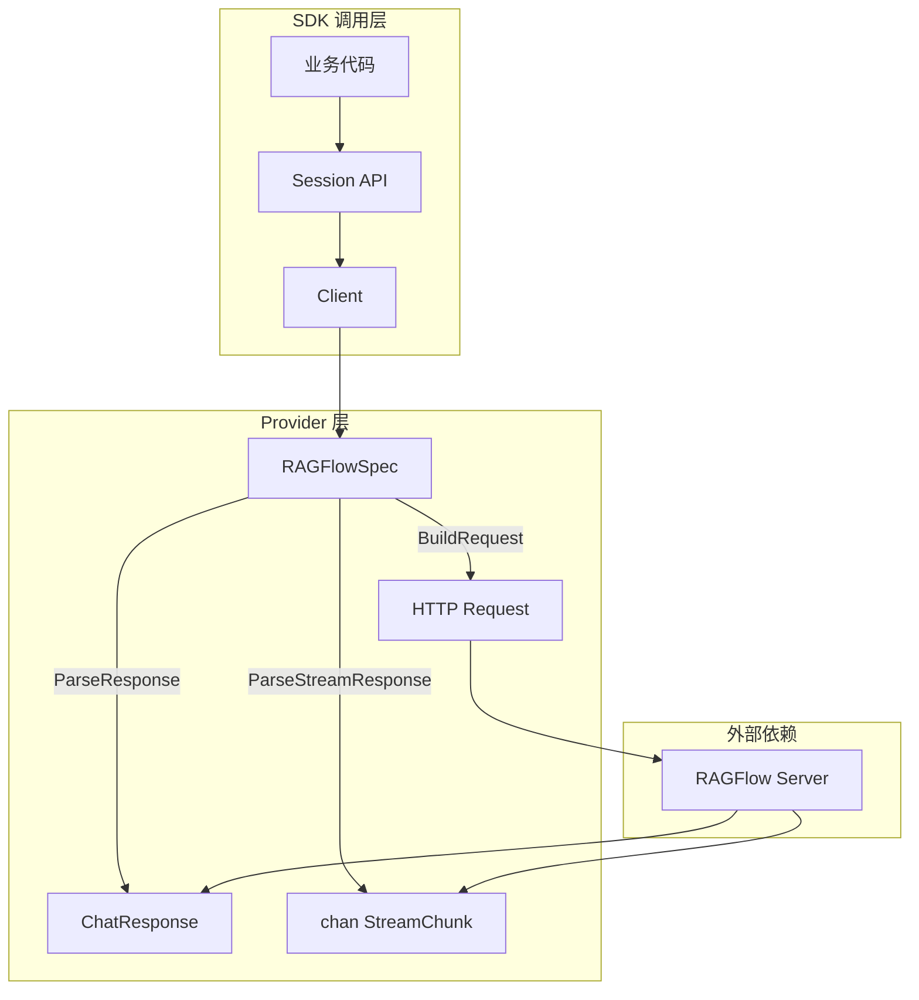
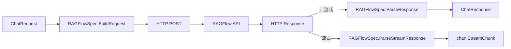
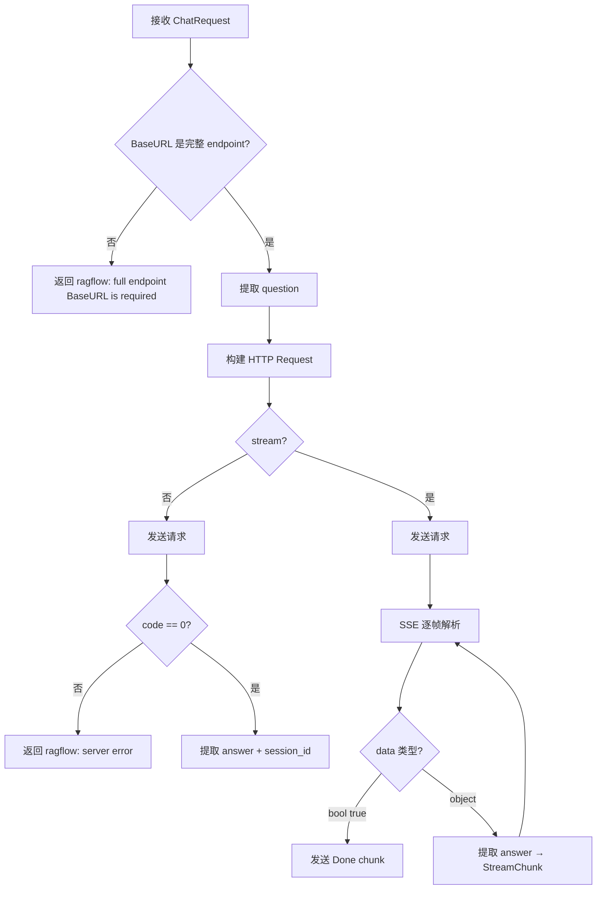

# 模块需求与设计一体化文档

> **文档编号**: MOD-RAGFLOW-V1.0
> **文档版本**: v1.0
> **创建日期**: 2026-03-17
> **文档状态**: 设计评审中

**评审边界说明**:
- **需求评审**: 第1-2章 → 通过后锁定为需求基线 v1.0
- **设计评审**: 第3-4章 → 通过后锁定设计基线 v1.x
- **交接契约**: 2.5 验收条件 — 需求定义 What，设计实现 How

**ID 体系**: REQ（需求）、FEAT（功能）、API（接口）、TC（测试用例）、RISK（风险）、NFR（非功能指标）

---

## 1. 文档控制

### 1.1 责任人

| 角色 | 姓名 | 职责范围 |
|------|------|---------|
| 产品经理 | - | 需求定义、业务验收 |
| 开发负责人 | claude-agent | 技术方案、代码实现 |
| 测试负责人 | claude-agent | 测试策略、质量保证 |
| 架构师 | - | 架构审核、技术决策 |

### 1.2 修订历史

| 版本 | 日期 | 作者 | 变更描述 |
|------|------|------|---------|
| v0.1 | 2026-03-17 | claude-agent | 初始草稿 |
| v1.0 | 2026-03-17 | claude-agent | 需求评审通过 |

---

## 2. 需求分析

### 2.1 需求概述 [必填]

| 项目 | 内容 |
|------|------|
| **模块名称** | RAGFlow 对话接入模块 |
| **模块ID** | MOD-RAGFLOW |
| **所属系统/产品线** | ai-api-sdk（多供应商 AI 模型访问 Go SDK） |
| **所属版本/迭代** | generic_adapter 分支 |
| **需求类型** | 新功能 |
| **业务背景** | RAGFlow 是开源 RAG 引擎，广泛用于企业知识库问答场景。当前 SDK 已支持 OpenAI/Claude/Dify/FastGPT 等供应商，但尚未覆盖 RAGFlow。用户需通过统一 SDK 接口访问 RAGFlow 对话能力。 |
| **核心目标** | 在 SDK 内新增 RAGFlow 专用 Provider，支持非流式与流式对话，实现统一接口访问 RAGFlow Chat API |

---

### 2.2 痛点与价值 [必填]

| 维度 | 内容 |
|------|------|
| **目标用户** | 使用 ai-api-sdk 的 Go 开发者，需接入自部署 RAGFlow 服务 |
| **当前问题** | SDK 无法直接调用 RAGFlow API，开发者需手动编写 HTTP 请求、SSE 解析、会话管理等胶水代码 |
| **业务影响** | 每个接入 RAGFlow 的项目重复实现 ~300 行对话+流式代码 |
| **预期价值** | 通过 SDK 统一接口，零胶水代码接入 RAGFlow，与其他 Provider 一致的使用体验 |

**用户故事**

| 编号 | 用户故事 | 优先级 |
|------|---------|--------|
| US-01 | 作为 Go 开发者，我希望通过 SDK 统一接口调用 RAGFlow 对话 API，以便无需关心 RAGFlow 特有的请求/响应格式 | P0 |
| US-02 | 作为 Go 开发者，我希望 SDK 支持 RAGFlow 流式对话，以便实时展示 RAG 回答内容 | P0 |
| US-03 | 作为 Go 开发者，我希望 SDK 自动管理 RAGFlow 的 session_id，以便轻松实现多轮对话 | P1 |

---

### 2.3 功能方案 [必填]

#### 2.3.1 功能清单

| 功能ID | 功能名称 | 功能描述 | 优先级 | 来源需求 |
|--------|---------|---------|--------|---------|
| FEAT-01 | 非流式对话 | 发送问题到 RAGFlow，获取完整回答 | P0 | US-01 |
| FEAT-02 | 流式对话 | SSE 流式接收 RAGFlow 回答的增量文本 | P0 | US-02 |
| FEAT-03 | 会话管理 | 自动提取/注入 session_id 实现多轮对话 | P1 | US-03 |

#### 2.3.2 功能字段约束

**FEAT-01/02 请求字段约束**

| 字段名 | 字段类型 | 必填 | 来源 | 说明 |
|--------|---------|------|------|------|
| chat_id | string | Y | BaseURL 路径参数 | RAGFlow Chat Assistant ID，写入完整 endpoint 路径 |
| question | string | Y | 自动提取 | 从 `ChatRequest.Messages` 最后一条 user 消息提取 |
| stream | bool | N | ChatRequest.Stream | 是否启用流式，默认 false |
| session_id | string | N | ChatRequest.SessionID | 多轮对话会话 ID，首轮为空由 RAGFlow 自动生成 |

**FEAT-01 非流式响应字段**

| 字段名 | JSON 路径 | 映射目标 | 说明 |
|--------|----------|---------|------|
| answer | data.answer | ChatResponse.Text | 完整回答文本 |
| session_id | data.session_id | ChatResponse.SessionID | 会话 ID |
| code | code | 错误检测 | 0=成功，非0=错误 |
| message | message | 错误信息 | code!=0 时的错误描述 |

**FEAT-02 流式响应字段**

| 字段名 | JSON 路径 | 映射目标 | 说明 |
|--------|----------|---------|------|
| answer | data.answer | StreamChunk.Text | 增量文本 |
| session_id | data.session_id | StreamChunk.SessionID | 会话 ID |
| code | code | 错误检测 | 非0=错误 |
| data (bool) | data | 终止信号 | `data: true` 表示流结束 |

---

### 2.4 范围与边界 [必填]

| 类别 | 内容 |
|------|------|
| **范围（In Scope）** | RAGFlow Chat API 的非流式/流式对话、session_id 自动管理、Bearer Token 鉴权 |
| **非范围（Out of Scope）** | RAGFlow 知识库管理 API、文档上传 API、Session CRUD API、reference 源引用结构化解析 |
| **前置假设** | RAGFlow 服务已部署，用户已创建 Chat Assistant 并获得 chat_id 和 API Key |

---

### 2.5 验收条件 [必填]

#### 2.5.1 业务规则与约束

| ID | 类型 | 描述 |
|----|------|------|
| RULE-01 | 系统约束 | BaseURL 必须填写完整 endpoint，并在路径中包含 chat_id |
| RULE-02 | 业务规则 | 首轮对话不传 session_id，由 RAGFlow 自动生成 |
| RULE-03 | 系统约束 | 错误前缀统一使用 `ragflow:` |
| RULE-04 | 业务规则 | APIKey 类型凭据自动转为 Bearer Token 鉴权 |

#### 2.5.2 功能验收场景

**正常场景**

| 场景ID | 功能ID | 优先级 | 前置条件 | 操作 | 预期结果 |
|--------|--------|--------|---------|------|---------|
| S-01 | FEAT-01 | P0 | RAGFlow 服务可用，chat_id 有效 | 发送非流式对话请求 | 返回完整回答文本和 session_id |
| S-02 | FEAT-02 | P0 | 同上 | 发送流式对话请求 | 逐帧接收增量文本，最终收到 Done chunk |
| S-03 | FEAT-03 | P1 | 已获取 session_id | 携带 session_id 发送续轮请求 | 回答基于之前对话上下文 |

**异常场景**

| 场景ID | 功能ID | 触发条件 | 系统行为 |
|--------|--------|---------|---------|
| E-01 | FEAT-01 | BaseURL 为空或不完整 | 返回 `ragflow: full endpoint BaseURL is required` 错误 |
| E-02 | FEAT-01 | API Key 无效 | 返回 HTTP 错误（透传 RAGFlow 响应） |
| E-03 | FEAT-01 | 响应 code != 0 | 返回 `ragflow: server error` + message |
| E-04 | FEAT-02 | 流式帧 JSON 解析失败 | 返回 error chunk，流终止 |
| E-05 | FEAT-02 | 连接中断无终止帧 | 正常结束（graceful close） |

**边界场景**

| 场景ID | 条件 | 预期行为 |
|--------|------|---------|
| B-01 | Messages 为空 | question 提取为空字符串，发送空请求 |
| B-02 | 响应 data.answer 为空 | 返回空文本，不报错 |
| B-03 | 流式仅收到终止帧（无文本帧） | 仅返回 Done chunk |

#### 2.5.3 非功能性验收指标

| 指标ID | 指标名称 | 目标值 | 说明 |
|--------|---------|-------|------|
| NFR-PERF-01 | 流式首帧延迟 | 不引入额外延迟 | SDK 解析开销 ≤1ms |
| NFR-TEST-01 | 核心逻辑测试覆盖率 | ≥90% | BuildRequest/ParseResponse/ParseStreamResponse |

---

## 3. 技术设计

### 3.1 方案选型 [必填]

| 对比维度 | 方案A: OpenAI 兼容 Provider | 方案B: Generic Adapter | 方案C: RAGFlow 专用 Provider |
|---------|--------------------------|----------------------|---------------------------|
| 适用条件 | RAGFlow 完全兼容 OpenAI 格式 | 差异可通过模板配置映射 | 结构性差异需显式适配 |
| 可行性 | **不可行**：请求用 `question` 非 `messages`，响应嵌套 `code/data` | 可行但受限：终止帧 `data:true` 无法用 JSONPath 表达 | **完全可行** |
| 维护成本 | - | 中（配置易出错） | 低（代码显式可读） |
| 结论 | 排除 | 排除 | **选择** |

**选择理由**：RAGFlow API 格式与 OpenAI 不兼容（请求用 `question`、响应嵌套 `code/data`、终止帧为 `data:true`），Generic Adapter 的 JSONPath 机制无法处理 `data` 字段从 object 变为 bool 的终止信号。专用 Provider 最直接、最可维护。

#### 技术栈

| 类别 | 选型 | 版本 | 选型理由 |
|------|------|------|---------|
| 语言 | Go | 1.23.0 | 项目现有技术栈 |
| 依赖 | 标准库 | - | 仅使用 encoding/json, bufio, net/http 等标准库，无新增外部依赖 |

### 3.2 架构设计 [必填]

#### 3.2.1 功能与数据架构



**架构说明**

| 层级 | 元素 | 职责 |
|------|------|------|
| Provider 层 | RAGFlowSpec | 实现 ProviderSpec + ProviderStreamSpec 接口 |
| Provider 层 | stream.go | 自定义 SSE 解析器，处理增量文本 + bool 终止帧 |
| 外部依赖 | RAGFlow Server | 自部署 RAG 引擎，提供 Chat API |

#### 3.2.2 技术分层



#### 3.2.3 外部依赖清单

| 外部系统 | 依赖类型 | 协议 | 认证方式 | 超时 | 降级策略 |
|---------|---------|------|---------|------|---------|
| RAGFlow Server | 同步调用 | HTTPS/HTTP SSE | Bearer Token | 由 Client 层控制（流式 5min） | SDK 返回错误，由业务层处理 |

### 3.3 数据设计

> 不适用。本模块为 SDK 库，不涉及数据库表设计。

### 3.4 接口设计 [必填]

#### 3.4.1 接口清单

| 接口ID | 名称 | 方法 | 路径 | 说明 |
|--------|------|------|------|------|
| API-01 | RAGFlow 对话 | POST | `/api/v1/chats_openai/{chat_id}/chat/completions` | 非流式/流式对话 |

---

#### API-01: RAGFlow 对话

> **引用**: 字段约束 [2.3.2] | 性能 NFR-PERF-01

**接口契约**

```
POST /api/v1/chats_openai/{chat_id}/chat/completions
Content-Type: application/json
Authorization: Bearer {api_key}
```

**请求参数**

| 参数 | 类型 | 必填 | 约束 | 说明 |
|------|------|------|------|------|
| question | string | Y | 从最后一条 user Message 自动提取 | 用户问题 |
| stream | bool | N | true/false | 是否流式 |
| session_id | string | N | 首轮为空 | 多轮对话 ID |

> `chat_id` 为 URL 路径参数，直接包含在 BaseURL 完整 endpoint 中。

**请求示例**

```json
{
  "question": "RAGFlow 如何配置知识库？",
  "stream": true,
  "session_id": "abc123"
}
```

**非流式响应参数**

| 参数 | 类型 | 说明 |
|------|------|------|
| code | int | 0=成功，非0=错误 |
| message | string | 错误信息（code!=0 时） |
| data.answer | string | 完整回答文本 |
| data.session_id | string | 会话 ID |
| data.reference | object | RAG 源引用（不做结构化解析） |

**非流式响应示例**

```json
{
  "code": 0,
  "data": {
    "answer": "RAGFlow 配置知识库需要...",
    "reference": {"chunks": [], "doc_aggs": []},
    "session_id": "abc123"
  }
}
```

**流式响应格式（SSE）**

数据帧：
```
data:{"code": 0, "data": {"answer": "增量文本", "reference": {}, "session_id": "abc123"}}
```

终止帧：
```
data:{"code": 0, "data": true}
```

错误帧：
```
data:{"code": 102, "message": "unauthorized"}
```

**错误码**

| code | 信息 | 场景 |
|------|------|------|
| 0 | 成功 | 正常响应 |
| 非0 | message 字段描述 | 鉴权失败、参数错误等 |

**处理逻辑**



### 3.5 质量实现方案 [必填]

#### 3.5.1 性能设计

| 指标ID | 目标值 | 实现方案 | 验证方法 |
|--------|-------|---------|---------|
| NFR-PERF-01 | 首帧无额外延迟 | bufio.Reader 逐行解析，零缓冲 | benchmark 对比 |

#### 3.5.2 可靠性设计

**FMEA 分析**

| 失效模式 | 影响 | 原因 | S | O | D | RPN | 改进措施 |
|---------|------|------|:-:|:-:|:-:|:---:|---------|
| 响应 JSON 解析失败 | 请求失败 | RAGFlow 版本变更导致格式变化 | 6 | 3 | 3 | 54 | 错误信息包含原始 body |
| 流式连接中断无终止帧 | 流未正常关闭 | 网络抖动 | 5 | 4 | 2 | 40 | EOF 视为 graceful close |
| BaseURL 未包含 chat_id | 请求 404 | 用户配置遗漏 | 4 | 5 | 1 | 20 | BuildRequest 前置校验 |

#### 3.5.3 测试方案

| 指标ID | 验收标准 | 实现方案 | 验证方法 |
|--------|---------|---------|---------|
| NFR-TEST-01 | 覆盖率 ≥90% | 单元测试覆盖 BuildRequest/ParseResponse/ParseStreamResponse | `go test -cover` |

---

## 4. 部署与运维

> 不适用。本模块为 SDK 库，不涉及独立部署。用户通过 `go get` 引入依赖即可使用。

---

## 5. 风险与依赖

### 5.1 项目依赖

| 依赖 | 内容 | 状态 | 风险等级 |
|------|------|------|---------|
| RAGFlow API 稳定性 | Chat API 格式需保持向后兼容 | 基于 v0.14+ 文档 | 低 |
| SDK Provider 体系 | 依赖现有 ProviderSpec/StreamSpec 接口 | 已稳定 | 低 |

### 5.2 风险识别

| 风险ID | 类型 | 描述 | 概率 | 影响 | 应对措施 |
|--------|------|------|------|------|---------|
| RISK-01 | 技术 | RAGFlow 版本间 API 格式差异 | 低 | 中 | 基于官方文档实现，保留 Raw 字段供调试 |
| RISK-02 | 技术 | 流式终止帧格式变化 | 低 | 高 | 类型检测兜底，非 object 即终止 |

---

## 6. 需求追溯矩阵

| 需求ID | 需求描述 | 功能ID | 接口ID | 测试用例ID | 状态 |
|--------|---------|--------|--------|-----------|------|
| US-01 | 统一接口调用 RAGFlow | FEAT-01 | API-01 | TC-01~TC-04 | 待实现 |
| US-02 | 流式对话 | FEAT-02 | API-01 | TC-05~TC-09 | 待实现 |
| US-03 | 会话管理 | FEAT-03 | API-01 | TC-03, TC-07 | 待实现 |

---

## 附录：关键实现文件

| 文件 | 职责 | 参考模板 |
|------|------|---------|
| `provider/impls/ragflow/spec.go` | ProviderSpec 实现 | `provider/impls/dify/spec.go` |
| `provider/impls/ragflow/stream.go` | SSE 流式解析器 | `provider/impls/dify/stream.go` |
| `provider/provider.go` | 添加 blank import 触发注册 | 现有文件 |
| `test/ragflow_provider_test.go` | 单元测试 | `test/fastgpt_provider_test.go` |
